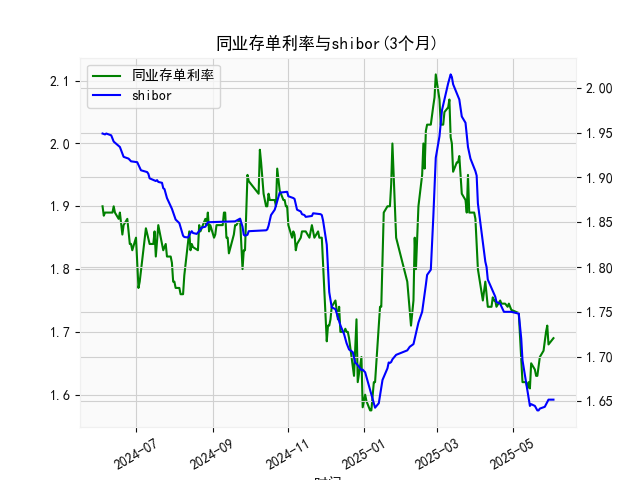

|            |   同业存单利率(3个月) |   shibor(3个月) |
|:-----------|----------------------:|----------------:|
| 2025-05-06 |                 1.73  |           1.748 |
| 2025-05-07 |                 1.69  |           1.737 |
| 2025-05-08 |                 1.66  |           1.72  |
| 2025-05-09 |                 1.62  |           1.696 |
| 2025-05-12 |                 1.62  |           1.672 |
| 2025-05-13 |                 1.61  |           1.662 |
| 2025-05-14 |                 1.62  |           1.653 |
| 2025-05-15 |                 1.61  |           1.645 |
| 2025-05-16 |                 1.65  |           1.647 |
| 2025-05-19 |                 1.64  |           1.645 |
| 2025-05-20 |                 1.63  |           1.642 |
| 2025-05-21 |                 1.63  |           1.64  |
| 2025-05-22 |                 1.655 |           1.64  |
| 2025-05-23 |                 1.66  |           1.642 |
| 2025-05-26 |                 1.67  |           1.643 |
| 2025-05-27 |                 1.69  |           1.644 |
| 2025-05-28 |                 1.7   |           1.647 |
| 2025-05-29 |                 1.71  |           1.652 |
| 2025-05-30 |                 1.68  |           1.652 |
| 2025-06-03 |                 1.69  |           1.652 |




# 同业存单利率与SHIBOR相关性分析及投资机会判断

## 一、同业存单利率与SHIBOR的相关性及影响逻辑

### 1. 内在关联性
（1）**定价基础趋同**：二者均反映银行间市场短期资金成本，3个月期限品种存在直接比价关系。同业存单作为标准化融资工具，其利率形成受SHIBOR报价机制影响，但存在约5-15bp的信用利差（AAA级存单利率通常低于SHIBOR）

（2）**传导路径**：
```
央行货币政策 → 银行体系流动性 → SHIBOR报价中枢 → 存单发行定价
```
当流动性宽松时，SHIBOR下行带动存单利率走低；流动性收紧时二者同步上行，但存单利率波动幅度通常大于SHIBOR

### 2. 分化逻辑
（1）**信用维度**：同业存单反映特定信用主体（AAA银行）融资成本，SHIBOR则是无担保平均报价。当银行信用分层加剧时，存单利率与SHIBOR利差扩大

（2）**供需关系**：存单利率受发行量/认购比等市场因素影响更显著（如季末MPA考核期间发行放量可能推高利率），而SHIBOR更多反映即期资金供需

（3）**政策预期**：SHIBOR对短期货币政策信号更敏感，存单利率则包含更长期限的流动性预期

---

## 二、近期投资机会分析（截至2025年6月3日）

### 1. 关键数据变动
```
| 指标       | 最新值   | 前日值   | 周变动 | 特征描述                |
|------------|----------|----------|--------|-------------------------|
| 同业存单   | 1.69%    | 1.67%    | +3bp  | 5日连升突破月均值(1.65%)|
| SHIBOR     | 1.75%    | 1.75%    | 持平   | 维持近3周波动中枢       |
```

### 2. 机会研判
**（1）利差套利窗口**
- 当前存单-SHIBOR利差收窄至-6bp（历史分位20%），存在均值回归动能
- 策略建议：做多AAA存单+利率互换对冲SHIBOR波动

**（2）流动性错配机会**
- 存单利率单周上行3bp但SHIBOR持稳，反映结构性流动性紧张
- 配置机会：重点参与7天内逆回购（GC007利率已升至2.1%）

**（3）久期策略调整**
- 存单利率曲线陡峭化（3M-1M利差扩大至12bp）
- 操作建议：构建"子弹型"组合，集中配置1个月期高收益存单

### 3. 风险提示
- 关注6月5日MLF续作量价信号
- 警惕季末资金面季节性扰动（财政存款上缴压力）
- 存单-SHIBOR利差持续倒挂可能引发监管窗口指导

---

> 注：具体操作需结合当日央行公开市场操作量价变化动态调整，建议在10:00 SHIBOR定盘后确认交易策略。