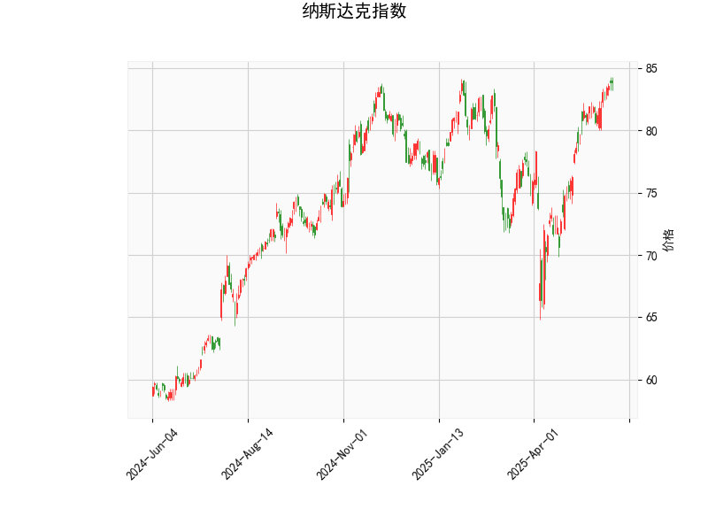

# 纳斯达克指数技术分析及策略建议

## 一、技术分析结果解读

### 1. 关键指标分析
- **RSI（69.78）**：接近超买阈值（70），显示短期可能面临回调压力，但未完全进入超买区间，需结合其他指标观察趋势持续性。
- **MACD（1.91 vs 信号线1.87）**：MACD线略高于信号线且柱状图转正（0.044），表明短期动能偏多但力度较弱，需警惕方向选择。
- **布林带（当前价83.81 vs 上轨85.52）**：价格贴近布林带上轨运行，若突破可能延续涨势，但需验证成交量配合；若遇阻回落可能回调至中轨（76.86）附近。
- **K线形态**：
  - **CDLMATCHINGLOW（匹配低形态）**：通常出现在下跌趋势末端，暗示空方力量衰竭。
  - **CDLSPINNINGTOP（纺锤线）**：反映多空博弈激烈，短期方向不明确。

### 2. 多空力量对比
- **多头信号**：MACD金叉、价格站稳布林带中上轨。
- **空头信号**：RSI接近超买、价格逼近布林带压力位、K线形态显示犹豫。

---

## 二、投资机会与策略建议

### 1. 趋势跟踪策略
- **突破交易**：
  - **做多条件**：若价格放量突破布林带上轨（85.52），目标看向前高区域，止损设于84.0下方。
  - **做空条件**：若价格跌破中轨（76.86）且RSI回落至50以下，可考虑短空，目标下轨（68.20）。
- **MACD确认**：关注MACD柱状图能否持续扩大，若缩量上涨伴随柱状图萎缩，则警惕假突破。

### 2. 均值回归策略
- **布林带逆向操作**：
  - 当前价格距离上轨仅1.71点，可分批轻仓试空，止损设于上轨上方（如86.0）。
  - 若回调至中轨（76.86）附近且RSI回落至50-55区间，可布局反弹多单。

### 3. 事件驱动风控
- **重大数据预警**：关注美联储利率决议、非农数据等可能引发波动率放大的事件，若价格突破时恰逢事件窗口，需降低仓位杠杆。

---

## 三、风险提示
1. **假突破风险**：布林带上轨附近若多次测试未果，可能引发快速回调。
2. **RSI背离风险**：若价格创新高但RSI未同步突破前高，需警惕顶背离。
3. **K线形态组合**：纺锤线后若出现大阴线吞没，则匹配低形态失效，可能开启下行趋势。

**建议仓位管理**：突破策略仓位不超过5%，逆向策略不超过3%，总仓位控制在10%以内。