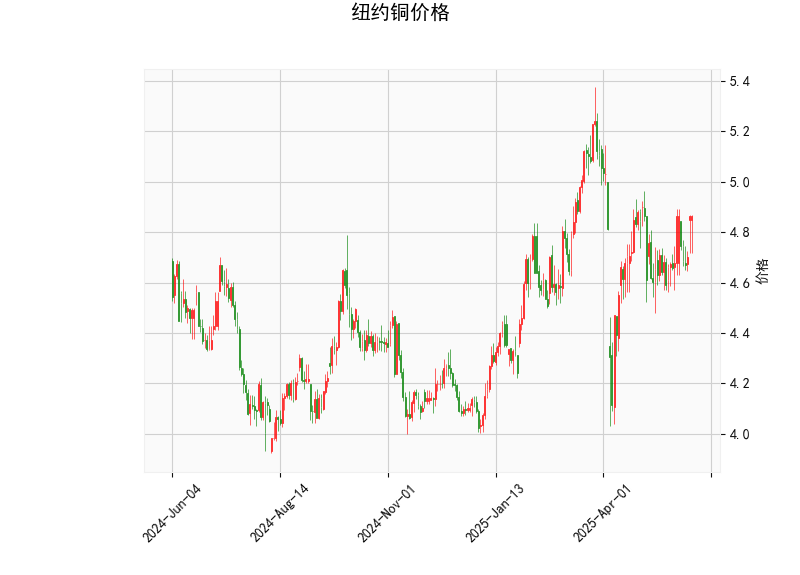

# 纽约铜价技术分析与投资策略

---

## 一、技术指标分析

### 1. 当前价与布林轨道
- **当前价4.865**位于布林带中轨（4.788）附近，接近布林带中轴，表明价格处于短期均衡区间。**上轨5.236**与**下轨4.341**之间的空间较大，说明市场存在潜在波动性。若价格突破中轨向上靠近上轨，可能触发多头动能；反之若跌破中轨向下，则可能加速下行。

### 2. RSI指标
- **RSI 57.34**处于中性区间（50-70），未进入超买区域（>70），但已略高于50分界线，表明短期多头略占优势，但缺乏强劲趋势动能。需警惕价格回调压力。

### 3. MACD指标
- **MACD线（0.019）**上穿**信号线（0.001）**形成“金叉”，柱状图（0.018）持续扩大，显示短期多头动能增强。但MACD绝对值较小，可能反映市场犹豫或震荡特征。

### 4. K线形态
- **CDLGAPSIDESIDEWHITE**（两侧缺口白线）：通常出现在趋势末期，暗示多空力量平衡后的潜在反转信号。
- **CDLHANGINGMAN**（上吊线）：若出现在上升趋势中，可能预示顶部反转风险，需结合成交量验证。

---

## 二、投资机会与策略建议

### 1. 短期震荡交易策略
- **区间操作**：若价格在布林带中轨（4.788）附近反复震荡，可尝试：
  - **支撑位做多**：4.34（下轨）附近逢低买入，止损设于4.30下方。
  - **阻力位做空**：5.23（上轨）附近逢高卖出，止损设于5.30上方。
- **突破交易**：若价格站稳中轨且MACD持续放量，可轻仓追多，目标5.0整数关口；若跌破中轨，则顺势看空至4.50。

### 2. 中期趋势跟踪策略
- **多空分水岭**：布林带中轨（4.788）可作为趋势分界：
  - **多头条件**：价格持续高于中轨且RSI突破60，目标看向5.0-5.2。
  - **空头条件**：价格下破中轨且MACD柱状图转负，目标看向4.5-4.3。

### 3. 套利机会
- **跨期套利**：关注近月与远月合约价差变化。若近月合约价格突破布林上轨而远月贴水扩大，可做多近月/做空远月。
- **波动率套利**：布林带收窄（波动率低）后可能迎来突破，可买入跨式期权组合（Long Straddle），押注波动率回升。

### 4. 风险提示
- **反转信号验证**：需警惕K线形态（上吊线）的潜在反转风险，若价格在5.0附近遇阻且RSI超买（>70），需及时止盈。
- **宏观数据冲击**：铜价受美元指数、全球制造业PMI及库存数据影响较大，建议结合基本面事件调整仓位。

---

**结论**：当前铜价处于震荡区间，建议以短线高抛低吸为主，关注布林带上下轨突破信号。中期需等待更明确的趋势确认，套利策略可结合跨期价差与波动率变化灵活布局。