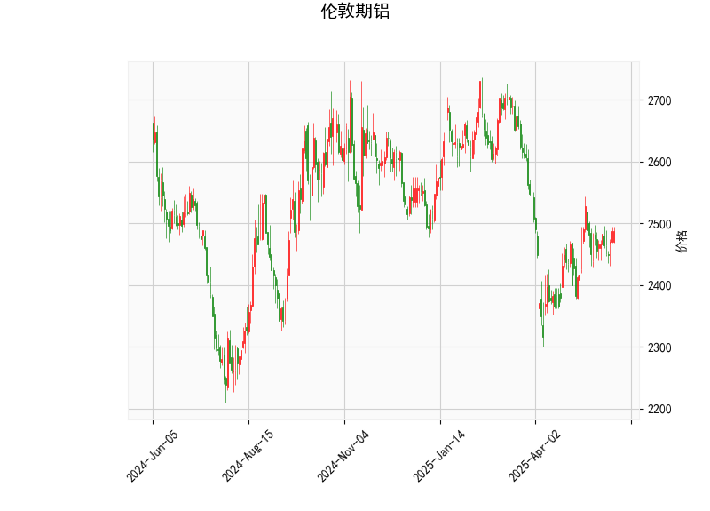

# 伦敦期铝技术分析与投资策略

## 一、技术分析结果解读

### 1. 价格与布林带指标
- **当前价**：2487美元，位于布林带中轨（2475）附近，短期处于震荡中枢区域。
- **布林带形态**：上轨2659、下轨2290，上下轨间距较大（约369美元），表明市场波动率较高。当前价格未突破中轨，暂未形成单边趋势信号。

### 2. RSI指标
- **RSI值54.65**：处于50中性线上方但未超买（>70），反映市场短期情绪偏多但未过热，需警惕回调风险。

### 3. MACD指标
- **MACD线（4.88）> 信号线（2.31）**：形成金叉且柱状图（2.56）持续扩张，显示短期上涨动能增强。
- **潜在信号**：若MACD柱状图持续放大，可能推动价格突破中轨向上轨靠近。

### 4. K线形态
- **CDLBELTHOLD（腰带线）**：需结合颜色（未明确）判断方向。若为阳线且收盘价接近高点，可能预示短期反弹；若为阴线则可能延续跌势。
- **CDLLONGLINE（长实体线）**：反映多空争夺激烈，但收盘价占据主导权。需结合位置判断：若出现在回调后，可能为反转信号。

---

## 二、投资与套利机会分析

### 1. 趋势跟踪策略
- **突破交易**：
  - **做多条件**：价格站稳中轨（2475）且MACD柱状图持续扩张，目标上看上轨2659，止损设于中轨下方。
  - **做空条件**：若价格跌破中轨且RSI下穿50，目标看向下轨2290，止损设于中轨上方。
- **优势**：适合波动率放大行情，捕捉单边趋势。

### 2. 区间震荡策略
- **高抛低吸**：
  - **反弹至中轨（2475）附近承压**：轻仓试空，止损2510，目标2300。
  - **回踩下轨（2290）附近企稳**：轻仓试多，止损2250，目标2500。
- **优势**：适用于无重大基本面刺激的震荡市。

### 3. 跨期套利机会
- **关注合约价差**：
  - 若近月合约贴水（Contango）扩大，可做空远月、做多近月，赚取价差收敛收益。
  - 需结合库存周期（如LME铝库存变化）验证供需预期。

### 4. 期权对冲策略
- **保护性看跌期权**：持有现货或期货多头的投资者可买入执行价2450的看跌期权，对冲潜在下跌风险。
- **波动率交易**：若预期波动率上升，可买入跨式组合（同时买入看涨和看跌期权）。

---

## 三、风险提示
1. **宏观扰动**：美联储政策、美元指数波动及全球经济复苏预期可能加剧价格波动。
2. **基本面验证**：需关注中国电解铝产能、LME库存变化及新能源需求（如光伏用铝）的边际影响。
3. **技术指标失效**：若价格快速突破关键位（如2659或2290），需及时止损并重新评估趋势。

**结论**：当前技术面偏向震荡偏多，建议以中轨为分水岭轻仓布局突破行情，同时设置严格止损。套利机会需结合跨市场数据动态跟踪。