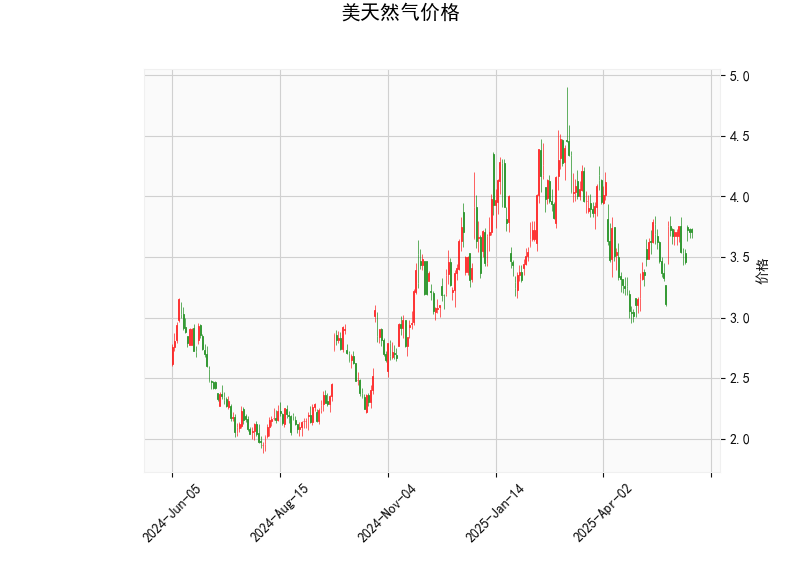

# 美天然气价格技术分析及策略建议

## 一、技术指标分析

### 1. 价格与布林带
- **当前价3.706**位于布林带中轨（3.618）附近，略高于中轨但低于上轨（4.246），显示价格处于中性偏强区域。
- **布林带收窄特征**：上轨-下轨间距1.255（4.246-2.991），表明近期波动性较低，需警惕突破行情。
- **价格方向信号**：若站稳中轨可能向上测试上轨，若跌破中轨则可能向下轨回落。

### 2. RSI指标
- **54.53的中性值**显示多空力量均衡，但存在两处潜在信号：
  - **买方动能初现**：从超卖区（<30）回升后的首次突破50中轴
  - **背离风险**：若价格创新高但RSI未同步突破60需警惕回调

### 3. MACD指标
- **金叉延续状态**：MACD线（0.0389）高于信号线（0.0225），柱状图持续放大（0.0163）
- **动量特征**：虽然绝对值较小，但正向发散显示短期上涨动能正在积累

### 4. K线形态
- **CDLMATCHINGLOW形态**为看涨反转信号，需结合位置确认：
  - 出现在布林带下轨附近时有效性更高
  - 当前处于中轨区域，需配合量能验证

---

## 二、潜在机会与策略

### 1. 趋势交易策略
- **突破交易**（适用波动率放大）：
  - **多头突破**：若收盘价站稳3.75（突破中轨+前平台），目标上看4.0整数关口，止损设3.65
  - **空头突破**：若跌破3.58（中轨支撑），目标下看3.3区域，止损设3.63

- **布林带回归策略**（适用区间震荡）：
  - 靠近下轨3.0附近布局多单，目标中轨3.618
  - 靠近上轨4.24附近布局空单，目标中轨3.618
  - 需配合RSI超买超卖信号（>70/<30）增强胜率

### 2. 事件驱动套利
- **库存报告套利**：
  - EIA每周库存报告公布前后，关注布林带下轨（2.99）与期货贴水结构的联动机会
  - 若库存下降超预期，可做多近月合约同时做空远月合约

- **季节性价差**：
  - 冬季合约（11-2月）与夏季合约（5-8月）价差已达历史均值上方，可关注：
    - 做空冬季合约/做多夏季合约的日历价差组合
    - 入场时机选择MACD柱状图收缩时

### 3. 风险提示
- **假突破风险**：当前布林带收窄至年度波动区间的15%分位，需防范突破失败后的反向波动
- **持仓量验证**：建议配合CME持仓报告（COT）观察商业空头持仓变化
- **天气敏感性**：需持续跟踪北美气温预测及飓风季发展

---

**关键支撑/阻力位**：
- 支撑1：3.58（布林中轨+心理关口）
- 支撑2：3.30（年度低点连线）
- 阻力1：3.85（前高平台）
- 阻力2：4.24（布林上轨）

（注：以上分析基于技术指标推导，实际交易需结合基本面数据和风险管理）