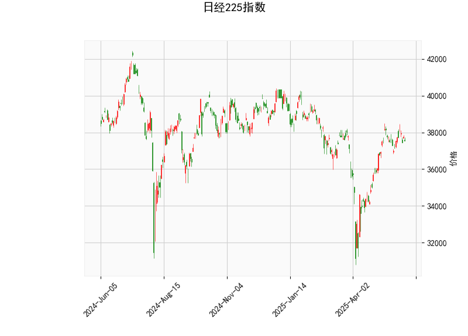

# 日经225指数技术分析及投资策略

## 一、技术指标解析

### 1. 价格与布林轨道
- **当前价37,554**位于布林带中轨（36,341）和上轨（39,805）之间，接近中上轨区域。当前价格高于中轨约3.3%，但距上轨仍有6%空间，显示市场处于**中性偏强**区间。
- **布林带宽**（上轨-下轨=6,927点）较大，反映近期波动率较高，但尚未出现明显的超买/超卖信号。

### 2. RSI指标
- **RSI 54.28**处于50中性线附近，未进入超买（>70）或超卖（<30）区间，暗示当前市场**缺乏明确方向性动能**。

### 3. MACD指标
- **MACD线（405.19）低于信号线（463.99）**，形成负向柱状图（-58.8），显示短期动量弱于长期动量，存在**短期回调压力**。
- 但MACD绝对值较高（>400），说明中长期趋势仍保持强势。

### 4. K线形态
- **倒锤头线（Inverted Hammer）**出现在当前价格位置，需注意：
  - 需结合次日收盘确认有效性，若后续出现阳线突破倒锤头高点，可能预示**趋势反转信号**。
  - 在布林带中上轨区域出现该形态，更可能暗示**短期上行受阻**。

---

## 二、投资机会与策略建议

### 1. 趋势跟踪策略
- **多头机会**：
  - 若价格突破布林上轨39,805且RSI突破60，可考虑短线做多，目标位看向前高40,000心理关口。
  - 确认条件：MACD柱状图转正且成交量放大。
- **空头机会**：
  - 若价格跌破中轨36,341，MACD死叉扩大，可能打开至下轨32,878的下跌空间（潜在跌幅8.2%）。
  - 止损建议：设置在布林中轨上方1%（约36,700）。

### 2. 均值回归策略
- **中轨反弹交易**：
  - 当前价与中轨存在3.3%正偏离，若价格回落至36,500附近（中轨上方0.4%）企稳，可博弈向38,000的反弹。
  - 需配合RSI回落至45以下形成超卖背离信号。

### 3. 事件驱动套利
- **波动率套利**：
  - 利用布林带宽收缩机会：当带宽从当前6,900点收窄至5,000点以下时，可提前布局突破方向期权组合。
- **期现套利**：
  - 关注期货溢价率：若股指期货溢价超过0.5%，可做空期货同时买入ETF组合，捕捉基差收敛收益。

---

## 三、风险提示
1. **MACD顶背离风险**：尽管价格维持高位，MACD柱状图持续走弱，警惕日线级别的技术修正。
2. **日元汇率影响**：日本央行政策变动可能通过日元汇率（当前USD/JPY≈157）传导至出口企业权重股。
3. **形态失效可能**：倒锤头线需配合成交量验证，若次日收于形态实体下方（<37,400），则看涨信号失效。

| 关键位        | 价格      | 触发动作       |
|---------------|-----------|----------------|
| 强压力位      | 39,805   | 减仓/反手做空  |
| 多空分水岭    | 36,341   | 趋势方向确认点 |
| 强支撑位      | 34,000   | 长线资金入场位 |

**（注：以上策略需配合止损3%-5%，建议仓位不超过总资金15%）**