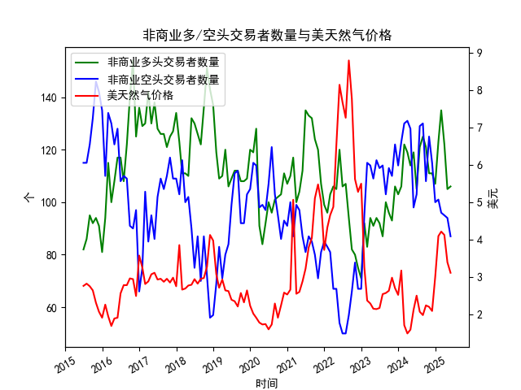

|            |   非商业多头交易者数量 |   非商业空头交易者数量 |   美天然气价格 |
|:-----------|-----------------------:|-----------------------:|---------------:|
| 2023-10-31 |                     93 |                    110 |           2.99 |
| 2023-11-30 |                    106 |                    122 |           2.71 |
| 2023-12-31 |                    103 |                    114 |           2.53 |
| 2024-01-31 |                    106 |                    123 |           3.18 |
| 2024-02-29 |                    122 |                    130 |           1.72 |
| 2024-03-31 |                    119 |                    131 |           1.5  |
| 2024-04-30 |                    114 |                    128 |           1.6  |
| 2024-05-31 |                    119 |                     98 |           2.13 |
| 2024-06-30 |                    105 |                    103 |           2.51 |
| 2024-07-31 |                    121 |                    129 |           2.08 |
| 2024-08-31 |                    125 |                    130 |           1.99 |
| 2024-09-30 |                    121 |                    108 |           2.25 |
| 2024-10-31 |                    111 |                    125 |           2.21 |
| 2024-11-30 |                    111 |                    115 |           2.1  |
| 2024-12-31 |                    107 |                    100 |           3.02 |
| 2025-01-31 |                    123 |                    101 |           4.1  |
| 2025-02-28 |                    135 |                     96 |           4.22 |
| 2025-03-31 |                    122 |                     95 |           4.13 |
| 2025-04-30 |                    105 |                     94 |           3.4  |
| 2025-05-31 |                    106 |                     87 |           3.12 |

### 近期投资机会分析（基于2025年3月-5月数据）

#### 1. **多空头寸的背离信号**
- **多头交易者数量**（单位：个）：
  - 2025年3月：122.0 → 4月：105.0（**↓13.9%**）→ 5月：106.0（**微增1.0**）。
  - **短期趋势**：4月大幅下降后，5月企稳，但尚未恢复至3月水平。
- **空头交易者数量**（单位：个）：
  - 2025年3月：95.0 → 4月：94.0（**↓1.1%**）→ 5月：87.0（**↓7.4%**）。
  - **短期趋势**：连续两月下降，空头平仓加速，市场看空情绪明显降温。

**机会点**：  
空头撤退速度加快，而多头企稳，可能预示市场情绪转向。若后续多头回升，价格可能触底反弹。

---

#### 2. **价格与头寸的背离**
- **天然气价格**（美元/百万英热单位）：
  - 2025年3月：4.13 → 4月：3.40（**↓17.7%**）→ 5月：3.12（**↓8.2%**）。
  - **短期趋势**：价格连续两月大幅下跌，但跌幅在5月收窄。
- **多空比（多头/空头）**：
  - 3月：1.28 → 4月：1.12 → 5月：1.22。
  - **关键变化**：价格下跌中多空比回升，表明空头离场速度更快。

**机会点**：  
价格下跌但空头加速撤离，可能形成“空头陷阱”。若库存或需求端出现利好，价格反弹概率较高。

---

#### 3. **季节性需求预期的潜在催化**
- **历史规律**：天然气价格通常在夏季（库存填充期）承压，冬季（取暖需求）走强。但当前数据周期截至5月，需关注6月后库存变化。
- **近期价格超跌**：5月价格已跌至3.12美元，接近2025年最低水平（1月为4.10美元），技术面存在超卖修复需求。

**机会点**：  
若夏季极端天气（如飓风或高温）影响供应或推高发电需求，价格可能快速反弹。

---

### 风险提示
1. **价格趋势尚未反转**：尽管空头撤离，但多头未显著增加，需警惕价格进一步下行。
2. **库存压力**：若美国天然气库存持续高位，可能压制反弹空间。
3. **政策与替代能源**：可再生能源政策或液化天然气（LNG）出口波动可能影响长期预期。

---

### 结论
- **短期机会**：关注空头平仓引发的技术性反弹，若5月数据后价格企稳，可试探性布局多头。
- **中期机会**：若6-7月库存增幅低于预期或需求端改善，价格可能进入上行通道。
- **关键观察点**：  
  - 下月多头是否持续回升（需突破110以上）。  
  - 库存报告及天气预测（如厄尔尼诺/拉尼娜现象）。