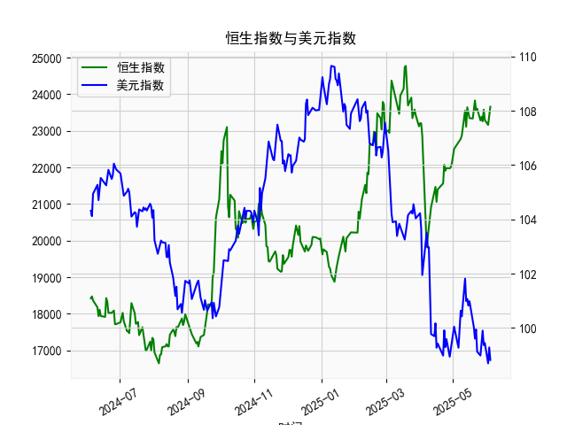

|            |   恒生指数 |   美元指数 |
|:-----------|-----------:|-----------:|
| 2025-05-08 |    22775.9 |   100.633  |
| 2025-05-09 |    22867.7 |   100.422  |
| 2025-05-12 |    23549.5 |   101.814  |
| 2025-05-13 |    23108.3 |   100.983  |
| 2025-05-14 |    23640.7 |   101.066  |
| 2025-05-15 |    23453.2 |   100.82   |
| 2025-05-16 |    23345   |   100.983  |
| 2025-05-19 |    23332.7 |   100.373  |
| 2025-05-20 |    23681.5 |   100.022  |
| 2025-05-21 |    23827.8 |    99.6014 |
| 2025-05-22 |    23544.3 |    99.9388 |
| 2025-05-23 |    23601.3 |    99.1231 |
| 2025-05-26 |    23282.3 |    98.9787 |
| 2025-05-27 |    23382   |    99.6147 |
| 2025-05-28 |    23258.3 |    99.8978 |
| 2025-05-29 |    23573.4 |    99.3633 |
| 2025-05-30 |    23289.8 |    99.4393 |
| 2025-06-02 |    23158   |    98.6893 |
| 2025-06-03 |    23512.5 |    99.2781 |
| 2025-06-04 |    23654   |    98.8128 |

### 1. 恒生指数与美元指数的相关性及影响逻辑

#### 相关性
恒生指数与美元指数通常呈现**负相关性**。历史数据显示，当美元走强时（美元指数上升），恒生指数倾向于承压下跌；反之，美元走弱（美元指数下降）时，恒生指数往往有上涨动力。

#### 影响逻辑
1. **资本流动效应**：
   - 美元指数上升时，全球资本倾向于回流美国市场（美元资产吸引力增强），导致新兴市场（包括香港）资金外流，恒生指数流动性收紧，估值承压。
   - 美元指数下降时，资本可能转向风险资产（如港股），推动恒生指数上涨。

2. **汇率联动机制**：
   - 港币与美元挂钩，美元走强会间接推高香港市场融资成本，抑制企业盈利预期；美元走弱则降低香港市场的海外债务压力，改善企业基本面。

3. **风险情绪传导**：
   - 美元指数常被视为避险资产，当全球经济不确定性上升时，美元走强会压制港股风险偏好；反之，美元走弱可能反映市场风险情绪回暖，利好港股。

---

### 2. 近期投资机会分析（聚焦最近一周）

#### 关键数据变化
- **人民币贷款增速与存款增速之差**（最新值：**23,654.03**）：
  - **短期趋势**：近一周（2025年5月30日—6月4日）该差值从**23,783.49**升至**23,654.03**，显示贷款增速相对存款增速的扩张略有放缓，但仍保持高位，表明信贷市场活跃度仍较高。
  - **今日变化**：6月4日较前一日（6月3日）微增**141.54**，反映短期信贷需求可能因政策刺激或市场信心改善而回升。

- **美元指数**（最新值：**98.81**）：
  - **短期趋势**：近一周美元指数从**99.28**跌至**98.81**，跌幅约**0.47%**，延续了自5月中旬以来的弱势格局。
  - **今日变化**：6月4日较前一日下跌**0.46**，技术面接近关键支撑位（98.5），可能触发进一步抛售。

#### 投资机会判断
1. **港股反弹窗口**：
   - **逻辑**：美元指数持续走弱（跌破99关口）释放资金回流新兴市场的信号，叠加信贷差值高位企稳，恒生指数（尤其是金融、地产板块）或迎来短期反弹。
   - **关注标的**：汇丰控股（0005.HK）、港交所（0388.HK）。

2. **大宗商品相关板块**：
   - **逻辑**：美元弱势通常推升以美元计价的大宗商品价格（如铜、原油），利好资源类股票。
   - **关注标的**：中海油（0883.HK）、江西铜业（0358.HK）。

3. **人民币资产重估**：
   - **逻辑**：信贷差值维持高位显示国内经济韧性，离岸人民币（CNH）汇率可能企稳，中资美元债及港股通标的（如腾讯、美团）或受益于资金流入。

4. **短期避险对冲**：
   - **风险提示**：若美元指数跌破98.5后快速反弹，可能引发港股波动。可配置黄金ETF（2840.HK）或高股息防御股（如中电控股，0002.HK）对冲尾部风险。

#### 今日操作建议
- **激进策略**：加仓港股金融、科技板块，捕捉美元走弱带来的估值修复机会。
- **保守策略**：持有高股息资产，等待美元指数明确方向后再择机布局。