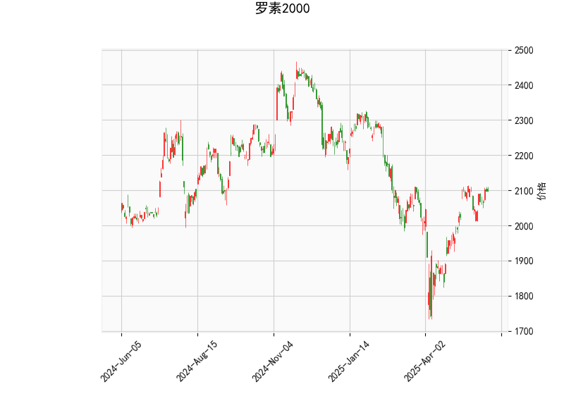

# 罗素2000指数技术分析及投资策略

## 一、技术指标解读

### 1. 价格与RSI
- **当前价2098.48**高于布林带中轨（2004.41），显示短期价格处于**中性偏强区间**。
- **RSI 59.62**接近超买临界值60，但尚未进入超买区，暗示市场存在**上涨动能余量**，需警惕短期回调风险。

### 2. MACD指标
- **MACD线（25.05）上穿信号线（24.89）**形成金叉，柱状图转正（0.16），确认**短期多头趋势启动**。
- 但柱状体绝对值较小，反映上涨动能**尚未充分释放**，需观察后续MACD柱是否持续放大。

### 3. 布林带分析
- 价格运行在**中轨与上轨之间**（2004-2189），当前价距离上轨尚有4.3%空间，显示指数存在**继续上探可能**。
- 中轨持续上行（2004.41）提供动态支撑，若跌破可能触发**技术性抛压**。

### 4. K线形态
- **CDLMATCHINGLOW**形态出现，配合MACD金叉，提示短期可能形成**看涨反转**，但需成交量配合确认有效性。

---

## 二、投资机会与策略

### （一）趋势跟踪策略
1. **多头建仓**
   - **入场条件**：价格站稳2100且MACD柱持续放大
   - **目标位**：布林带上轨2189附近（4.3%上行空间）
   - **止损设置**：中轨2004下方1-2%

2. **突破追涨**
   - 若放量突破前高（2189），可追加仓位
   - 注意RSI若超70需结合其他指标确认趋势延续性

### （二）均值回归策略
1. **区间交易**
   - **做多区域**：中轨2000-2050区间
   - **止盈区间**：2150-2189
   - **做空触发**：RSI超70且出现顶分型K线

2. **波动率套利**
   - 利用布林带收口特征（当前带宽370点）
   - 当价格触及上轨时卖出跨式期权组合
   - 需配合IV值分析进行风险对冲

### （三）风险警示
1. **宏观风险**：关注本周CPI数据公布，可能引发波动率骤升
2. **技术失效风险**：CDLMATCHINGLOW需3日内阳线确认，若未出现应及时止损
3. **流动性风险**：小盘股指数对资金面敏感，警惕月末效应带来的流动性收缩

---

## 三、关键观察点
1. **MACD柱状体**能否持续放大至0.5以上
2. **成交量变化**是否配合价格上涨
3. **中轨支撑有效性**：连续三日收盘价是否维持在2050上方
4. **市场宽度**：成分股上涨家数能否维持在55%以上

（注：以上分析基于历史数据，实际交易需结合实时市场动态调整）