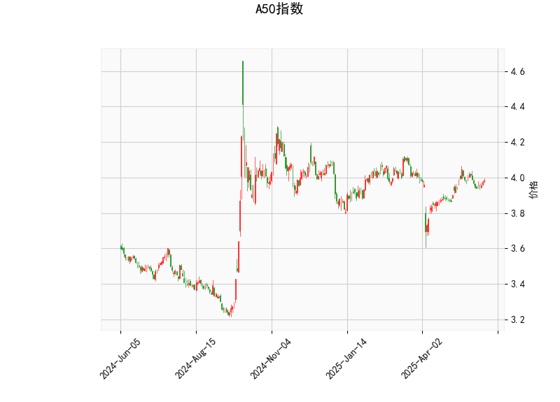

### A50指数技术分析结果解读

#### 1. 技术指标综合分析
- **当前价与布林轨道**：  
  当前价（3.984）位于布林带中轨（3.9478）上方，接近上轨（4.126），但未突破上轨压力位，显示短期价格处于**中性偏强区域**。若后续价格站稳中轨并向上轨靠近，可能延续反弹；若跌破中轨，则可能向下轨（3.769）回落。

- **RSI（55.49）**：  
  RSI处于中性区域（50-70），表明市场**无超买或超卖信号**，多空力量相对均衡。需关注RSI是否突破60（可能增强看涨）或跌破50（转向看跌）。

- **MACD指标**：  
  - MACD线（0.0096）低于信号线（0.0128），形成轻微**死叉**，但两者数值均接近零轴，显示动能较弱。  
  - MACD柱状图（-0.00316）为负值，表明短期**空头动能略占优**，但力度有限，市场可能进入盘整阶段。

- **K线形态（纺锤顶）**：  
  纺锤顶（CDLSPINNINGTOP）反映价格波动收窄，多空双方博弈激烈，但未形成明确方向。结合当前价位于布林带中轨附近，暗示短期可能延续震荡。

---

#### 2. 近期投资机会与策略

##### **潜在机会**  
1. **区间交易（布林带策略）**：  
   - **多头机会**：若价格站稳中轨（3.9478）并向上轨（4.126）反弹，可轻仓介入，目标价4.1附近，止损设于中轨下方。  
   - **空头机会**：若价格跌破中轨并向下轨（3.769）回落，可考虑短线做空，目标价3.77-3.8区间，止损设于中轨上方。  

2. **趋势突破策略**：  
   - 若价格放量突破布林带上轨（4.126），可能开启新一轮上涨，可追多，目标价看向前高4.2以上。  
   - 若价格跌破下轨（3.769），可能加速下跌，需警惕趋势反转风险。

3. **MACD金叉/死叉信号**：  
   - 若MACD线向上突破信号线（金叉），配合RSI回升至60以上，可视为短期做多信号。  
   - 若MACD死叉延续且RSI跌破50，则需防范回调风险。

##### **风险提示**  
- 当前市场处于**震荡市**，MACD和RSI均无强势信号，需警惕假突破。  
- 纺锤顶形态需结合后续K线确认方向，若出现大阳/阴线，可能打破盘整格局。  
- 若布林带收窄后突然扩张，可能伴随波动率上升，需灵活调整仓位。

##### **套利思路**  
- **跨期套利**：若近月合约与远月合约价差扩大，可关注正向套利（买入近月、卖出远月）。  
- **波动率策略**：若布林带持续收窄后选择方向，可布局期权（如买入跨式组合），捕捉突破后的波动收益。

---

### 总结  
短期A50指数或维持震荡，建议以**区间交易为主**，重点关注布林带边界和MACD动能变化。若出现明确突破信号（如放量突破上轨/下轨），可顺势跟进。中长线投资者需等待更明确的趋势信号（如RSI脱离中性区、MACD脱离零轴）。