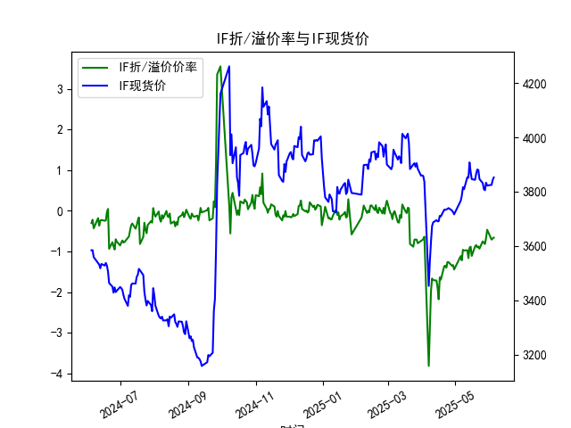
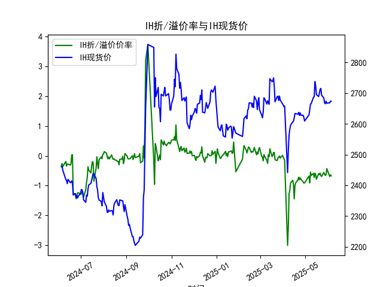
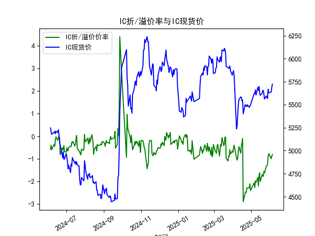
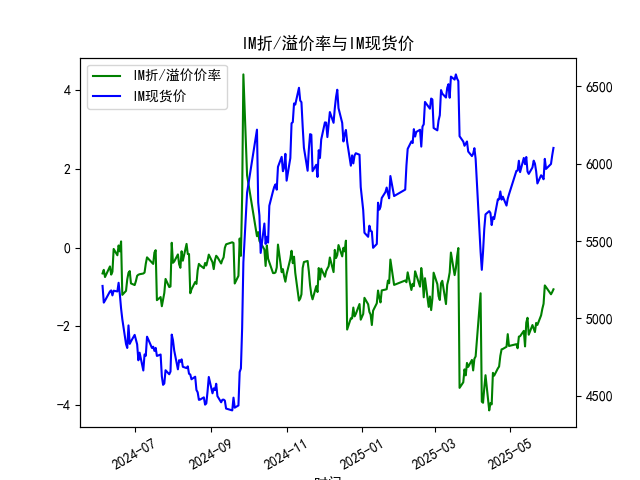

|            |   IF折/溢价率 |   IF现货价 |   IH折/溢价率 |   IH现货价 |   IC折/溢价率 |   IC现货价 |   IM折/溢价率 |   IM现货价 |
|:-----------|--------------:|-----------:|--------------:|-----------:|--------------:|-----------:|--------------:|-----------:|
| 2025-05-08 |     -0.957625 |     3816   |     -0.548944 |     2664.8 |     -1.97107  |     5660   |     -2.2617   |     6018.8 |
| 2025-05-09 |     -0.976471 |     3808.6 |     -0.663397 |     2666.2 |     -2.04348  |     5604.8 |     -2.25057  |     5945.2 |
| 2025-05-12 |     -0.966676 |     3853   |     -0.592655 |     2686.6 |     -1.82396  |     5688   |     -2.1153   |     6037   |
| 2025-05-13 |     -1.16158  |     3851   |     -0.733322 |     2688.2 |     -2.19778  |     5654.6 |     -2.51032  |     5996.6 |
| 2025-05-14 |     -0.908163 |     3907.4 |     -0.587737 |     2737.6 |     -1.74715  |     5697.8 |     -1.90524  |     6043   |
| 2025-05-15 |     -0.880406 |     3872.8 |     -0.631231 |     2723   |     -1.6149   |     5623   |     -1.78364  |     5949   |
| 2025-05-16 |     -1.10785  |     3846   |     -0.790006 |     2695.2 |     -1.99531  |     5601.8 |     -2.21348  |     5933.8 |
| 2025-05-19 |     -0.875523 |     3843.2 |     -0.602139 |     2688.8 |     -1.70946  |     5623   |     -1.96768  |     5975.4 |
| 2025-05-20 |     -0.840664 |     3865.4 |     -0.63422  |     2699.4 |     -1.6802   |     5650.8 |     -2.06014  |     6019.4 |
| 2025-05-21 |     -0.898296 |     3881.2 |     -0.580049 |     2712.6 |     -1.77707  |     5655.6 |     -2.14574  |     6000.6 |
| 2025-05-22 |     -0.87548  |     3879.6 |     -0.666962 |     2715.4 |     -1.55138  |     5614.8 |     -1.91397  |     5950   |
| 2025-05-23 |     -0.9292   |     3846.2 |     -0.695185 |     2693   |     -1.61406  |     5561.8 |     -1.96463  |     5872   |
| 2025-05-26 |     -0.748858 |     3831.2 |     -0.556508 |     2684.4 |     -1.32042  |     5594.6 |     -1.72151  |     5925   |
| 2025-05-27 |     -0.786501 |     3809.2 |     -0.621209 |     2668.6 |     -1.31181  |     5578   |     -1.55547  |     5915   |
| 2025-05-28 |     -0.814251 |     3805   |     -0.658307 |     2665.4 |     -1.22822  |     5568   |     -1.42796  |     5899   |
| 2025-05-29 |     -0.671205 |     3832.8 |     -0.642634 |     2673.6 |     -0.897044 |     5668.6 |     -0.961935 |     6031   |
| 2025-05-30 |     -0.464355 |     3822.4 |     -0.429145 |     2667.2 |     -0.763036 |     5627.8 |     -1.00489  |     5966   |
| 2025-06-03 |     -0.706454 |     3824.8 |     -0.695718 |     2668.6 |     -0.991047 |     5638.4 |     -1.18676  |     5998   |
| 2025-06-04 |     -0.680916 |     3842.4 |     -0.640112 |     2673.6 |     -0.874817 |     5688.8 |     -1.12968  |     6054   |
| 2025-06-05 |     -0.659067 |     3852   |     -0.673396 |     2674   |     -0.803601 |     5723.6 |     -1.06072  |     6101.6 |

### 1. 股指期货折/溢价率与现货价的相关性及影响逻辑

#### （1）折/溢价率的定义与形成逻辑
- **折价率**（负值）：期货价格低于现货价格，反映市场对未来的悲观预期（如流动性紧张、风险偏好下降、套利资金抛售期货对冲等）。
- **溢价率**（正值）：期货价格高于现货价格，反映市场对未来的乐观预期（如资金成本较低、分红预期消化完毕、套利需求推动期货上涨）。

#### （2）与现货价的相关性
- **正向联动**：当期货折价率收窄（或溢价率扩大）且现货价格上涨时，通常表明市场情绪改善，资金通过期货市场提前布局现货上涨预期。
- **反向信号**：若期货折价率持续扩大但现货价格仍上涨，可能隐含远期风险（如流动性收紧预期），需警惕现货回调压力。
- **均值回归特性**：长期来看，折/溢价率受套利机制约束会向零轴回归，短期偏离可能创造套利机会。

#### （3）影响逻辑
- **资金成本与股息率**：期货定价模型（F=S×e^{(r-q)T}）中，折/溢价率受无风险利率（r）与股息率（q）差值驱动。
- **市场情绪放大器**：高波动环境下，折价率扩大可能加剧现货抛压（如IM期货折价率常高于其他品种，反映小盘股情绪更敏感）。
- **跨期结构信号**：主力合约临近交割时，折价率快速收敛可能预示现货方向选择。

---

### 2. 近期投资机会分析（聚焦最近一周）

#### （1）IF（沪深300指数期货）
- **最新数据**（2025-06-05）：折价率-0.659%（前日-0.680%），现货价3852.0（前日3842.4）。
- **信号**：折价率连续2日收窄且现货上涨，反映悲观情绪缓解，短期或存在期货补涨机会。

#### （2）IH（上证50指数期货）
- **最新数据**（2025-06-05）：折价率-0.673%（前日-0.640%），现货价2674.0（前日2673.6）。
- **矛盾信号**：折价率小幅扩大但现货微涨，需警惕大盘蓝筹股短期滞涨风险。

#### （3）IC（中证500指数期货）
- **最新数据**（2025-06-05）：折价率-0.804%（前日-0.875%），现货价5723.6（前日5688.8）。
- **机会**：折价率显著收窄+现货大涨1.2%，中盘股情绪修复明显，可关注期现套利（做多期货+做空现货）。

#### （4）IM（中证1000指数期货）
- **最新数据**（2025-06-05）：折价率-1.061%（前日-1.130%），现货价6101.6（前日6054.0）。
- **核心机会**：折价率收窄幅度最大（6.1%）+现货涨幅最大（2.0%），小盘股超跌反弹动能强劲，短期做多IM期货性价比高。

#### （5）跨品种策略
- **多IC/IM空IH**：中小盘折价率修复速度快于大盘股，且IC/IM现货弹性更高，可博弈风格切换。
- **风险提示**：关注6月交割周（2025-06-03至06-05）后移仓换月对折价率的短期扰动。

---

### 总结
**重点机会**：  
① **IM期货趋势做多**（折价率快速收窄+现货突破关键位）；  
② **IC期现套利**（利用折价率均值回归特性）；  
③ **IF短线波段**（折价率与现货价同步改善）。  
**风险点**：需防范7-8月传统流动性收紧周期对折价率的压制。

