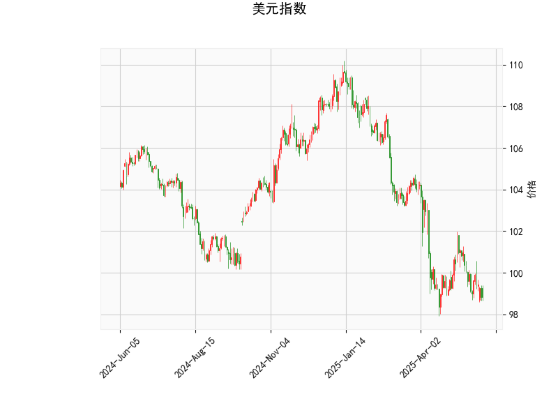

# 美元指数技术分析解读

## 一、美元指数技术分析结论
### 1. 当前价格与布林轨道关系
- **价格位置**：当前价98.81显著低于布林带中轨（101.06），且接近下轨（97.10），表明美元指数处于短期超卖区域。布林带开口向下，说明市场波动性较高，但价格接近下轨可能触发短期反弹需求。
- **潜在方向**：若价格站稳下轨并反弹突破中轨（101.06），可能确认短期底部；若下破下轨，则可能加速下跌。

### 2. RSI指标
- **数值解读**：RSI为39.29，略低于中性水平（40），但未进入超卖区（30以下）。反映市场抛压占优但未极端化，需警惕进一步下跌风险。
- **背离信号**：若价格创新低而RSI未同步下行，可能形成底背离，暗示反弹可能。

### 3. MACD指标
- **动能分析**：MACD线（-0.486）低于信号线（-0.442），但负柱状图（-0.044）开始收敛，显示下跌动能减弱。若MACD上穿信号线形成“金叉”，可能预示反弹启动。
- **趋势验证**：需观察MACD能否持续向零轴靠拢，以确认趋势反转。

### 4. K线形态
- **CDLLONGLINE（长实体线）**：当前K线实体较长且收于低位，表明空头占据主导，但若下一根K线反转收高，可能形成“锤子线”见底信号。
- **CDLMATCHINGLOW（平头底部）**：连续两日低点相近，反映空头动能衰减，短期或有反弹尝试。

**综合判断**：美元指数短期存在超跌反弹可能性，但需突破中轨101.06才能确认趋势反转；若持续承压于中轨下方，则中期弱势格局难改。

---

# 近期A股/港股投资机会与策略

## 二、A股与港股联动性机会
### 1. **AH股溢价套利**
- **现状**：AH溢价指数长期高于130（部分金融股A股较H股溢价超40%），可关注溢价率较高的个股（如中信证券、中国平安）。
- **策略**：
  - **做多H股+做空A股**：通过港股通买入H股，同时融券卖出A股，赚取溢价收敛收益。
  - **风险提示**：需关注流动性风险及政策变动（如印花税调整）。

### 2. **跨境行业轮动**
- **受益板块**：
  - **科技股**：若美元走弱提振风险偏好，港股科技板块（腾讯、美团）及A股半导体（中芯国际、北方华创）或受益。
  - **消费与医药**：港股创新药（药明生物）与A股消费龙头（贵州茅台）可能受外资回流驱动。

## 三、美元指数关联策略
### 1. **汇率敏感型资产**
- **港股高分红资产**：若美元反弹受阻，港币挂钩美元资产吸引力下降，资金可能流入高分红港股（如中移动、汇丰控股）。
- **出口导向型行业**：美元走弱利好A股出口企业（家电、机械），关注格力电器、三一重工。

### 2. **大宗商品联动**
- **资源股机会**：美元弱势通常支撑大宗商品价格，关注港股油气（中海油）、A股有色金属（紫金矿业）的反弹机会。

## 四、风险提示
1. **美元反弹风险**：若美联储释放鹰派信号或地缘冲突升级，可能导致美元快速走强，压制新兴市场。
2. **政策监管**：A股需防范行业政策收紧（如新能源补贴退坡），港股关注国际资本流动限制风险。
3. **技术面验证**：建议结合成交量放大、MACD金叉等信号确认趋势后再布局。

**操作建议**：短期可轻仓参与超跌反弹（如恒生科技指数ETF），中长期关注低估值高分红的港股金融与消费板块，同时利用AH溢价套利对冲市场波动。