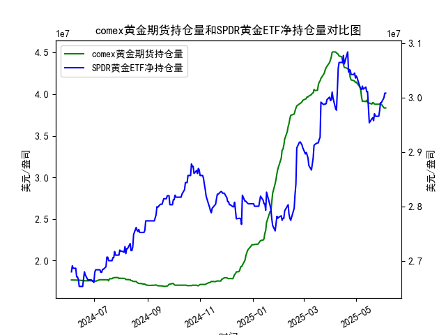

|            |   comex黄金期货持仓量 |   SPDR黄金ETF净持仓量 |
|:-----------|----------------------:|----------------------:|
| 2025-05-07 |           3.96819e+07 |           3.0147e+07  |
| 2025-05-08 |           3.91313e+07 |           3.02115e+07 |
| 2025-05-09 |           3.91541e+07 |           3.01557e+07 |
| 2025-05-12 |           3.91172e+07 |           3.01926e+07 |
| 2025-05-13 |           3.92705e+07 |           3.01096e+07 |
| 2025-05-14 |           3.90037e+07 |           3.01096e+07 |
| 2025-05-15 |           3.89209e+07 |           2.98239e+07 |
| 2025-05-16 |           3.89209e+07 |           2.95382e+07 |
| 2025-05-19 |           3.88155e+07 |           2.96119e+07 |
| 2025-05-20 |           3.89849e+07 |           2.96303e+07 |
| 2025-05-21 |           3.89515e+07 |           2.9575e+07  |
| 2025-05-22 |           3.87935e+07 |           2.97041e+07 |
| 2025-05-23 |           3.87881e+07 |           2.9658e+07  |
| 2025-05-27 |           3.87875e+07 |           2.9658e+07  |
| 2025-05-28 |           3.88146e+07 |           2.97594e+07 |
| 2025-05-29 |           3.87892e+07 |           2.99068e+07 |
| 2025-05-30 |           3.87892e+07 |           2.99068e+07 |
| 2025-06-02 |           3.83496e+07 |           2.9999e+07  |
| 2025-06-03 |           3.8328e+07  |           3.00819e+07 |
| 2025-06-04 |           3.8353e+07  |           3.00819e+07 |

### 1. COMEX黄金期货持仓量与SPDR黄金ETF净持仓量的相关性及影响逻辑

#### 相关性分析
- **COMEX黄金期货持仓量**：反映市场投机资金和套保头寸的活跃度，短期波动受情绪驱动（如地缘风险、美元走势）。持仓量增加通常代表多空博弈加剧，高杠杆属性会放大价格波动。
- **SPDR黄金ETF净持仓量**：代表实物黄金的长期投资需求，与避险情绪、通胀预期挂钩。净流入（增持）表明资金对黄金的配置需求上升，往往与金价正相关。

**逻辑关系**：
- **同向变动**：若两者同步增仓（如期货多头加仓+ETF资金流入），说明短期投机与长期投资形成共振，金价上涨动力强；反之同步减仓则预示市场看空。
- **背离信号**：若期货持仓上升但ETF减持，可能是短期投机过热但长期资金撤退，需警惕价格回调；反之期货减仓但ETF增持，则可能是短期调整但长期趋势未改。

---

### 2. 近期投资机会分析（聚焦最近一周及今日变化）

#### 数据观察（假设今日为最后一日数据）：
- **COMEX期货持仓量**：
  - **最近一周趋势**：持仓量从38,349,604.94（前5日）小幅波动至38,353,043.55（今日），整体呈低位震荡，今日环比微增0.06%。
  - **关键变化**：持仓量连续多日未突破前期低点，空头平仓迹象隐现，但未形成明确反转信号。

- **SPDR黄金ETF净持仓量**：
  - **最近一周趋势**：净持仓从30,081,919.75（前5日）持平至今日，资金观望情绪浓厚。
  - **关键变化**：ETF持仓量近一周无显著波动，与COMEX的弱反弹形成背离。

#### 潜在机会判断：
1. **短期反弹博弈**：
   - COMEX持仓量今日微增，可能暗示空头力量减弱，若金价配合技术面超跌反弹，可关注日内做多机会。
   - **风险**：ETF资金未跟进，反弹持续性存疑，需快进快出。

2. **中长期布局窗口**：
   - COMEX持仓量处近1个月低位，若未来1-2周出现持仓量回升+ETF同步增仓，可能确认底部信号。
   - **触发条件**：突破COMEX持仓量38,500,000的阻力位或SPDR持仓量单日增超1%。

#### 操作建议：
- **谨慎追多**：当前缺乏ETF资金支持，短期反弹空间有限，可轻仓试多但需设置止损（如金价跌破关键支撑）。
- **空头警惕**：若COMEX持仓量再度放量下跌，可能引发新一轮抛售，但需结合美元指数等外部指标验证。