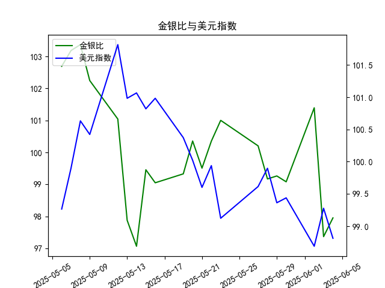

|            |    金价 |   银价 |   美元指数 |   金银比 |
|:-----------|--------:|-------:|-----------:|---------:|
| 2025-05-07 | 3392.25 | 32.875 |    99.9006 | 103.186  |
| 2025-05-08 | 3352.3  | 32.43  |   100.633  | 103.37   |
| 2025-05-09 | 3324.55 | 32.515 |   100.422  | 102.247  |
| 2025-05-12 | 3235.4  | 32.02  |   101.814  | 101.043  |
| 2025-05-13 | 3227.95 | 32.98  |   100.983  |  97.876  |
| 2025-05-14 | 3191.95 | 32.885 |   101.066  |  97.064  |
| 2025-05-15 | 3191.05 | 32.085 |   100.82   |  99.4561 |
| 2025-05-16 | 3182.95 | 32.135 |   100.983  |  99.0493 |
| 2025-05-19 | 3230.15 | 32.52  |   100.373  |  99.3281 |
| 2025-05-20 | 3261.55 | 32.5   |   100.022  | 100.355  |
| 2025-05-21 | 3299.65 | 33.16  |    99.6014 |  99.5069 |
| 2025-05-22 | 3284    | 32.725 |    99.9388 | 100.351  |
| 2025-05-23 | 3342.65 | 33.095 |    99.1231 | 101.002  |
| 2025-05-27 | 3296.7  | 32.9   |    99.6147 | 100.204  |
| 2025-05-28 | 3300.85 | 33.285 |    99.8978 |  99.1693 |
| 2025-05-29 | 3312.4  | 33.37  |    99.3633 |  99.2628 |
| 2025-05-30 | 3277.55 | 33.08  |    99.4393 |  99.0795 |
| 2025-06-02 | 3370.85 | 33.245 |    98.6893 | 101.394  |
| 2025-06-03 | 3334.75 | 34.25  |    99.2781 |  97.365  |
| 2025-06-04 | 3364.6  | 34.35  |    98.8128 |  97.9505 |

### 1. 金银比与美元指数的相关性及影响逻辑

#### 相关性
金银比（黄金价格/白银价格）与美元指数通常呈现**负相关性**，但这一关系可能因市场环境波动而阶段性失效。从长期逻辑看：
- **美元走强**时，以美元计价的金银价格承压，但白银（工业属性占比50%以上）受经济预期拖累更明显，导致**金银比上升**（黄金相对抗跌）。
- **美元走弱**时，金银价格受计价效应提振，但白银因经济复苏预期或通胀升温（工业需求+投机属性）涨幅常高于黄金，导致**金银比下降**。

#### 核心影响因素
1. **避险情绪**：若市场风险偏好骤降（如地缘冲突），黄金避险属性强于白银，金银比与美元可能短期同步上升（避险资金同时涌入美元和黄金）。
2. **通胀预期**：高通胀环境下，白银工业需求预期叠加抗通胀属性，可能导致金银比与美元指数负相关性增强。
3. **流动性环境**：美联储宽松周期中，美元贬值与流动性宽松共同驱动白银投机性买盘，压制金银比。

---

### 2. 近期投资机会分析（聚焦最后一周）

#### 数据关键变化（2025年5月28日-6月4日）
- **金银比**：从5月28日的99.17波动上升至6月2日的101.39，随后大幅回落至6月3日的97.36（**单日暴跌4%**），6月4日小幅反弹至97.95。
- **美元指数**：从5月28日的99.90震荡下跌至6月4日的98.81（**整体贬值1.1%**），但6月3日意外反弹至99.28（单日+0.6%）。

#### 机会解读
1. **金银比短期超跌反弹**（6月4日）：
   - 6月3日金银比暴跌可能反映白银超涨（或黄金超跌），而6月4日比值修复与美元指数回落同步，暗示市场对前日过度波动的修正。若美元延续弱势，可关注**做多黄金/白银比价**的均值回归机会。

2. **美元弱势驱动的贵金属多头**：
   - 最近一周美元指数持续下行（除6月3日外），6月4日进一步跌至98.81，接近一个月低点。若美元破位确认，**黄金、白银均存在趋势性做多机会**，但需优先选择更强品种：
     - 黄金：6月4日金银比反弹显示其相对抗跌，适合风险厌恶型配置。
     - 白银：若经济数据（如制造业PMI）超预期，可能因工业属性补涨。

3. **事件冲击博弈**（6月3日异常波动）：
   - 6月3日美元指数反弹但金银比暴跌，可能与当日突发风险事件（如白银库存骤降、投机资金撤离黄金）有关。若消息面平静后市场回归基本面逻辑，可反向操作套利。

#### 今日（6月4日）vs 昨日（6月3日）信号
- **金银比回升**（97.36 → 97.95）：黄金相对白银从弱势转为企稳，可能反映避险情绪边际升温。
- **美元延续下行**（99.28 → 98.81）：计价效应继续支撑贵金属，但需警惕技术性反弹风险。

---

### 结论
**优先策略**：做多黄金（受益于美元弱势+避险需求），次选做多白银（需经济数据配合）。  
**风险提示**：6月3日异常波动需确认是否为短期噪音，建议结合实时消息面调整仓位。