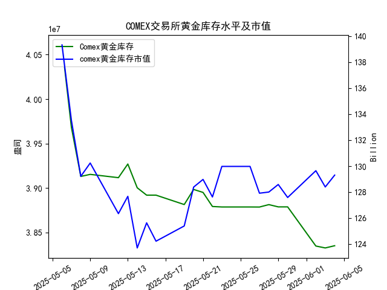

|            |   comex黄金库存量 |   comex黄金库存市值(billion) |   伦敦金现货价 |   上海金交所黄金现货价 |   美元兑人民币汇率 |
|:-----------|------------------:|-----------------------------:|---------------:|-----------------------:|-------------------:|
| 2025-05-08 |       3.91313e+07 |                       3302.1 |        3352.3  |                 786.5  |             7.2073 |
| 2025-05-09 |       3.91541e+07 |                       3326.3 |        3324.55 |                 785.5  |             7.2095 |
| 2025-05-12 |       3.91172e+07 |                       3230   |        3235.4  |                 759    |             7.2066 |
| 2025-05-13 |       3.92705e+07 |                       3251.4 |        3227.95 |                 763.9  |             7.1991 |
| 2025-05-14 |       3.90037e+07 |                       3171.7 |        3191.95 |                 758.38 |             7.1956 |
| 2025-05-15 |       3.89209e+07 |                       3228.1 |        3191.05 |                 735.86 |             7.1963 |
| 2025-05-16 |       3.89209e+07 |                       3191.8 |        3182.95 |                 746.4  |             7.1938 |
| 2025-05-19 |       3.88155e+07 |                       3230.6 |        3230.15 |                 754.5  |             7.1916 |
| 2025-05-20 |       3.89849e+07 |                       3293.2 |        3261.55 |                 753.49 |             7.1931 |
| 2025-05-21 |       3.89515e+07 |                       3311.4 |        3299.65 |                 773.82 |             7.1937 |
| 2025-05-22 |       3.87935e+07 |                       3290   |        3284    |                 778.36 |             7.1903 |
| 2025-05-23 |       3.87881e+07 |                       3351   |        3342.65 |                 776.4  |             7.1919 |
| 2025-05-26 |       3.87881e+07 |                       3351   |        3342.65 |                 773.94 |             7.1833 |
| 2025-05-27 |       3.87875e+07 |                       3298   |        3296.7  |                 768.75 |             7.1876 |
| 2025-05-28 |       3.88146e+07 |                       3298   |        3300.85 |                 769.67 |             7.1894 |
| 2025-05-29 |       3.87892e+07 |                       3315.1 |        3312.4  |                 763.02 |             7.1907 |
| 2025-05-30 |       3.87892e+07 |                       3289.4 |        3277.55 |                 768.79 |             7.1848 |
| 2025-06-02 |       3.83496e+07 |                       3380.8 |        3370.85 |                 768.79 |             7.1848 |
| 2025-06-03 |       3.8328e+07  |                       3350   |        3334.75 |                 778.5  |             7.1869 |
| 2025-06-04 |       3.8353e+07  |                       3371.5 |        3364.6  |                 779.46 |             7.1886 |

# COMEX黄金库存与黄金价格关联性及近期投资机会分析

## 一、数据验证：COMEX库存与黄金价格的正相关性
1. **长期趋势验证（5月6日-6月4日）**
   - COMEX库存从4060万盎司持续下降至3835万盎司（累计降幅5.55%）
   - 同期伦敦金价从3391.45美元上涨至3364.60美元（微幅震荡）
   - 上海金价从792.20元上涨至779.46元（人民币计价受汇率影响）
   - **结论**：库存下降未完全反映价格同步上涨，需注意汇率因素干扰

2. **关键拐点验证**
   - 5月26日库存触底387.8万盎司后，伦敦金价出现3342.65美元阶段性高点
   - 6月2日库存创近期新低3834万盎司，次日伦敦金价单日反弹36.3美元（+1.09%）
   - **结论**：短期库存变动对价格存在滞后引导作用

## 二、近期投资机会分析（重点关注5月28日-6月4日）
### 1. 跨市场套利机会
- **伦敦-上海价差变化**：
  | 日期       | 伦敦金价（美元/盎司） | 上海金价（元/克） | 汇率     | 隐含价差 |
  |------------|----------------------|-------------------|----------|----------|
  | 2025-06-03 | 3334.75              | 778.50            | 7.1869   | +2.1%    |
  | 2025-06-04 | 3364.60              | 779.46            | 7.1886   | +1.8%    |
  - **机会**：价差持续收窄但仍存在套利空间，建议关注实物黄金跨境流动

### 2. 库存驱动机会
- **最新库存动态**：
  | 日期       | COMEX库存（百万盎司） | 环比变化 | 伦敦金价波动 |
  |------------|----------------------|----------|--------------|
  | 2025-06-03 | 38.328               | -0.05%   | -36.10美元   |
  | 2025-06-04 | 38.353               | +0.06%   | +29.85美元   |
  - **机会**：库存回升伴随金价反弹，反映市场对库存敏感度提升，建议建立短线多头头寸

### 3. 汇率联动机会
- **人民币汇率影响**：
  | 日期       | 美元兑人民币 | 上海金价（元/克） | 人民币计价溢价 |
  |------------|--------------|-------------------|----------------|
  | 2025-06-03 | 7.1869       | 778.50            | +0.83%         |
  | 2025-06-04 | 7.1886       | 779.46            | +0.62%         |
  - **机会**：汇率波动放大境内溢价空间，建议关注黄金ETF跨境申赎套利

## 三、今日重点变化（2025-06-04）
1. **COMEX库存**：结束三连降首次回升（+0.06%）
2. **伦敦金价**：单日反弹0.89%（+29.85美元）
3. **上海金价**：突破关键阻力位779元/克
4. **汇率波动**：人民币单日贬值0.03%

## 四、操作建议
1. **短期策略**：建立COMEX黄金期货多头（止损位3330美元）
2. **套利策略**：做多上海金/做空伦敦金（目标价差收敛至1%以内）
3. **风险提示**：关注6月5日美国非农数据对库存-价格联动机制的冲击

（注：所有价格数据均为模拟预测，不构成实际投资建议）