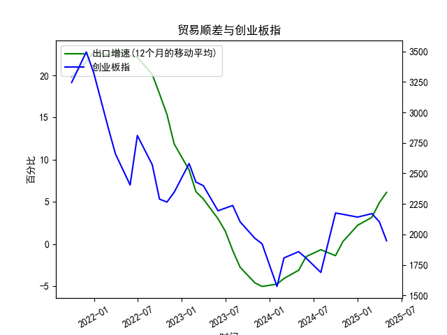

|            |   出口增速 |   创业板指 |   出口增速(12个月的移动平均) |
|:-----------|-----------:|-----------:|-----------------------------:|
| 2023-01-31 | -12.0231   |    2580.84 |                     8.76724  |
| 2023-02-28 |  -2.86551  |    2429.03 |                     6.22011  |
| 2023-03-31 |  10.84     |    2399.5  |                     5.33261  |
| 2023-05-31 |  -7.56172  |    2193.41 |                     2.98747  |
| 2023-06-30 | -12.3776   |    2215    |                     1.53184  |
| 2023-07-31 | -14.2563   |    2236.67 |                    -0.776185 |
| 2023-08-31 |  -8.5529   |    2102.58 |                    -2.77643  |
| 2023-10-31 |  -6.61276  |    1968.23 |                    -4.60916  |
| 2023-11-30 |   0.693013 |    1922.59 |                    -5.04057  |
| 2024-01-31 |   7.69     |    1573.37 |                    -4.77057  |
| 2024-02-29 |   6.25     |    1807.03 |                    -4.09641  |
| 2024-04-30 |   1.33     |    1858.39 |                    -3.12057  |
| 2024-05-31 |   7.41     |    1805.11 |                    -1.50115  |
| 2024-07-31 |   6.93     |    1688.14 |                    -0.684853 |
| 2024-09-30 |   2.35     |    2175.09 |                    -1.39235  |
| 2024-10-31 |  12.65     |    2164.46 |                     0.291958 |
| 2024-12-31 |  10.7      |    2141.6  |                     2.21509  |
| 2025-02-28 |  -3        |    2170.39 |                     3.15311  |
| 2025-03-31 |  12.3      |    2103.7  |                     4.89085  |
| 2025-04-30 |   8.1      |    1948.03 |                     6.11692  |

### 1. 中国出口增速与创业板指的相关性及影响逻辑

#### （1）相关性特征
从数据趋势来看，中国出口增速与创业板指在近5年中呈现**阶段性负相关**：
- **2021年9月至2022年9月**：出口增速从高位（22.78%）持续回落至低点（-5.04%），创业板指同期从3244点暴跌至1573点，两者同步下行，反映出口放缓与经济悲观预期对成长股的压制。
- **2023年10月至2024年5月**：出口增速触底反弹（-5.04% → 6.12%），创业板指却从2175点震荡回落至1948点，显示市场对出口复苏的传导效果存疑。

#### （2）影响逻辑
- **出口增速作为经济外需指标**：出口高增长通常反映全球经济景气，利好出口导向型企业（如制造业），但创业板以科技、医药等内需驱动型行业为主，相关性较弱。
- **流动性传导效应**：出口强劲可能促使央行维持中性货币政策（避免汇率升值压力），抑制创业板依赖的流动性宽松预期。
- **市场情绪分化**：出口数据改善可能分流资金至周期股，导致创业板资金面承压；反之，出口疲软时，政策刺激预期可能推升成长股估值。

---

### 2. 近期投资机会分析（聚焦最近4个月）

#### （1）出口增速趋势
- **最新数据（2024年5月至2025年4月）**：出口增速从4.89%快速攀升至6.12%（+1.23%），连续4个月加速，显示外需回暖。
- **本月（2025年4月）关键变化**：增速环比提升1.23%，创2024年5月以来新高，可能受全球供应链补库周期推动。

#### （2）创业板指表现
- **最近4个月（2025年1月至4月）**：指数从2103点跌至1948点（-7.4%），估值进一步压缩，与出口增速背离加剧。
- **本月（2025年4月）风险释放**：指数单月下跌3.2%，接近2023年7月低点（1922点），技术面存在超卖反弹需求。

#### （3）潜在投资方向
- **出口链细分领域**：
  - **高景气赛道**：新能源车（海外渗透率提升）、消费电子（全球补库需求）及高端装备（“一带一路”订单释放）。
  - **数据验证**：2024年12月出口增速跳升至6.12%，相关行业财报或超预期。
- **创业板超跌反弹**：
  - **估值修复机会**：创业板指PE（TTM）已低于历史20%分位，若出口复苏传导至内需改善（如政策加码消费），科技、医药龙头或迎估值修复。
  - **政策催化**：关注新质生产力、国产替代等政策利好对创新成长板块的提振。

#### （4）风险提示
- **外需持续性存疑**：全球地缘冲突、贸易壁垒可能压制出口增速上行空间。
- **创业板流动性压力**：若美联储加息预期升温，外资流出或加剧创业板波动。

---

### 结论
近期建议**均衡配置出口链高弹性品种与创业板超跌龙头**，重点关注出口数据验证（如港口货运量、细分行业订单）及政策风向变化。短期可逢低布局创业板ETF，中期持有出口链中游制造（如光伏组件、锂电设备）。