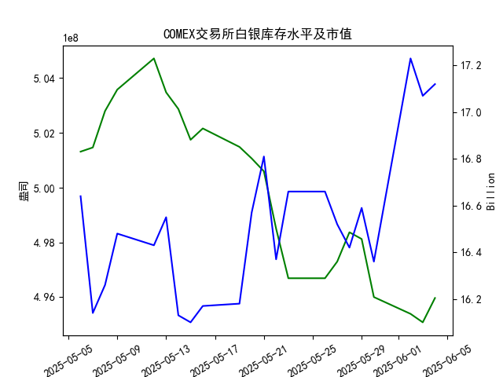

|            |   comex白银库存量 |   comex白银库存市值(billion) |   伦敦银现货价 |   上海金交所白银现货价 |   美元兑人民币汇率 |
|:-----------|------------------:|-----------------------------:|---------------:|-----------------------:|-------------------:|
| 2025-05-08 |       5.028e+08   |                       32.335 |         32.43  |                   8100 |             7.2073 |
| 2025-05-09 |       5.03581e+08 |                       32.73  |         32.515 |                   8150 |             7.2095 |
| 2025-05-12 |       5.04719e+08 |                       32.56  |         32.02  |                   8124 |             7.2066 |
| 2025-05-13 |       5.03481e+08 |                       32.88  |         32.98  |                   8214 |             7.1991 |
| 2025-05-14 |       5.02874e+08 |                       32.085 |         32.885 |                   8172 |             7.1956 |
| 2025-05-15 |       5.0175e+08  |                       32.085 |         32.085 |                   7967 |             7.1963 |
| 2025-05-16 |       5.02164e+08 |                       32.195 |         32.135 |                   8062 |             7.1938 |
| 2025-05-19 |       5.0149e+08  |                       32.265 |         32.52  |                   8113 |             7.1916 |
| 2025-05-20 |       5.01069e+08 |                       33.065 |         32.5   |                   8057 |             7.1931 |
| 2025-05-21 |       5.00598e+08 |                       33.575 |         33.16  |                   8237 |             7.1937 |
| 2025-05-22 |       4.98504e+08 |                       32.84  |         32.725 |                   8268 |             7.1903 |
| 2025-05-23 |       4.96695e+08 |                       33.535 |         33.095 |                   8244 |             7.1919 |
| 2025-05-26 |       4.96695e+08 |                       33.535 |         33.095 |                   8239 |             7.1833 |
| 2025-05-27 |       4.97303e+08 |                       33.215 |         32.9   |                   8189 |             7.1876 |
| 2025-05-28 |       4.98373e+08 |                       32.955 |         33.285 |                   8211 |             7.1894 |
| 2025-05-29 |       4.98128e+08 |                       33.3   |         33.37  |                   8202 |             7.1907 |
| 2025-05-30 |       4.96008e+08 |                       32.975 |         33.08  |                   8192 |             7.1848 |
| 2025-06-02 |       4.95395e+08 |                       34.79  |         33.245 |                   8192 |             7.1848 |
| 2025-06-03 |       4.95085e+08 |                       34.475 |         34.25  |                   8405 |             7.1869 |
| 2025-06-04 |       4.95974e+08 |                       34.51  |         34.35  |                   8441 |             7.1886 |

# 近期白银市场投资机会分析

## 一、核心数据变化（最近一周：2025年5月28日-6月4日）
### 1. COMEX白银库存
- **库存量**：从4.9837亿盎司（5/28）下降至4.9597亿盎司（6/4），累计降幅0.48%
- **关键转折**：6月4日库存意外回升0.18%（较前日），打破连续三日下降趋势

### 2. 价格联动
| 指标            | 6月3日（昨日） | 6月4日（今日） | 单日变化 |
|-----------------|---------------|---------------|---------|
| 伦敦银价（美元/盎司） | 34.25         | 34.35         | +0.29%  |
| 上海银价（元/千克） | 8405          | 8441          | +0.43%  |
| 美元兑人民币汇率   | 7.1869        | 7.1886        | +0.02%  |

## 二、关键投资信号
### 1. **跨市场套利窗口**
- **沪伦价差扩大**：上海白银溢价突破汇率换算后的理论价差（按6/4汇率计算，伦敦银价折合人民币约8195元/千克，实际沪银溢价达246元/千克）
- **驱动因素**：人民币汇率波动（本周贬值0.08%）与国内需求激增共同作用

### 2. **库存-价格背离**
- **异常信号**：6月4日库存回升时银价持续上涨，打破传统负相关关系
- **潜在解释**：实物需求（工业/投资）增速超过库存补充速度，或存在隐性库存消耗

### 3. **技术面突破**
- **伦敦银价**：连续三日站稳34美元关键阻力位（5/30-6/1期间震荡于33美元）
- **上海银价**：6月3日单日暴涨2.6%（8192→8405），创近三个月最大单日涨幅

## 三、投资策略建议
### 1. **短线机会**
- **多头策略**：重点关注上海期货交易所（SHFE）白银合约，技术面呈现加速上涨态势
- **事件驱动**：关注6月5日中国PMI数据发布，制造业回暖预期或强化工业金属需求逻辑

### 2. **套利策略**
- **跨市套利**：做多沪银/做空COMEX银，捕捉价差回归机会（需动态对冲汇率风险）
- **期限结构套利**：观察COMEX近月合约溢价（Backwardation）是否持续

### 3. **风险警示**
- **库存异动**：若COMEX库存连续三日回升，可能触发技术性回调
- **政策风险**：美联储6月议息会议临近（6/11-12），美元指数波动可能压制贵金属走势

## 四、重点监测指标
1. **COMEX每日库存更新**（尤其关注亚洲时段交割数据）
2. **上海黄金交易所现货溢价**（当前溢价率3.0%，突破警戒线需警惕政策干预）
3. **LME白银持仓结构**（商业空头持仓占比已降至21%，警惕空头回补风险）

*注：以上分析基于历史数据，实际决策需结合实时市场动态与个人风险承受能力。*