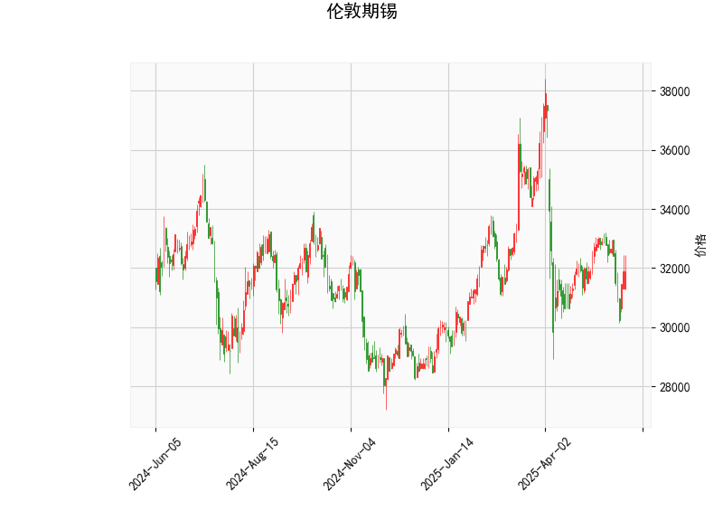

# 伦敦期锡技术分析与投资策略

## 一、技术分析结果解读

### 1. **关键指标分析**
- **当前价**：31,895美元，位于**布林通道中轨（32,880美元）与下轨（28,922美元）之间**，略低于中轨，显示短期价格处于弱势区间。
- **RSI（48.28）**：接近中性值50，表明市场情绪无明显超买或超卖，但存在向空方倾斜的潜在动能。
- **MACD**：MACD线（-240.75）低于信号线（-168.54），且MACD柱（-72.2）持续负值，反映**下跌动能仍在主导趋势**，但需关注潜在背离信号。
- **布林通道**：中轨（32,880美元）为短期压力位，若价格突破中轨可能转强；下轨（28,922美元）为关键支撑，若跌破可能加速下行。
- **K线形态**：CDLBELTHOLD（捉腰带线）形态出现，通常表示**空头占据优势**，需警惕价格延续下行趋势。

---

## 二、投资机会与策略建议

### 1. **短期趋势判断**
- **偏空格局**：当前价低于布林中轨、MACD负值扩散，结合K线看跌形态，短期可能进一步测试下轨支撑（28,922美元）。
- **潜在反转信号**：若价格反弹突破中轨（32,880美元）且MACD柱缩窄，可能开启反弹，目标看向上轨（36,838美元）。

### 2. **策略建议**
#### （1）**空头策略（保守型）**
- **入场条件**：价格反弹至中轨（32,880美元）附近受阻，或跌破31,000美元。
- **目标位**：下轨28,922美元。
- **止损位**：中轨上方33,000美元。

#### （2）**多头策略（激进型）**
- **入场条件**：价格站稳中轨32,880美元，且MACD柱开始收窄。
- **目标位**：上轨36,838美元。
- **止损位**：中轨下方31,500美元。

#### （3）**套利机会**
- **跨期套利**：若远期合约贴水扩大（Contango），可考虑买入近月合约、卖出远月合约，博弈价差收敛。
- **波动率交易**：布林通道收窄后可能伴随价格突破，可布局期权跨式组合（Long Straddle）。

---

## 三、风险提示
- **宏观因素干扰**：需关注美元指数、全球锡矿供应（如印尼出口政策）及工业需求变化。
- **技术面失效风险**：若价格快速突破中轨并伴随成交量放大，需及时调整空头仓位。

**结论**：当前技术面偏空，建议以反弹做空为主，密切跟踪中轨压力与MACD动能变化，严格设置止损。