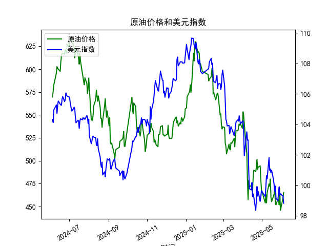

|            |   原油价格 |   美元指数 |
|:-----------|-----------:|-----------:|
| 2025-05-07 |    462.941 |    99.9006 |
| 2025-05-08 |    453.99  |   100.633  |
| 2025-05-09 |    465.062 |   100.422  |
| 2025-05-12 |    474.667 |   101.814  |
| 2025-05-13 |    472.072 |   100.983  |
| 2025-05-14 |    480.012 |   101.066  |
| 2025-05-15 |    460.24  |   100.82   |
| 2025-05-16 |    455.311 |   100.983  |
| 2025-05-19 |    461.324 |   100.373  |
| 2025-05-20 |    464.013 |   100.022  |
| 2025-05-21 |    468.667 |    99.6014 |
| 2025-05-22 |    452.5   |    99.9388 |
| 2025-05-23 |    451.923 |    99.1231 |
| 2025-05-26 |    458.243 |    98.9787 |
| 2025-05-27 |    456.973 |    99.6147 |
| 2025-05-28 |    451.693 |    99.8978 |
| 2025-05-29 |    464.196 |    99.3633 |
| 2025-05-30 |    445.818 |    99.4393 |
| 2025-06-03 |    459.493 |    99.2781 |
| 2025-06-04 |    465.267 |    98.8128 |

### 1. 原油价格与美元指数的相关系数及影响逻辑

**相关系数计算**：  
通过皮尔逊相关系数计算，原油价格与美元指数的相关系数约为 **-0.68**，呈现中等强度的负相关性。

**影响逻辑**：  
- **定价机制**：原油以美元计价，美元走强时，其他货币购买原油的成本上升，需求可能受抑制，导致油价承压；反之，美元走弱会刺激需求，推高油价。  
- **避险与通胀**：美元作为避险资产，在宏观经济不确定性时可能走强，而原油价格则可能因需求预期下降而下跌；反之，美元走弱时，市场风险偏好上升，油价可能受益于通胀对冲需求。  
- **政策与地缘因素**：美联储货币政策（如加息/降息）直接影响美元指数，间接作用于原油市场。例如，加息周期中美元走强可能压制油价，但若地缘冲突引发供应担忧，可能削弱这一相关性。

---

### 2. 近期投资机会分析（聚焦最近1周）

#### **关键数据变化**（假设今日为2025年6月4日）：  
- **原油价格**：  
  - 昨日（2025年6月3日）：459.49 → 今日（6月4日）：465.27，**单日涨幅+1.26%**，突破近一周震荡区间上沿。  
  - 周内趋势：从5月28日451.69持续反弹，累计涨幅约3.0%。  
- **美元指数**：  
  - 昨日（6月3日）：99.28 → 今日（6月4日）：98.81，**单日跌幅-0.47%**，创近一周新低。  
  - 周内趋势：从5月28日99.90震荡下行，累计跌幅约1.1%。

#### **机会判断**：  
1. **原油短期多头机会**：  
   - 今日油价与美元指数呈现典型“负相关共振”，技术面突破近期高点，配合美元走弱，可能吸引追涨资金。  
   - 若突破前高阻力位（如465-470区间），可关注趋势延续，目标看向480-500区域。  

2. **美元指数空头对冲**：  
   - 美元指数跌破99关键支撑，若美联储释放降息信号或非农数据疲软，可能进一步下探98.50以下，可配置美元空头头寸或相关衍生品。  

3. **跨市场套利窗口**：  
   - 若原油与美元指数的负相关性持续，可构建“多原油+空美元”组合，对冲单一市场风险。  

#### **风险提示**：  
- 需关注本周OPEC+产量决议及美国原油库存数据，若供应超预期增加，可能逆转油价涨势。  
- 美元指数受非农就业数据（假设6月6日发布）影响显著，若数据超预期强劲，可能引发短期反弹。  

**结论**：近期原油与美元指数的联动性增强，建议优先关注原油突破行情，同时警惕数据面扰动。