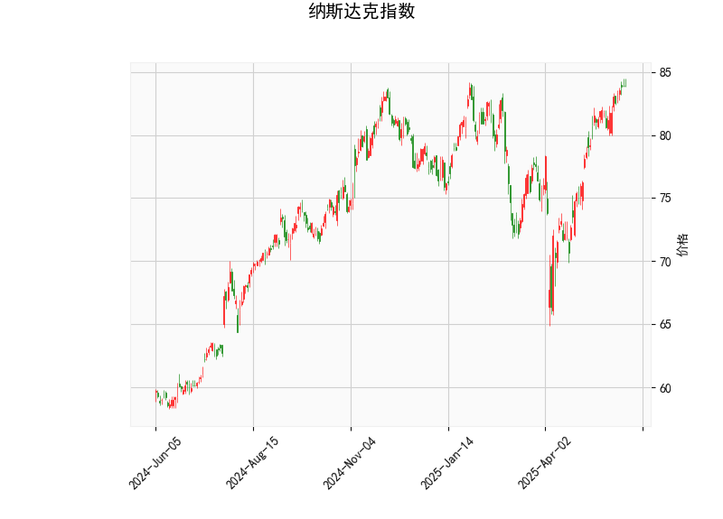

### 纳斯达克指数技术分析解读

#### 1. 技术指标综合分析
**当前价与布林轨道**  
- 当前价（83.87）处于布林轨道上轨（85.84）和中轨（77.07）之间，靠近上轨但尚未突破，表明市场处于**短期强势区域**，但需警惕上轨附近的阻力。
- 中轨（77.07）与当前价的偏离度较大，若价格回落，中轨可能成为动态支撑。

**RSI指标**  
- RSI值为69.97，接近70的超买阈值，显示短期存在**过热风险**。若后续价格无法突破上轨且RSI持续高于70，可能触发回调。

**MACD指标**  
- MACD（1.889）略高于信号线（1.875），柱状图（0.014）为正值但幅度微弱，表明短期动能向上但**趋势强度不足**，需警惕“假金叉”后反转的可能。

**K线形态**  
- 出现多个十字星类形态（如CDLDOJI、CDLGRAVESTONEDOJI、CDLLONGLEGGEDDOJI），反映市场**多空博弈激烈**，短期方向不明朗。
- CDLHIGHWAVE（长脚十字线）和CDLSPINNINGTOP（纺锤线）进一步强化了犹豫信号。
- CDLMATCHINGLOW（低位匹配线）暗示下方可能有一定支撑，但需结合价格位置判断有效性。

---

#### 2. 潜在机会与策略建议

**短期交易机会**  
1. **阻力位博弈**  
   - **看空策略**：若价格接近布林上轨（85.84）后无法突破且RSI超买（>70），可考虑轻仓做空，目标中轨（77.07），止损设于上轨上方（如86.5）。
   - **看多策略**：若价格放量突破上轨且MACD柱状图扩大，可追多，目标前高附近，止损设于上轨下方（如85.5）。

2. **回调买入机会**  
   - 若价格回踩中轨（77.07）并企稳，配合RSI回落至50附近，可视为逢低买入信号，目标上轨附近。

**套利与风控建议**  
1. **波动率套利**  
   - 当前布林轨道收窄（上轨-下轨≈17.5点）且K线形态显示波动率收缩，可关注突破后的波动率扩张机会（如期权跨式组合）。

2. **风险提示**  
   - 警惕MACD柱状图动能不足导致的假突破，需结合成交量验证。
   - 若价格跌破中轨（77.07），可能加速向下轨（68.30）运行，需严格止损。

---

**结论**  
短期市场处于**高位震荡阶段**，建议以区间交易（高抛低吸）为主，突破后顺势跟进。重点关注RSI超买修复情况与布林轨道动态变化，严格控制仓位与止损。