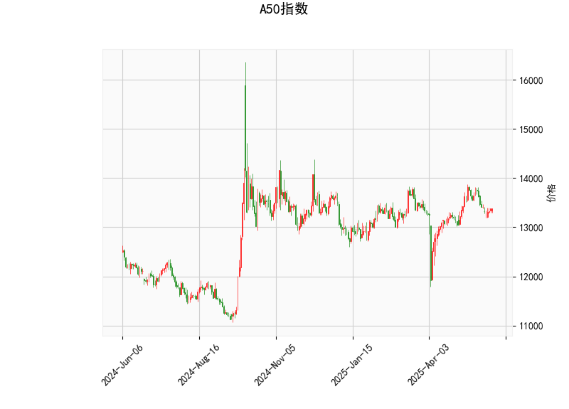

### A50指数技术分析结果详解

#### 1. 技术指标分析
以下是对A50指数当前技术分析结果的详细解读，基于提供的指标数据。A50指数当前价格为13380.0，整体显示出中性偏弱的市场信号，但尚未出现极端趋势。

- **RSI (相对强弱指数)**: 当前RSI值为48.95，这处于中性区域（通常RSI高于70表示超买，小于30表示超卖）。RSI接近50表明市场力量相对平衡，没有明显的超买或超卖迹象。这暗示短期内A50指数可能维持震荡状态，而不是急剧上涨或下跌，投资者需关注后续价格行为以确认潜在反转。

- **MACD (移动平均收敛散度)**: 
  - MACD线值为10.08，信号线值为48.01，MACD直方图值为-37.93（负值）。
  - MACD线低于信号线，且直方图为负，这是一个典型的看跌信号，表明短期动量可能转向负面。直方图的负值反映了卖出压力的增加，可能预示着价格短期内向下调整。然而，MACD线的数值相对温和，表明下行趋势并非强烈，这可能只是暂时的修正而非深度熊市。

- **Bollinger Bands (布林带)**:
  - 上轨（Upper Band）: 13973.75
  - 中轨（Middle Band）: 13307.04
  - 下轨（Lower Band）: 12640.32
  - 当前价格13380.0位于中轨附近（略高于中轨），这表明价格处于布林带的中间区域，市场可能在区间内波动而非突破性行情。如果价格接近上轨，可能面临阻力；反之，接近下轨则可能提供支撑。目前的布林带宽度适中，没有明显扩张，暗示波动率较低，适合震荡市策略。

- **K线形态**:
  - 'CDLGAPSIDESIDEWHITE': 这表示一个带有跳空缺口的实体较长的白色（或阳线）K线，暗示短期内可能有向上尝试，但伴随缺口可能带来不确定性。这种形态通常预示潜在的趋势延续或反转，需要结合其他指标验证。
  - 'CDLSHORTLINE': 这显示了一个短实体K线，可能表示市场犹豫或小幅波动，常出现于整理阶段。整体K线形态结合MACD的看跌信号，提示短期内可能有小幅回调风险。

**总体市场解读**: A50指数当前处于中性偏弱状态。RSI和Bollinger Bands显示市场不极端，MACD和K线形态则略微偏向下行。这可能反映出投资者观望情绪，短期内指数可能在13300-14000的区间内震荡。如果外部因素（如经济数据或地缘事件）介入，可能会放大下行风险。

#### 2. 近期投资或套利机会和策略判断
基于上述技术分析，以下是对A50指数近期可能投资或套利机会的评估。需要强调的是，市场充满不确定性，任何策略均应结合风险管理（如止损设置）和宏观环境（如全球股市动态）进行。

- **潜在投资机会**:
  - **下行风险机会**: MACD的看跌信号和K线缺口形态暗示短期回调可能。如果指数跌破中轨（13307.04）并接近下轨（12640.32），这可能为做空或卖出提供机会。预计回调幅度在2-5%，若跌至12800附近，则可能是一个低吸点。
  - **区间震荡机会**: 当前价格在中轨附近，RSI中性，适合区间交易策略。投资者可在上轨（13973.75）附近卖出，在下轨（12640.32）附近买入，实现小幅盈利。近期若无重大事件，这类机会可能持续1-2周。
  - **套利潜力**: A50指数涉及期货、期权或与相关资产（如A股或海外指数）的相关性较高。可能的套利策略包括：
    - **跨市场套利**: 如果A50期货价格与现货或相关指数（如沪深300）出现偏差，可进行套利。例如，如果A50期货折价于现货，可在期货市场买入并对冲现货卖出。
    - **期权策略**: 利用波动率较低的布林带，购买看跌期权（如PUT期权）以对冲下行风险，或构建价差策略（如牛市价差或熊市价差），若预期震荡则可获利。

- **推荐策略**:
  - **短期策略**: 若您偏好风险较低的操作，建议采取观望为主，等待MACD直方图转为正值或RSI突破50作为买入信号。保守投资者可在当前价位设置止损（如13200以下），并考虑小仓位做空。
  - **中长期策略**: 关注突破信号。如果价格上破上轨，可能转为多头行情；反之，下破下轨则加强做空。结合RSI，如果RSI跌至40以下，可视作超卖买入机会。
  - **风险管理建议**: 市场可能受外部因素影响（如中美贸易动态或国内政策），建议控制仓位不超过30%，并使用技术止损（如Bollinger Bands下轨）。套利策略需注意交易成本和流动性风险，避免过度杠杆。

总之，近期A50指数的投资机会以区间交易或小幅回调利用为主，而套利则聚焦跨市场差异。投资者应持续监测指标变化，并结合基本面分析以优化决策。