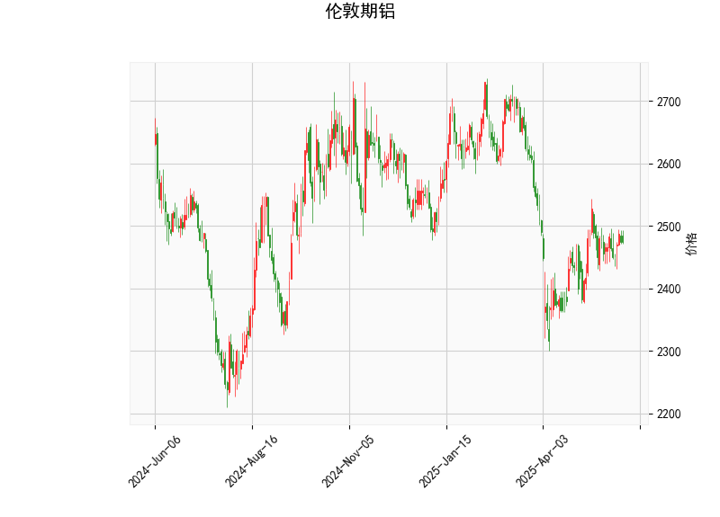

### 分析伦敦期铝的技术分析结果

伦敦期铝的技术分析结果显示了一系列关键指标和形态，这些可以帮助我们评估当前市场的动向。以下是对这些指标的详细解读：

- **当前价格（2475.0）**：当前价格位于布林带的中轨（2470.95）附近，这表明价格处于相对中性的位置。布林带的上轨为2646.48，下轨为2295.41，价格在这一区间内波动，暗示短期内市场可能保持稳定，但如果向上突破上轨，将可能出现强势上涨。

- **RSI（52.18）**：相对强弱指数（RSI）略高于50，这表示市场处于中性偏强势状态。RSI值未达到超买区域（70以上），也没有进入超卖区域（30以下），因此短期内可能不会有剧烈反转，但这也反映出市场缺乏强烈的趋势信号。

- **MACD指标**：
  - MACD线（4.20）高于信号线（2.53），且MACD直方图（1.66）为正值，这是一个典型的看涨信号。MACD的正直方图表明短期动量正在增强，可能预示着价格向上突破的潜力。
  - 然而，MACD值的整体水平相对温和，表明上涨势头还不是非常强劲，需要进一步确认。

- **布林带（Bollinger Bands）**：
  - 上轨（2646.48）、中轨（2470.95）和下轨（2295.41）显示当前价格紧邻中轨，这通常表示市场处于盘整阶段。如果价格向上穿越中轨并接近上轨，可能会触发买盘；反之，向下穿越下轨则可能出现卖压。目前的布林带宽度适中，表明波动性一般。

- **K线形态**：
  - CDLMATCHINGLOW（匹配低点）：这是一个看涨形态，通常出现在价格见底后，暗示市场可能已经触及短期低点，并有反弹潜力。这是一种底部反转信号，常用于识别潜在的买入机会。
  - CDLSHORTLINE（短线形态）：这表示K线实体较短，反映出市场不确定性或小幅波动。结合CDLMATCHINGLOW，它可能暗示价格正处于整理阶段，等待进一步的催化剂。

总体而言，这些指标显示伦敦期铝当前处于一个轻微看涨的态势。RSI和MACD提供了一些正面信号，特别是MACD的交叉和K线的底部形态，但整体市场仍显中性。价格在中轨附近徘徊，表明短期内可能维持盘整，如果外部因素（如经济数据或商品需求）推动，向上突破的可能性较大。

### 判断近期可能存在的投资或套利机会和策略

基于上述技术分析，伦敦期铝近期可能存在一些投资和套利机会，尤其是在看涨信号逐步显现的情况下。以下是对潜在机会和策略的分析和建议：

- **投资机会**：
  - **看涨潜力**：MACD的正直方图和CDLMATCHINGLOW形态暗示短期内可能出现向上反弹。如果价格突破布林带上轨（2646.48），这将是一个强有力的买入信号，潜在目标可看向2650-2700区间。当前RSI值中性，表明市场尚未超买，因此有空间进一步上涨。
  - **风险因素**：如果RSI回落至50以下或价格跌破中轨（2470.95），可能转为下行，增加卖压。因此，投资机会主要适合短期多头操作。

- **套利机会**：
  - **跨品种套利**：伦敦期铝作为大宗商品，可能与铝现货市场或其他金属（如铜或锌）存在价差机会。例如，如果期铝价格相对现货出现低估（当前价格接近中轨，可能表示估值合理但未充分反映需求），投资者可以考虑现货-期货套利策略，买入期铝并卖出现货以锁定价差。但需注意，实际套利需结合基本面，如全球铝需求（例如电动汽车行业）和供应（如中国产量）。
  - **技术套利**：基于指标的波动，利用MACD和布林带的交叉进行交易。例如，当MACD直方图扩大时，买入期铝头寸；如果价格靠近下轨，可考虑反向套利（如卖出看涨期权）。近期盘整阶段可能提供低风险套利窗口，但波动性较低可能导致机会较少。

- **投资策略建议**：
  - **多头策略**：推荐在当前价格附近（2475左右）建立小额多头头寸，设置止盈目标在上轨（2646）以上，并将止损置于下轨（2295）附近。这可利用MACD看涨信号捕捉反弹。适用于短期交易者，持仓时间建议1-2周。
  - **观望与确认策略**：如果市场不确定性增加（如RSI回落），建议先观望，等待K线形态确认（如连续看涨蜡烛）。结合基本面分析，例如监控全球经济复苏和能源价格对铝需求的影响，以增强策略可靠性。
  - **风险管理**：采用分批建仓和严格止损（如损失5-10%清仓），以应对潜在回调。杠杆交易需谨慎，避免因波动放大损失。
  - **套利策略**：针对跨市场套利，投资者可监控铝与相关资产（如LME铜）的价差。如果期铝相对于铜的价差缩小，可考虑买入铝-卖出铜的组合。短期内，技术套利机会可能通过期权或期货合约实现，但需评估交易成本和流动性。

总之，近期伦敦期铝的投资机会主要基于技术面看涨信号，但需结合市场基本面和风险控制。投资者应根据个人风险偏好调整策略，并持续监测指标变化，以避免潜在下行风险。