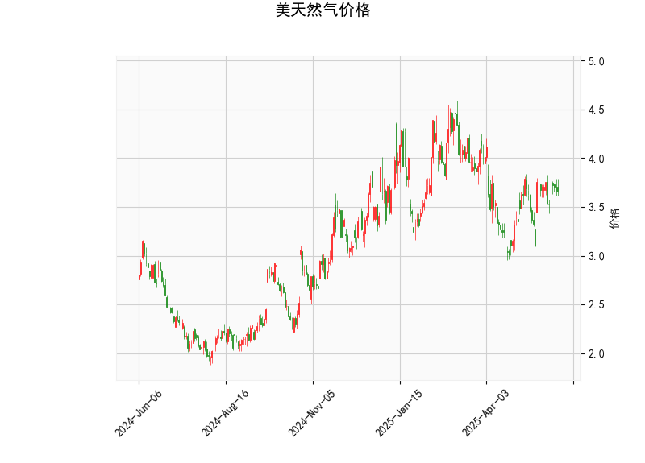

# 美天然气价格的技术分析结果分析

## 1. 对技术分析结果的详细分析
以下是对提供的美天然气价格技术指标的逐一分析，这些指标基于当前价位和市场动量，帮助评估价格趋势和潜在风险。

- **当前价（Current Price）: 3.66**  
  当前价格为3.66美元，位于中性区域。该价格与Bollinger Bands的中轨（3.61）接近，表明市场处于相对平衡状态，既未明显超买（接近上轨4.22），也未超卖（接近下轨2.99）。这可能暗示短期内价格波动较小，但需结合其他指标判断是否会突破。

- **RSI（Relative Strength Index）: 52.84**  
  RSI值为52.84，处于中性水平（通常50以上表示轻微看涨，70以上为超买）。这表明美天然气市场目前未出现过度买入或卖出行为，价格可能保持稳定或缓慢上升。如果RSI持续上升至60以上，可能预示进一步上涨；反之，若跌破50，可能转为看跌。

- **MACD（Moving Average Convergence Divergence）指标**  
  - MACD线: 0.036  
  - MACD信号线: 0.025  
  - MACD柱状图（Hist）: 0.011  
  MACD线高于信号线，且柱状图为正值，这是一个轻微看涨信号，表明短期内价格可能有向上趋势。然而，MACD值的幅度较小（0.036），显示动量不强。如果MACD柱状图继续扩大，可能确认上涨；反之，若MACD线跌破信号线，将转为看跌。

- **Bollinger Bands（布林带）**  
  - 上轨: 4.22  
  - 中轨: 3.61  
  - 下轨: 2.99  
  当前价格（3.66）接近中轨，表明价格处于波动带的中部，市场波动性适中。Bollinger Bands的宽度（上轨与下轨之差约为1.23）显示当前波动率较低。如果价格向上逼近上轨（4.22），可能出现超买信号；向下接近下轨（2.99），则可能超卖并引发反弹。总体上，这反映市场缺乏强烈方向性，但潜在突破机会存在。

- **K线形态（CDLMATCHINGLOW）**  
  K线形态显示为“CDLMATCHINGLOW”（匹配低点模式），这是一个潜在看跌或反转信号，通常表示价格可能在短期内测试低点或出现回调。该形态常出现在价格底部，但需结合其他指标验证。如果伴随MACD的看涨信号，这可能是一个“假突破”或反转起点；否则，可能会导致进一步下行。

总体而言，技术指标呈现混合信号：MACD显示轻微看涨，RSI中性，Bollinger Bands中性，而K线形态略显谨慎。市场可能处于盘整阶段，短期内缺乏强烈趋势，但向上突破的可能性稍高于向下。

## 2. 近期可能存在的投资或套利机会和策略
基于上述分析，以下是对美天然气价格近期投资或套利机会的判断。机会主要源于指标的混合信号和潜在波动性，但需注意市场不确定性（如地缘政治或供需变化）。建议结合基本面分析和风险管理进行操作。

### 可能存在的投资机会
- **看涨机会：** MACD的正值和RSI的中性水平暗示短期向上潜力。如果价格突破Bollinger Bands上轨（4.22），可能触发多头行情，适合中短期买入。K线形态的“CDLMATCHINGLOW”若被视为底部信号，也可视为低点买入机会。
- **看跌机会：** K线形态的看跌暗示可能回调，尤其是如果RSI超过70（超买）或MACD柱状图缩小。价格若跌破中轨（3.61），向下测试下轨（2.99），可考虑卖出或做空。
- **套利机会：** 当前价格在中轨附近，波动率较低，适合波动率套利策略。例如，利用Bollinger Bands的收缩期进行跨期或跨品种套利（如天然气期货与现货的价差交易），尤其在价格回归均值时获利。

### 推荐投资策略
- **买入策略（Long Position）:**  
  如果MACD柱状图继续扩大（>0.02）和RSI保持在50-60区间，考虑在当前价位（3.66）附近买入，目标设在上轨（4.22）附近。止损可设在中轨下方（3.50），以防范K线形态引发的回调。这适合风险偏好中性的投资者，预期短期回报。

- **卖出策略（Short Position）:**  
  若K线形态确认看跌（例如，价格跌破3.61），可尝试卖出或做空，目标指向下轨（2.99）。结合RSI，若其跌破50，可作为入场信号。止盈设在3.40附近，以锁定利润。该策略适用于短期交易者，但需警惕MACD的潜在反转。

- **套利策略（Arbitrage）:**  
  利用Bollinger Bands的波动性进行均值回归套利：在价格接近下轨时买入，接近上轨时卖出，实现价差收益。例如，通过天然气期货与现货的价差交易，或与相关商品（如原油）进行相关性套利。当前中轨位置提供良好起点，预期波动率扩大时执行。风险较低，但需监控交易成本和流动性。

### 风险与注意事项
- **整体风险：** 市场波动性可能因外部因素（如天气、能源政策）放大，K线形态的潜在反转风险较高。RSI和MACD的信号较弱，建议勿过度依赖。
- **策略建议：** 采用小仓位操作，设置严格止损（如5-10%的价格变动）。定期复盘指标变化，并结合基本面（如库存数据）验证。适合经验丰富的投资者；新手应优先模拟交易。