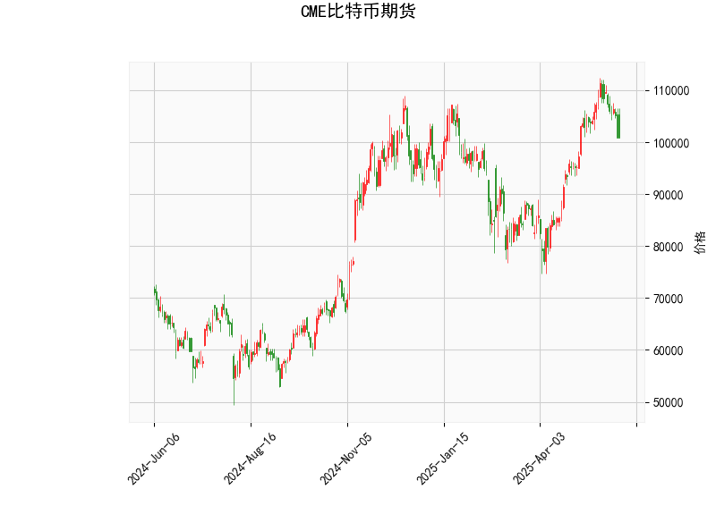

### 1. 对CME比特币期货的技术分析结果进行分析

以下是对提供的技术分析结果的详细解读，这些指标共同反映了比特币期货市场的当前状态和技术趋势。比特币期货价格为100880.0美元，我们将从多个角度分析RSI、MACD、Bollinger Bands和K线形态等关键指标。

#### RSI（相对强弱指数）
- **当前值**：46.78
- **分析**：RSI衡量价格变动速度和变化幅度，范围通常在0-100之间。46.78的水平处于中性区域（低于50），表明市场短期内没有明显的超买或超卖信号。具体来说，这暗示比特币价格可能处于均衡状态，缺乏强烈的买入或卖出压力。如果RSI进一步下降至30以下，将可能进入超卖区域，预示潜在反弹机会；反之，如果上升至70以上，则可能出现超买风险。目前的RSI值显示市场情绪相对稳定，但缺乏上行动力。

#### MACD（移动平均收敛散度）
- **当前值**：MACD线为2144.24，信号线为3554.53，MACD柱状图（Hist）为-1410.29
- **分析**：MACD线低于信号线，且柱状图为负值，这是一个典型的看跌信号，表明短期价格趋势可能向下。MACD线和信号线的差距（Hist值为负）反映了卖方力量暂时占优，价格可能面临回调压力。然而，MACD线的正值（2144.24）表明整体趋势并非极端 bearish（看空），而是处于微弱的修正阶段。如果MACD线向上穿越信号线，将可能形成看涨信号，逆转当前下行态势。

#### Bollinger Bands（布林带）
- **当前值**：上轨为114209.85，中轨为94141.73，下轨为74073.61
- **分析**：当前价格（100880.0）位于中轨（94141.73）和下轨（74073.61）之间，接近中轨水平。这表明价格处于相对稳定的波动区间内，市场波动性较低（Bollinger Bands收窄）。上轨代表阻力位，下轨代表支撑位；价格若向上突破上轨，可能触发强势上涨；若向下突破下轨，则可能加剧下跌。目前的位置暗示潜在的区间震荡，投资者可关注是否会出现突破，从而决定进场时机。

#### K线形态
- **当前形态**：CDLCLOSINGMARUBOZU和CDLMATCHINGLOW
- **分析**：
  - **CDLCLOSINGMARUBOZU**：这是一种强势K线形态，通常表示价格以较长实体蜡烛收盘，显示强烈的趋势方向（可能是看涨）。在当前上下文中，它可能暗示短期内有上行动能，但需结合其他指标验证，因为MACD显示看跌信号。
  - **CDLMATCHINGLOW**：这表示价格触及先前低点，形成潜在支撑位，常被视为反转信号或测试底部。如果价格在此位置企稳，可能预示反弹；否则，若跌破支撑，将强化下行趋势。整体而言，这些形态显示市场可能在关键水平附近挣扎，存在不确定性。

**总体技术分析总结**：比特币期货当前呈现混合信号。RSI和Bollinger Bands显示中性偏稳的状态，MACD暗示短期看跌风险，而K线形态提供了一些潜在支撑和强势迹象。市场可能处于整理阶段，等待突破方向确认。如果外部因素（如宏观经济数据或监管新闻）介入，价格波动可能放大。

### 2. 分析判断近期可能存在的投资或套利机会和策略

基于上述技术分析，结合比特币期货市场的特性（如高波动性和与现货市场的联动），我将评估近期可能的投资或套利机会。比特币作为高风险资产，机会往往与市场情绪和全球事件相关。以下分析假设当前市场环境稳定，但需注意实际操作应结合实时数据和风险管理。

#### 可能存在的投资机会
- **短期看跌机会**：MACD的负Hist值和K线形态的潜在支撑测试表明，价格可能进一步回调至Bollinger Bands下轨（74073.61）附近。这为做空策略提供机会，例如通过比特币期货合约卖出或买入看跌期权。如果价格跌破支撑位，目标可设在75000-80000美元区间，潜在获利空间约10-15%。
- **中期反弹机会**：RSI处于中性（46.78），且CDLMATCHINGLOW可能形成底部，暗示若市场企稳，价格可能反弹至中轨或上轨（94141.73-114209.85）。这适合买入策略，例如在支撑位附近建仓多头头寸，或等待RSI回升至50以上再入场。预计反弹空间为5-10%，若比特币整体市场情绪转好，可能扩展。
- **风险因素**：比特币易受全球流动性、加密货币监管或地缘政治事件影响。目前的技术信号不极端，因此机会更多是战术性而非战略性。

#### 可能存在的套利机会
- **期货与现货价差套利**：CME比特币期货价格（100880.0）可能与现货市场（如Coinbase或Binance）存在价差。如果期货价格高于现货（basis正值），可进行“cash and carry”套利：买入现货并做空期货，持有至交割期赚取价差（当前价差约需监控）。反之，若期货价格低于现货，可做多期货并做空现货。
- **跨交易所套利**：比特币期货在CME与其他平台（如Deribit）的价格可能不一致。如果CME价格低于其他交易所，可在CME买入期货并在高价平台卖出，锁定无风险收益。预计价差在1-5%之间，适合高频交易者。
- **期权套利**：结合K线形态的潜在反转，可探索波动率套利。例如，如果隐含波动率高于历史波动率（Bollinger Bands显示低波动），可卖出看涨/看跌期权赚取时间价值。但需注意比特币期权市场的流动性风险。

#### 推荐投资或套利策略
- **保守策略**：采用区间震荡策略，价格在Bollinger Bands中轨（94141.73）附近买入，设定止损在下轨（74073.61）下方。结合RSI监控，若RSI跌至40以下再加仓，目标卖出点为上轨附近。风险控制：仓位不超过总资金的10%，使用止盈止损。
- **积极策略**：如果MACD信号逆转（Hist值转为正），立即转向多头布局，例如买入期货合约或ETF跟踪比特币。同时，探索套利：监控CME与现货价差，每日扫描1-2次，执行自动化套利以捕捉瞬时机会。
- **整体建议**：近期机会以战术性为主，适合经验丰富的投资者。优先考虑风险管理（如设置10-20%的止损水平）和多样化（结合黄金或股票作为对冲）。如果市场不确定性增加（如美联储政策变动），建议观望。最终，策略应基于个人风险偏好和实时市场数据调整。