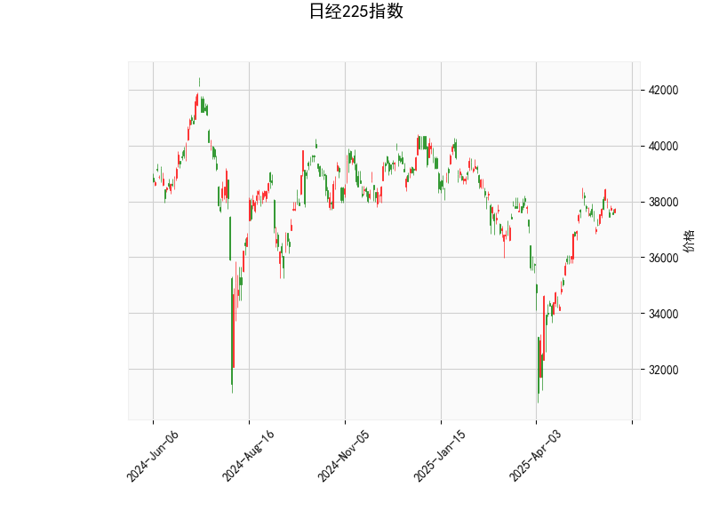

# 日经225指数的技术分析结果分析

## 1. 对技术分析结果的详细解读
基于提供的日经225指数数据，我们可以从多个技术指标入手，对当前市场状况进行全面评估。以下是对各指标的分析：

- **当前价格（Current Price）**：日经225指数当前报价为37741.61点。该价格位于布林带的中轨（36354.29点）和上轨（39832.81点）之间，表明指数处于一个相对稳定的区间内，没有明显突破上行或下行边界。这可能反映出市场短期内缺乏强烈的趋势方向，投资者需关注后续价格行为。

- **RSI（Relative Strength Index，相对强弱指数）**：RSI值为56.11，处于中性水平（高于50但低于70）。这表示日经225指数当前没有出现超买或超卖状态，市场动力较为均衡。RSI的这一位置暗示短期内可能继续保持横盘整理，但如果RSI升至70以上，可能预示超买风险；反之，若跌至30以下，则可能出现超卖反弹机会。

- **MACD（Moving Average Convergence Divergence，移动平均收敛散度）**：MACD线为386.50，信号线为448.50，MACD柱状图（Histogram）为-61.99。这显示MACD线已处于信号线下方，形成一个看跌信号（Death Cross的早期迹象）。柱状图的负值表明短期卖压可能增强，潜在的市场动能正在减弱。如果这一趋势持续，可能预示价格回调或修正期。然而，MACD的整体水平仍处于正值附近，意味着熊市尚未完全确立。

- **Bollinger Bands（布林带）**：上轨为39832.81点，中轨为36354.29点，下轨为32875.76点。目前价格（37741.61点）靠近中轨，显示价格波动处于正常范围内，没有显著的超买或超卖特征。布林带的宽度相对适中，表明市场波动性不高。如果价格向上突破上轨，可能触发看涨信号；反之，若跌破下轨，则可能出现看跌趋势。

- **K线形态（CDLSHORTLINE）**：K线形态显示为“CDLSHORTLINE”（短线模式），这通常指代一个实体较小的蜡烛线，可能代表市场不确定性或短期波动。该形态常出现在整理阶段，暗示买卖力量均衡。如果后续K线出现连续的短线或与其他模式结合（如锤头线），可能预示方向性突破。

总体而言，日经225指数当前处于中性偏弱的态势。RSI显示市场不极端，MACD的负柱状图暗示潜在回调风险，而价格在中轨附近进一步强化了横盘整理的可能性。外部因素如全球经济数据、日元汇率或地缘政治事件可能放大这些信号的影响。

## 2. 近期可能存在的投资或套利机会和策略判断
基于上述技术分析，我们可以评估日经225指数的潜在投资机会。当前市场信号较为混合，因此策略应以风险控制为主，优先考虑短期操作。以下是针对近期可能机会的分析和建议：

### 潜在投资机会
- **回调买入机会**：由于MACD柱状图为负且价格接近中轨，短期内可能出现小幅回调（例如跌向下轨32875.76点附近）。如果回调后RSI降至40-50区间，这可能是一个低风险买入点，尤其适合多头策略投资者。通过买入指数ETF或期货，在价格反弹时获利。
  
- **观望或卖出信号**：MACD的看跌交叉和CDLSHORTLINE形态暗示，如果价格无法突破上轨39832.81点，短期卖压可能增加。投资者可考虑在价格接近上轨时卖出或建立空头头寸（如卖出看涨期权），以捕捉可能的修正行情。

- **套利机会**：日经225指数的波动性较低（布林带宽度适中），这为波动率套利（如期权价差策略）提供了基础。例如：
  - **跨式期权套利**：如果预期短期内价格波动加剧（例如受日本央行政策影响），可以买入看涨和看跌期权组合，待价格突破布林带时获利。但需注意当前RSI中性，波动率可能有限。
  - **指数与期货套利**：日经225期货与现货价差可能存在机会。如果期货价格与现货出现偏离（如由于市场情绪导致），可以通过无风险套利（如期货现货对冲）来锁定收益。

### 推荐策略
- **短期策略（1-2周）**：
  - **中性观望**：鉴于RSI和MACD的混合信号，建议等待确认性突破。例如，如果价格跌破中轨，可考虑轻仓做空；反之，若RSI升至60以上并突破上轨，则转为多头。
  - **风险管理**：设置止损位，例如在下轨附近（33000点）设置买入止损，或在上轨附近设置卖出止损。使用小仓位测试市场，避免大额风险。

- **中期策略（1-3个月）**：
  - **趋势跟踪**：监控MACD是否进一步交叉或RSI是否极端化。如果MACD柱状图转为正值，考虑加仓多头ETF（如跟踪日经225的基金）。若K线形态转向看跌（如连续阴线），则转向防御性资产（如债券或避险货币）。
  - **多样化组合**：结合全球市场（如与美国股指相关联），通过日经225期权或期货构建对冲组合，降低单一市场风险。

- **套利策略注意事项**：套利机会依赖市场效率，例如日经225期货与现货的价差套利。但在当前中性市场中，机会可能较少；建议仅由经验丰富的投资者操作，并结合基本面分析（如日本经济数据）。

总体风险提示：技术分析仅为参考，不应作为唯一依据。日经225指数受全球经济、日本政策和汇率影响较大，投资者需结合实时新闻和风险承受能力制定计划。建议使用模拟交易测试策略，以最小化损失。