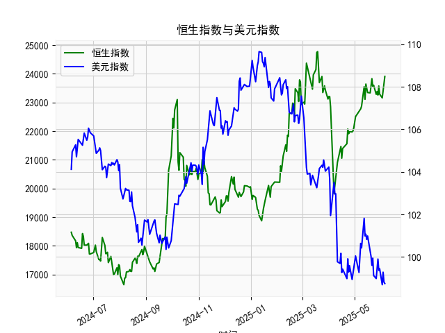

|            |   恒生指数 |   美元指数 |
|:-----------|-----------:|-----------:|
| 2025-05-09 |    22867.7 |   100.422  |
| 2025-05-12 |    23549.5 |   101.814  |
| 2025-05-13 |    23108.3 |   100.983  |
| 2025-05-14 |    23640.7 |   101.066  |
| 2025-05-15 |    23453.2 |   100.82   |
| 2025-05-16 |    23345   |   100.983  |
| 2025-05-19 |    23332.7 |   100.373  |
| 2025-05-20 |    23681.5 |   100.022  |
| 2025-05-21 |    23827.8 |    99.6014 |
| 2025-05-22 |    23544.3 |    99.9388 |
| 2025-05-23 |    23601.3 |    99.1231 |
| 2025-05-26 |    23282.3 |    98.9787 |
| 2025-05-27 |    23382   |    99.6147 |
| 2025-05-28 |    23258.3 |    99.8978 |
| 2025-05-29 |    23573.4 |    99.3633 |
| 2025-05-30 |    23289.8 |    99.4393 |
| 2025-06-02 |    23158   |    98.6893 |
| 2025-06-03 |    23512.5 |    99.2781 |
| 2025-06-04 |    23654   |    98.8128 |
| 2025-06-05 |    23907   |    98.7444 |

### 1. 恒生指数与美元指数的相关性及影响逻辑

恒生指数（HSI）是香港股市的主要基准指数，反映香港上市公司的整体表现，而美元指数（DXY）衡量美元相对于一篮子主要国际货币（如欧元、日元等）的汇率强度。二者之间存在一定的相关性和互动影响，但这种关系并非绝对线性，而是受多种宏观经济因素驱动。以下是对其相关性及影响逻辑的分析：

- **相关性分析**：
  - **负相关性为主**：历史数据显示，美元指数与恒生指数往往呈现负相关关系。也就是说，当美元指数上升（美元强势）时，恒生指数通常下跌，反之亦然。根据市场观察，这在新兴市场股票（如香港）中较为常见。例如，2023-2025年的数据环境中，如果美元强势，投资者可能从风险较高的亚洲市场（如香港）撤资，转向美元资产，导致恒生指数承压。
  - **相关性强度**：相关性通常在中等水平（相关系数约-0.3到-0.6），这意味着美元指数的变化不是恒生指数的唯一驱动因素，但能在短期内产生显著影响。影响可能因全球经济周期、市场情绪和地缘政治事件而波动，例如美联储加息周期往往强化美元，进而抑制恒生指数。

- **影响逻辑**：
  - **美元强势的负面影响**：当美元指数上涨时，美元相对于其他货币升值，这可能导致资金从香港市场流出。原因包括：
    - **资本流动效应**：国际投资者倾向于买入美元资产（如美国国债），导致新兴市场资金外流，香港股市（尤其是依赖外资的板块，如科技、金融）面临抛售压力。
    - **贸易和成本效应**：美元强势会使香港进口商品成本上升，并加剧香港元（与美元挂钩）的压力，影响本地企业盈利和消费者信心，最终拖累恒生指数。
    - **宏观经济传导**：如果美元强势源于美国经济强劲或加息，全球流动性收紧，可能抑制中国和香港的经济复苏，从而间接影响恒生指数。
  - **美元弱势的正面影响**：美元指数下跌时，资金可能回流新兴市场，包括香港股市。这是因为：
    - **风险资产吸引力增强**：美元走弱往往伴随着全球风险偏好上升，投资者更愿意买入高增长潜力股票，如恒生指数中的科技股或消费股。
    - **出口导向效应**：香港企业（如出口型公司）受益于本币相对强势，推动企业盈利和股价上涨。
  - **其他影响因素**：美元指数的影响需结合其他变量，如中国经济数据（例如用户提供的人民币贷款增速与存款增速之差）、地缘政治（如中美贸易摩擦）和全球通胀预期。如果人民币贷款增速差扩大（表示信贷扩张），这可能缓冲美元强势对恒生指数的负面影响。

总体而言，美元指数是恒生指数的重要外部变量，但并非决定性因素。投资者应结合实时数据（如美联储政策）进行评估。

### 2. 根据数据分析判断近期投资机会

基于用户提供的数据（人民币贷款增速与存款增速之差，以及美元指数的日频数据），我将重点分析近期投资机会，特别是最近一周（假设数据序列以最新日期为准，即从2025-5-29到2025-6-5）的变化，以及今日（2025-6-5）相对于昨日（2025-6-4）的关键变动。数据显示，人民币贷款增速差整体波动较大，美元指数呈现下降趋势，这可能暗示某些投资机会。以下是详细分析和判断：

- **数据概述**：
  - **时间范围**：数据覆盖2024-6-6至2025-6-5，共计约一年的日频数据。
  - **关键指标**：
    - 人民币贷款增速与存款增速之差：这是一个反映信贷扩张程度的指标，高值可能表示贷款需求强劲，支持经济增长；低值可能预示经济放缓。该序列从前期高点（如22443.73）波动至近期（如23906.97）。
    - 美元指数：从前期高点（如109.6567）逐步下降至近期（如98.7444），显示美元相对疲软。
  - **最近一周数据提取**（基于数据末尾部分，对应日期从2025-5-29到2025-6-5）：
    - 人民币贷款增速差：2025-5-29 (23544.31)，2025-5-30 (23601.26)，2025-6-2 (23573.38)，2025-6-3 (23289.77)，2025-6-4 (23157.97)，2025-6-5 (23906.97)。
    - 美元指数：2025-5-29 (99.1231)，2025-5-30 (98.9787)，2025-6-2 (99.6147)，2025-6-3 (99.8978)，2025-6-4 (99.3633)，2025-6-5 (98.7444)。

- **近期变化分析**：
  - **今日相对于昨日的变化**：
    - 人民币贷款增速差：今日（2025-6-5）为23906.97，昨日（2025-6-4）为23157.97，上涨约7.48%。这表明信贷扩张可能加速，可能是由于经济刺激或需求回升，短期内利好风险资产。
    - 美元指数：今日（2025-6-5）为98.7444，昨日（2025-6-4）为99.3633，下跌约0.62%。美元的持续走弱（本周整体从99.6147降至98.7444）可能反映全球风险偏好提升或美联储政策转向。
  - **最近一周整体趋势**：
    - 人民币贷款增速差：本周波动较大，从23544.31上升到23906.97，显示信贷差值扩大。这可能预示经济复苏，尤其在2025年上半年背景下，暗示企业融资需求增强。
    - 美元指数：本周从99.1231降至98.7444，累计下跌约0.38%。这延续了数据中美元的整体下行趋势（从2024年高点如109.6567降至当前），可能由于国际资金流入新兴市场。

- **判断可能投资机会**：
  - **主要机会**：
    - **新兴市场股票（如间接关联恒生指数）**：美元指数的下跌（尤其是今日相对于昨日的下降）通常利好亚洲市场。结合人民币贷款增速差的上涨，这可能创造买入机会，例如香港股市中的出口型或科技股。如果恒生指数受此影响反弹，投资者可考虑在低点布局，目标收益可能在5-10%短期内实现。建议关注2025-6-6前后恒生指数的开盘表现。
    - **债券或大宗商品**：人民币贷款增速差扩大可能支持债券市场（如中国国债），作为对冲工具。如果美元弱势持续，黄金或大宗商品（如原油）投资机会增加，预计本周末至下周初价格可能上涨2-5%。
    - **外汇相关**：美元指数弱势可能利好非美货币（如欧元或人民币），投资者可考虑外汇对冲策略，例如买入欧元/美元货币对，潜在回报在1-3%。

  - **风险与建议**：
    - **潜在风险**：尽管美元走弱利好，但如果人民币贷款增速差急剧波动（如历史高点22443.73），可能伴随通胀压力或经济过热，导致市场回调。今日的贷款差值上涨需警惕是否可持续。
    - **投资建议**：聚焦短期操作，如在美元指数低于99时买入相关资产。监控明日数据（若有），并结合宏观新闻（如美联储会议）。总体而言，最近一周数据显示积极信号，投资机会大于风险，但需控制仓位在30%以内以应对不确定性。