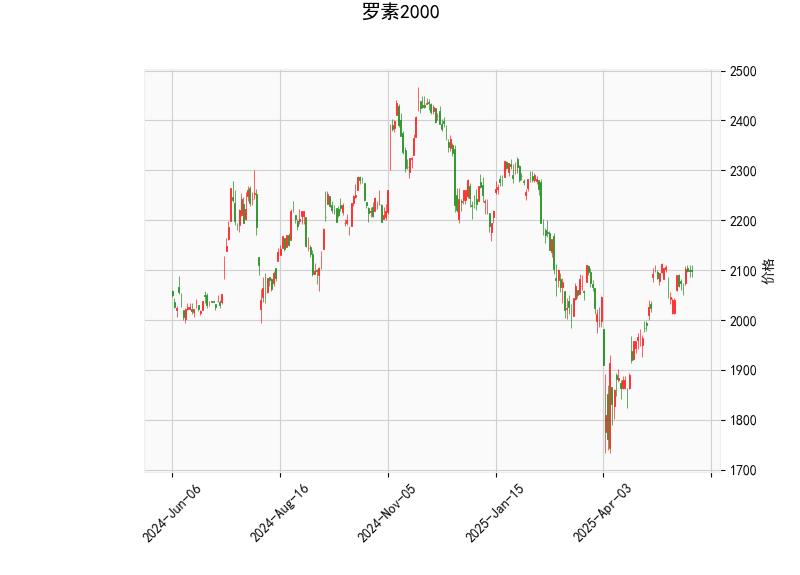

### 罗素2000指数技术分析结果解读

#### 1. 对技术指标的详细分析
罗素2000指数当前价格为2097.35，这是一个反映美国小盘股表现的关键指数。以下是对提供的指标进行逐一分析，帮助理解市场当前态势：

- **RSI (相对强弱指数)**: 当前RSI值为59.37。这表明指数处于中性偏多头区域（RSI通常在30-70之间视为中性）。RSI高于50暗示近期买方力量稍占上风，但尚未进入超买状态（RSI>70）。这可能表示市场有温和的上行潜力，但如果RSI继续上升，可能面临回调风险。

- **MACD (移动平均收敛散度)**: MACD线为24.75，信号线为24.85，直方图为-0.105。这显示MACD线略低于信号线，形成一个轻微的看跌信号，因为直方图是负值（表示动量减弱）。短期内，这可能预示着价格可能小幅回调或横盘整理。然而，MACD整体水平较高，表明长期趋势仍相对健康。如果直方图转为正值，将是多头信号的确认。

- **Bollinger Bands (布林带)**: 上轨为2191.70，中轨为2005.36，下轨为1819.02。目前价格2097.35位于中轨和上轨之间，显示价格处于正常波动范围内，没有明显的超买或超卖情况。这暗示市场 volatility 较低，价格可能继续在这一区间震荡。如果价格突破上轨（向上），可能触发上行趋势；反之，如果跌破下轨（向下），则可能出现下行修正。

- **K线形态**: 提供的形态包括CDLDOJI、CDLHIGHWAVE、CDLLONGLEGGEDDOJI、CDLMATCHINGLOW和CDLSPINNINGTOP。这些形态整体反映了市场的犹豫和不确定性：
  - CDLDOJI、CDLLONGLEGGEDDOJI和CDLHIGHWAVE 强调了高不确定性，可能表示买方和卖方力量平衡，预示潜在反转或横盘。
  - CDLMATCHINGLOW 可能显示支撑位形成，暗示短期底部。
  - CDLSPINNINGTOP 表示市场犹豫，可能在关键点位（如中轨附近）等待突破。
  总体上，这些形态建议当前市场缺乏清晰方向，投资者应密切关注后续K线以确认趋势。

综合分析：罗素2000指数当前处于一个中性偏多头的状态，但MACD的轻微看跌信号和K线的不确定性形态表明短期内可能出现波动或小幅回调。RSI和Bollinger Bands显示价格稳定在中轨附近，这为潜在的上行机会提供了基础，但需警惕外部因素（如经济数据或地缘事件）引发波动。

#### 2. 近期可能存在的投资或套利机会及策略判断
基于上述技术分析，罗素2000指数的近期机会主要源于其不确定性与潜在波动。以下是针对投资和套利的判断及策略建议：

- **投资机会判断**:
  - **潜在上行机会**: RSI接近60且价格在中轨上方，暗示如果市场突破上轨（约2191.70），可能迎来小盘股反弹。尤其在经济复苏或美联储政策支持下，小盘股（如罗素2000）往往领先大盘表现。
  - **潜在下行风险**: MACD直方图为负，结合K线不确定性，短期回调概率较高（如跌向下轨1819.02）。如果RSI跌破50，这可能触发卖出。
  - **总体判断**: 市场处于观望期，适合中期投资者。机会窗口可能在1-3个月内，取决于经济数据（如就业报告或通胀数据）。

- **套利机会判断**:
  - **波动率套利**: K线形态显示高不确定性，Bollinger Bands收窄可能预示即将 breakout。这为波动率套利（如卖出期权或使用straddle策略）提供机会。例如，利用指数期货与现货价差进行套利，如果价格在bands内震荡，波动率较低时可构建中性策略。
  - **反转套利**: CDLMATCHINGLOW形态暗示潜在支撑位，可通过买入看涨期权（call option）并卖出看跌期权（put option）来捕捉反弹。反之，如果MACD确认看跌，可在小盘股指数与大盘（如S&P 500）间寻找相对价值套利机会（如罗素2000相对落后时买入）。
  - **总体判断**: 套利机会较适合经验丰富的交易者，短期内（如1-2周）可能通过衍生品捕捉波动。当前中性RSI和负MACD直方图适合低风险套利策略，如波动率中性交易。

- **推荐策略**:
  - **投资策略**: 
    - **多头策略**: 如果RSI升至65以上并突破上轨，考虑买入ETF（如IWM，跟踪罗素2000）或相关股票，设定止损在下轨附近（约1819.02）。
    - **空头策略**: 如果MACD直方图加深负值或K线显示持续犹豫，短期卖出或持有现金观望。
    - **风险管理**: 采用50%仓位入场，结合RSI和Bollinger Bands设置动态止盈止损。
  - **套利策略**:
    - **波动率策略**: 使用strangle期权组合（买入一档外期权），在价格震荡期获利。
    - **指数相关套利**: 监控罗素2000与S&P 500的价差，如果缩小则买入罗素2000相关资产。
    - **执行建议**: 优先在低波动期（如当前）构建套利头寸，目标回报率5-10%，并在关键K线确认后调整。

总体而言，近期罗素2000指数的投资机会大于套利，但需谨慎等待趋势确认。建议结合基本面分析（如公司财报或宏观经济）辅助决策，以降低风险。