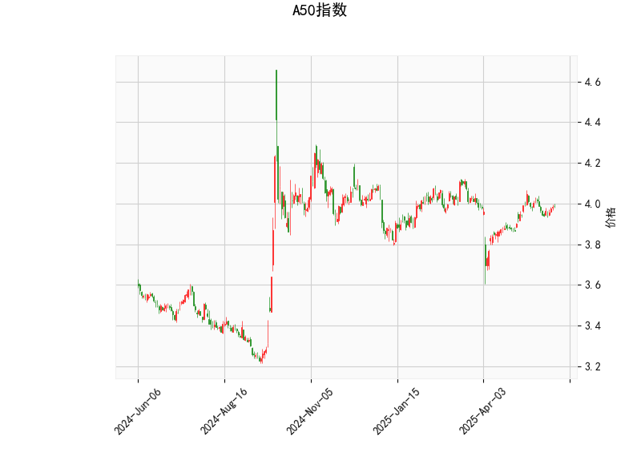

## A50指数的技术分析结果分析

### 1. 对技术分析结果的详细解读
A50指数的当前技术指标显示出市场处于一种相对平衡但略带不确定性的状态，具体分析如下：

- **当前价格（Current Price）**：指数当前价格为3.986，位于布林带的中轨（Middle Band，3.946）附近。这表明价格处于中性区域，既未明显突破上轨（Upper Band，4.119），也未跌至下轨（Lower Band，3.772）。这种位置通常暗示市场缺乏强势方向，可能即将出现盘整或小幅回调。

- **RSI（Relative Strength Index）**：RSI值为55.89，处于中性水平（一般在30-70范围内）。这表示指数没有明显的超买（RSI>70）或超卖（RSI<30）信号，市场动力较为平稳。但接近60的水平可能预示着短期内潜在的上行压力，如果RSI继续上升，可能吸引更多买盘。

- **MACD（Moving Average Convergence Divergence）**：MACD线值为0.0102，信号线值为0.0123，直方图（MACD Hist）为-0.0021（负值）。MACD线低于信号线，且直方图呈负向分歧，这是一个典型的看跌信号，暗示短期内卖方力量可能占优，价格可能出现回调或修正。然而，MACD值的整体水平不高，表明跌势可能有限，仅为短期波动而非趋势逆转。

- **布林带（Bollinger Bands）**：上轨为4.119，中轨为3.946，下轨为3.772。当前价格紧邻中轨，显示市场波动率较低（布林带收窄）。如果价格向上突破上轨，可能触发上行趋势；反之，如果跌破下轨，则可能进入超卖区域。目前的窄带宽度暗示市场不确定性增加，投资者需警惕潜在的突破或崩盘。

- **K线形态**：检测到的形态包括CDLDOJI、CDLHIGHWAVE、CDLLONGLEGGEDDOJI和CDLSPINNINGTOP。这些形态通常表示市场犹豫和不确定性：
  - CDLDOJI和CDLLONGLEGGEDDOJI：这些是十字星或长腿十字形态，常代表买卖力量均衡，可能预示反转或盘整。
  - CDLHIGHWAVE和CDLSPINNINGTOP：这些高波形态和旋转顶部形态显示价格波动剧烈但方向不明，常出现在市场顶部或底部，暗示短期内可能出现方向选择。
  总体上，这些形态强化了市场缺乏清晰方向的观点，投资者应密切关注后续K线发展。

综合而言，A50指数的技术指标显示短期市场处于中性偏弱状态。RSI和布林带的中性位置提供了一些支撑，但MACD的负分歧和K线形态的犹豫信号增加了回调风险。整体上，这反映出市场可能在等待外部事件（如经济数据或政策变动）来决定方向。

### 2. 判断近期可能存在的投资或套利机会和策略
基于上述分析，A50指数近期可能存在一些短期投资机会，但整体风险较高。以下是对潜在机会和策略的判断：

- **可能的投资机会**：
  - **短期回调机会**：MACD直方图的负值和K线形态的犹豫表明，指数可能面临小幅下行（例如跌向布林带下轨3.772附近）。这为短期卖出或空头操作提供机会，尤其适合风险偏好较高的投资者。如果价格跌破中轨，回调幅度可能在1-3%，提供低位买入点。
  - **潜在反转机会**：如果RSI继续上升并突破60，且价格向上测试上轨（4.119），则可能出现反弹行情。K线形态的犹豫性暗示反转概率较高，投资者可关注是否形成更强势的买盘信号（如阳线确认）。
  - **整体风险**：当前市场不确定性强，机会更多偏向短期投机而非长期持有。A50指数作为跟踪中国50大蓝筹股的指数，其表现受宏观经济影响较大，因此需结合全球市场（如美股或大宗商品）动态评估。

- **可能套利机会**：
  - **跨市场套利**：A50指数期货（如中国A50期货）与相关资产（如沪深300指数或全球新兴市场ETF）之间可能存在价差。鉴于当前MACD负分歧，A50期货可能相对低估；投资者可考虑在A50期货上做空，同时在相关多头市场（如A股或港股）做多，以捕捉价差收敛（例如，如果A50回调而A股企稳）。预计套利空间在0.5-2%范围内，适合经验丰富的交易者。
  - **期权或衍生品套利**：如果市场波动率上升（布林带收窄后可能扩张），可通过买入A50指数期权（例如看跌期权）来对冲风险，或进行波动率套利（如铁蝶式策略）。当前K线形态的犹豫性增加了期权隐含波动率的吸引力，但需注意交易成本。
  - **风险因素**：套利机会依赖市场效率，近期全球经济不确定性（如地缘政治事件）可能放大价差，但也增加执行风险。建议仅在低流动性时段避免操作。

- **推荐策略**：
  - **短期策略**：采取观望为主的策略。如果MACD直方图转为正值或价格突破上轨，可轻仓买入；反之，如果价格跌破中轨，考虑小额做空。止损设置在布林带外轨（例如上轨上方5%或下轨下方5%）以控制风险。
  - **中期策略**：等待K线形态确认方向（如连续阳线形成），然后构建多头头寸。结合RSI监控，RSI跌至40以下时可考虑加仓买入。
  - **风险管理建议**：始终结合基本面分析（如中国经济数据或政策公告），并使用仓位控制（不超过总仓位的20-30%用于高风险操作）。对于套利，优先选择流动性强的市场，并监控交易费用以确保净收益。
  - **总体建议**：当前环境适合防御性策略，投资者应优先选择多元化组合（如结合债券或黄金），避免过度依赖A50指数的波动。定期复盘技术指标，以适应市场变化。