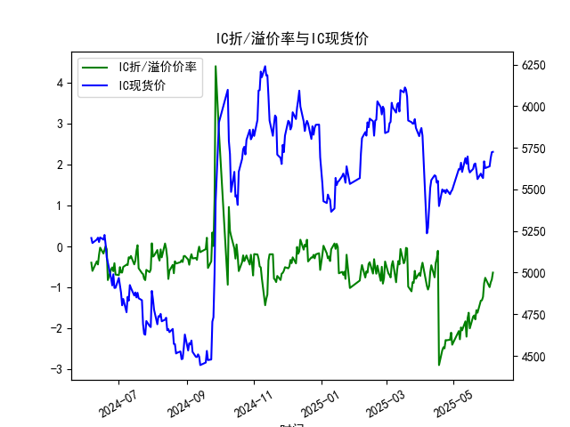

|            |   IF折/溢价率 |   IF现货价 |   IH折/溢价率 |   IH现货价 |   IC折/溢价率 |   IC现货价 |   IM折/溢价率 |   IM现货价 |
|:-----------|--------------:|-----------:|--------------:|-----------:|--------------:|-----------:|--------------:|-----------:|
| 2025-05-09 |     -0.976471 |     3808.6 |     -0.663397 |     2666.2 |     -2.04348  |     5604.8 |     -2.25057  |     5945.2 |
| 2025-05-12 |     -0.966676 |     3853   |     -0.592655 |     2686.6 |     -1.82396  |     5688   |     -2.1153   |     6037   |
| 2025-05-13 |     -1.16158  |     3851   |     -0.733322 |     2688.2 |     -2.19778  |     5654.6 |     -2.51032  |     5996.6 |
| 2025-05-14 |     -0.908163 |     3907.4 |     -0.587737 |     2737.6 |     -1.74715  |     5697.8 |     -1.90524  |     6043   |
| 2025-05-15 |     -0.880406 |     3872.8 |     -0.631231 |     2723   |     -1.6149   |     5623   |     -1.78364  |     5949   |
| 2025-05-16 |     -1.10785  |     3846   |     -0.790006 |     2695.2 |     -1.99531  |     5601.8 |     -2.21348  |     5933.8 |
| 2025-05-19 |     -0.875523 |     3843.2 |     -0.602139 |     2688.8 |     -1.70946  |     5623   |     -1.96768  |     5975.4 |
| 2025-05-20 |     -0.840664 |     3865.4 |     -0.63422  |     2699.4 |     -1.6802   |     5650.8 |     -2.06014  |     6019.4 |
| 2025-05-21 |     -0.898296 |     3881.2 |     -0.580049 |     2712.6 |     -1.77707  |     5655.6 |     -2.14574  |     6000.6 |
| 2025-05-22 |     -0.87548  |     3879.6 |     -0.666962 |     2715.4 |     -1.55138  |     5614.8 |     -1.91397  |     5950   |
| 2025-05-23 |     -0.9292   |     3846.2 |     -0.695185 |     2693   |     -1.61406  |     5561.8 |     -1.96463  |     5872   |
| 2025-05-26 |     -0.748858 |     3831.2 |     -0.556508 |     2684.4 |     -1.32042  |     5594.6 |     -1.72151  |     5925   |
| 2025-05-27 |     -0.786501 |     3809.2 |     -0.621209 |     2668.6 |     -1.31181  |     5578   |     -1.55547  |     5915   |
| 2025-05-28 |     -0.814251 |     3805   |     -0.658307 |     2665.4 |     -1.22822  |     5568   |     -1.42796  |     5899   |
| 2025-05-29 |     -0.671205 |     3832.8 |     -0.642634 |     2673.6 |     -0.897044 |     5668.6 |     -0.961935 |     6031   |
| 2025-05-30 |     -0.464355 |     3822.4 |     -0.429145 |     2667.2 |     -0.763036 |     5627.8 |     -1.00489  |     5966   |
| 2025-06-03 |     -0.706454 |     3824.8 |     -0.695718 |     2668.6 |     -0.991047 |     5638.4 |     -1.18676  |     5998   |
| 2025-06-04 |     -0.680916 |     3842.4 |     -0.640112 |     2673.6 |     -0.874817 |     5688.8 |     -1.12968  |     6054   |
| 2025-06-05 |     -0.659067 |     3852   |     -0.673396 |     2674   |     -0.803601 |     5723.6 |     -1.06072  |     6101.6 |
| 2025-06-06 |     -0.479715 |     3855.4 |     -0.567172 |     2673.6 |     -0.636538 |     5725.4 |     -0.855614 |     6100.2 |

### 1. 股指期货折/溢价率与现货价的相关性及影响逻辑

股指期货的折/溢价率（通常以百分比表示）是指期货合约价格相对于现货指数价格的相对差异。如果折/溢价率为负值（如-0.5%），表示期货价格低于现货价格（折价）；如果为正值，表示期货价格高于现货价格（溢价）。这种差异并非随机，而是受多种市场因素驱动，与现货价格密切相关。下面解释其相关性和影响逻辑：

- **相关性分析**：
  - **正相关但非绝对一致**：股指期货价格通常与现货价格高度相关，因为期货是对现货指数的未来预期的定价。根据无套利理论，期货价格应等于现货价格加上持有成本（如融资利息、交易费用）减去预期收益（如股息）。因此，折/溢价率的变化往往反映现货价格的波动。如果现货价格上涨，期货价格可能跟随上涨，导致折价率缩小（或转为溢价）；反之，现货价格下跌可能加剧折价。
  - **短期波动性**：在数据中，我们看到如IF、IH、IC和IM的折/溢价率与现货价格（CLOSE列）在同一日期内共同波动。例如，IF的现货价格从2024-06-06的3584.4上涨到2025-06-06的3855.4，同时折/溢价率从-0.218398变为-0.479715（折价加深），表明现货强势但期货相对滞后。
  - **整体趋势**：从提供的242行数据看，四种股指期货（IF、IH、IC、IM）均显示出负折价率为主（例如IC的折价率平均在-0.5%至-1%之间），这与现货价格的缓慢上涨（如IM从5101.8涨至6100.2）相关，暗示市场对未来预期较为谨慎，导致期货定价偏低。

- **影响逻辑**：
  - **市场预期和情绪**：折/溢价率是市场对未来经济状况的晴雨表。如果投资者预期经济下行或市场波动增大，现货价格可能上涨但期货折价加深（如数据中IH的折价率从-0.190558到-0.695718）。反之，如果现货价格持续上涨且折价率缩小，表明市场乐观，可能触发多头机会。
  - **持有成本和无套利机制**：期货价格会考虑现货持有成本（如资金机会成本）。如果现货价格上涨但期货折价过大（如IM的-1.186761），投资者可进行正向套利（买入期货、卖出现货），推动期货价格向现货靠拢。
  - **外部因素影响**：宏观经济（如利率、通胀）、政策（如央行干预）和流动性（如交易量）会间接影响两者。举例来说，如果现货价格因经济数据好转而上涨，折/溢价率可能缩小；反之，市场恐慌（如地缘政治事件）会加剧折价。
  - **逻辑总结**：现货价格是基础，现货价格变动驱动期货调整，但折/溢价率反映了时间价值和风险溢价。长期看，如果折价率过大（例如低于-1%），可能预示现货价格回调风险；如果溢价率过高，可能有反向套利机会。

### 2. 近期投资机会分析：聚焦最近一周数据变化

基于提供的数据，我分析了从2025-05-30到2025-06-06的最近一周（共6个交易日），并特别关注今日（2025-06-06）相对于昨日（2025-06-05）的变化。投资机会主要基于折/溢价率的缩小或扩大，以及现货价格的趋势。总体上，四种股指期货（IF、IH、IC、IM）均处于折价状态（负值），但今日折价率普遍减轻，这可能表示市场情绪好转，潜在套利或多头机会。

- **数据概述及关键变化**：
  下表总结最近一周的折/溢价率和现货价格变化（单位：折/溢价率为百分比，现货价格为指数点）：

  | 日期       | IF 折/溢价率 | IF现货价格 | IH 折/溢价率 | IH现货价格 | IC 折/溢价率 | IC现货价格 | IM 折/溢价率 | IM现货价格 |
  |------------|--------------|------------|--------------|------------|--------------|------------|--------------|------------|
  | 2025-05-30 | -0.464355   | 3822.4    | -0.429145   | 2667.2    | -0.763036   | 5627.8    | -1.004890   | 5966.0    |
  | 2025-06-03 | -0.706454   | 3824.8    | -0.695718   | 2668.6    | -0.991047   | 5638.4    | -1.186761   | 5998.0    |
  | 2025-06-04 | -0.680916   | 3842.4    | -0.640112   | 2673.6    | -0.874817   | 5688.8    | -1.129676   | 6054.0    |
  | 2025-06-05 | -0.659067   | 3852.0    | -0.673396   | 2674.0    | -0.803601   | 5723.6    | -1.060722   | 6101.6    |
  | 2025-06-06 | -0.479715   | 3855.4    | -0.567172   | 2673.6    | -0.636538   | 5725.4    | -0.855614   | 6100.2    |

  - **今日 vs 昨日变化**：
    - **IF**：折/溢价率从-0.659067改善至-0.479715（折价减轻约0.18%），现货价格从3852.0微涨至3855.4（上涨约0.09%）。这表明市场对IF的预期好转，可能有短期多头机会。
    - **IH**：折/溢价率从-0.673396改善至-0.567172（折价减轻约0.11%），但现货价格从2674.0微跌至2673.6（下跌约0.02%）。折价减轻暗示潜在反弹，尽管现货弱势。
    - **IC**：折/溢价率从-0.803601改善至-0.636538（折价减轻约0.17%），现货价格从5723.6涨至5725.4（上涨约0.03%）。这显示IC强势，可能适合正向套利。
    - **IM**：折/溢价率从-1.060722改善至-0.855614（折价减轻约0.21%），现货价格从6101.6微跌至6100.2（下跌约0.02%）。折价显著减轻，但现货小幅回调，需警惕波动。

- **判断可能投资机会**：
  - **正向套利机会**：今日折/溢价率普遍减轻（所有合约折价率缩小），表明期货价格正向现货价格收敛。这为正向套利提供机会，例如买入IF或IC期货并卖出现货（因为IF和IC现货价格上涨）。尤其在IC上，折价率从-0.803601降至-0.636538，缩小幅度较大，如果市场继续好转，短期收益可观。
  - **多头机会**：IF和IC的现货价格小幅上涨且折价减轻，暗示市场情绪转暖。投资者可考虑在今日基础上买入这些期货，期待进一步收敛。但需注意IH和IM现货价格微跌，如果折价率继续改善，可能在明日反弹。
  - **风险与注意事项**：最近一周整体折价率加深（如从2025-05-30到2025-06-03），但今日改善可能只是短期修正。如果外部因素（如经济数据）恶化，折价可能重新加深。建议结合成交量和市场新闻确认，避免单日波动风险。
  - **总体推荐**：短期内，IF和IC的投资机会更明确（基于今日改善），但IH和IM需观察明日数据。保守投资者可等待确认后小仓位介入；激进者可利用今日折价减轻进行套利。未来一周若现货价格持续上涨，机会将进一步扩大。

