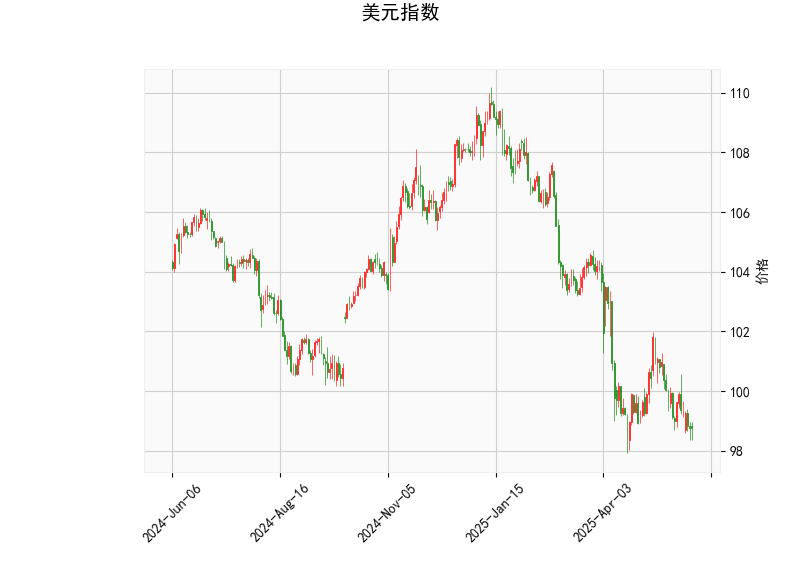

# 美元指数技术分析

## 关键指标概述
- **当前价格**：98.7444。这表明美元指数目前处于相对较低水平，接近近期支撑位。
- **RSI（相对强弱指数）**：38.83。这是一个低于50的数值，暗示美元指数可能处于超卖状态，短期内可能出现反弹或修正。如果RSI继续下跌至30以下，将进一步强化超卖信号。
- **MACD（移动平均收敛散度）**：主线（-0.508）、信号线（-0.456）和直方图（-0.052）。MACD线位于信号线下方，且直方图为负值，显示短期动量偏向下行，市场可能仍处于弱势趋势。然而，直方图的负值幅度较小，暗示下行动能正在减弱，可能预示反转。
- **布林带**：上轨（104.91）、中轨（100.97）和下轨（97.02）。当前价格接近下轨（97.02），这通常表示价格已进入超卖区域，潜在反弹风险增加。如果价格突破中轨，可能转为中性或看涨。
- **K线形态**：包括“CDLMATCHINGLOW”（匹配低点）和“CDLSPINNINGTOP”（纺锤线）。这些形态显示市场不确定性增强，“CDLMATCHINGLOW”可能表示潜在支撑位，而“CDLSPINNINGTOP”暗示买卖力量均衡，短期内可能出现反转或横盘整理。

## 总体解读
美元指数当前显示出弱势特征，主要指标（如RSI和MACD）表明市场可能已过度下行，接近超卖状态。价格位于布林带下轨附近，结合K线形态的潜在支撑信号，短期内美元指数可能迎来技术性反弹。然而，如果多头动能不足，持续下行风险仍存。整体而言，这反映了全球市场对美元的谨慎情绪，可能与美联储政策、美债收益率和地缘政治因素相关。投资者应密切关注关键水平（如突破100以上为看涨信号），以评估未来走势。

# A股和港股投资机会分析

## 美元指数对A股和港股的影响
美元指数的弱势通常对新兴市场有利，尤其是出口导向型经济体如中国。A股（内地股市）和港股（香港股市）与美元指数存在负相关性：如果美元指数反弹，可能导致资金从新兴市场流出，推动A股和港股下行；反之，美元持续弱势可能吸引外资流入，支撑市场上涨。基于上述技术分析，美元指数可能处于超卖阶段，短期反弹概率较高，这可能对A股和港股带来压力。具体影响包括：
- **汇率因素**：美元反弹可能导致人民币贬值，增加进口成本并影响企业盈利，进而拖累A股和港股表现。
- **资金流动**：全球投资者可能从新兴市场转向美元资产，导致A股和港股短期波动加剧。
- **市场情绪**：A股更受国内政策驱动，而港股更易受全球因素影响，因此港股可能对美元变化更敏感。

## 可能存在的投资或套利机会
鉴于美元指数的技术信号，短期内A股和港股可能面临调整，但这也创造了一些机会。以下是潜在的投资和套利策略：

### 投资机会
1. **防御性布局**：如果美元指数反弹导致A股和港股回调，投资者可考虑在低位买入防御性股票，如消费、金融或科技股。例如：
   - 在A股，关注蓝筹股（如银行和消费龙头），这些股票在市场波动中相对稳定。
   - 在港股，布局恒生指数成分股（如腾讯控股或中国移动），这些股票可能在美元弱势时受益于外资流入。
   - **机会点**：若A股上证指数跌破关键支撑（如3000点），可能提供逢低买入的机会；港股恒生指数若回落至15000点附近，可能形成技术支撑。

2. **主题投资**：关注受益于美元弱势的板块，如出口导向型行业（例如电子和机械制造）。如果美元指数未能有效反弹，这些板块可能迎来上涨行情。
   - **A股示例**：消费和新能源板块，可能在经济复苏预期下表现强劲。
   - **港股示例**：中概股（如电商和科技公司），若人民币相对稳定，这些股票可能吸引外资。

### 套利机会和策略
1. **中港股套利**：A股和港股间存在价差（如同股不同权股票），投资者可通过沪港通或深港通进行套利。如果美元指数弱势导致港股相对A股更疲软，可在港股低估时买入，并在A股高估时卖出，实现价差收益。
   - **策略**：例如，买入港股中的H股（如中国银行H股），并卖出对应A股（如中国银行A股），待价差收窄获利。短期内，美元反弹可能放大这种价差，提供套利窗口。

2. **汇率相关套利**：结合美元走势，考虑外汇和股票的组合策略。例如，如果预期美元反弹，可持有美元资产并短期减持A股/港股，以对冲风险；反之，利用美元弱势买入港股中的美元敏感股。
   - **策略**：采用期权或期货对冲，例如购买A股/港股指数看跌期权，以保护在美元反弹时的潜在损失。

### 总体策略建议
- **风险管理**：短期内，建议优先采取观望策略，等待美元指数确认反弹方向。若RSI反弹至50以上，可考虑加仓A股和港股。设置止损位（如A股跌破5%支撑）以控制风险。
- **时机选择**：在美元指数企稳前，焦点应放在价值投资上，选择低估值股票。长期来看，如果全球经济复苏，A股和港股可能受益于美元弱势。
- **注意事项**：投资决策应结合基本面因素，如中国经济数据、政策刺激和地缘事件。当前市场不确定性较高，建议分散投资组合，避免单一市场风险。

总之，美元指数的弱势和技术超卖信号为A股和港股提供了潜在买入机会，但需警惕短期反弹带来的波动。通过防御性投资和套利策略，投资者可抓住市场调整期的优势。