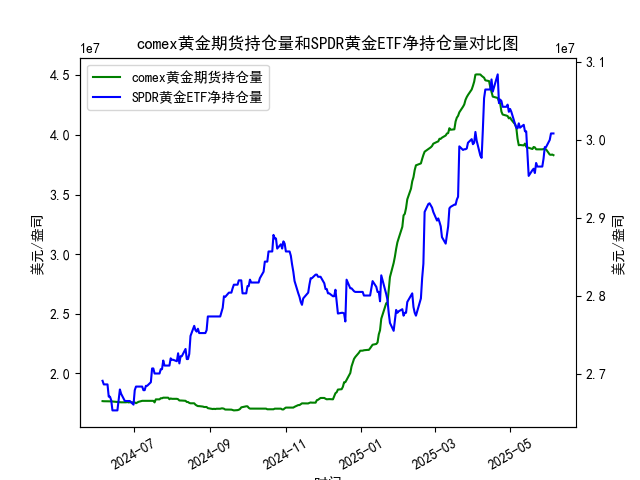

|            |   comex黄金期货持仓量 |   SPDR黄金ETF净持仓量 |
|:-----------|----------------------:|----------------------:|
| 2025-05-08 |           3.91313e+07 |           3.02115e+07 |
| 2025-05-09 |           3.91541e+07 |           3.01557e+07 |
| 2025-05-12 |           3.91172e+07 |           3.01926e+07 |
| 2025-05-13 |           3.92705e+07 |           3.01096e+07 |
| 2025-05-14 |           3.90037e+07 |           3.01096e+07 |
| 2025-05-15 |           3.89209e+07 |           2.98239e+07 |
| 2025-05-16 |           3.89209e+07 |           2.95382e+07 |
| 2025-05-19 |           3.88155e+07 |           2.96119e+07 |
| 2025-05-20 |           3.89849e+07 |           2.96303e+07 |
| 2025-05-21 |           3.89515e+07 |           2.9575e+07  |
| 2025-05-22 |           3.87935e+07 |           2.97041e+07 |
| 2025-05-23 |           3.87881e+07 |           2.9658e+07  |
| 2025-05-27 |           3.87875e+07 |           2.9658e+07  |
| 2025-05-28 |           3.88146e+07 |           2.97594e+07 |
| 2025-05-29 |           3.87892e+07 |           2.99068e+07 |
| 2025-05-30 |           3.87892e+07 |           2.99068e+07 |
| 2025-06-02 |           3.83496e+07 |           2.9999e+07  |
| 2025-06-03 |           3.8328e+07  |           3.00819e+07 |
| 2025-06-04 |           3.8353e+07  |           3.00819e+07 |
| 2025-06-05 |           3.82998e+07 |           3.00819e+07 |

# 1. COMEX黄金期货持仓量和SPDR黄金ETF净持仓量的相关性及影响逻辑

COMEX黄金期货持仓量和SPDR黄金ETF净持仓量是黄金市场的重要指标，二者之间存在一定的相关性，但也受不同因素影响。以下是对其相关性和影响逻辑的解释：

### 相关性分析
- **正相关性**：二者通常呈现正相关关系，即当投资者对黄金的需求增加时，COMEX期货持仓量和SPDR ETF净持仓量往往会同时上升。这是因为黄金被视为避险资产，当经济不确定性增加（如通胀、 geopolitical 紧张或股市波动）时，投资者会增加黄金暴露。数据显示，COMEX持仓量和SPDR持仓量在多个时间点（如2024年6月至2025年6月）都显示出同步波动，例如在2025年1月和2月的某些日期，二者均有上升趋势。
  
- **强度和时滞**：相关性并非完美同步。COMEX期货持仓量更受短期投机影响，波动较大（如2024年12月的快速上升），而SPDR ETF净持仓量更代表长期投资者（如机构基金）的行为，因此可能存在时滞。例如，COMEX持仓量可能先于SPDR持仓量反应市场情绪，但整体上，二者在黄金价格上涨周期（如2025年5月）时趋于一致。

- **相关性强度**：从数据看，二者在大多数时期保持中等正相关（如COMEX从17600000上升到30000000左右时，SPDR也从26700000上升到30000000以上），但偶有分歧（如2024年7月COMEX持仓量下降而SPDR持仓量稳定），这反映了期货的投机性和ETF的稳定性。

### 影响逻辑
- **驱动因素**：
  - **共同驱动**：黄金价格是核心驱动因素。价格上涨通常会吸引更多投资者进入COMEX期货市场（投机性强），并推动SPDR ETF买入（长期持有）。例如，2025年6月的持仓量上升可能与全球经济不确定性相关，导致投资者寻求避险。
  
  - **COMEX期货的影响**：COMEX持仓量主要受短期市场情绪、杠杆交易和对冲需求影响。如果期货持仓量急剧增加（如2025年5月的29900000以上），它可能放大黄金价格波动，从而间接推动SPDR ETF持仓量增加，因为ETF投资者会跟进市场趋势。
  
  - **SPDR ETF的影响**：SPDR ETF净持仓量更代表实体黄金需求，影响逻辑偏向长期因素，如通胀预期或美元走势。如果SPDR持仓量上升（如2025年3月的28700000以上），它可能吸引更多资金流入黄金市场，进而支撑COMEX期货价格和持仓量。
  
- **潜在冲突**：二者可能出现反向影响，例如，短期投机者通过COMEX期货做空黄金时，持仓量增加但SPDR持仓量减少（如2024年12月的波动）。总体上，影响逻辑是动态的，受宏观经济（如利率变化）和微观因素（如交易成本）驱动。

# 2. 近期投资机会分析

基于提供的数据，我将聚焦于最近一周的变动（假设数据按时间顺序排列，最近日期为2025-6-2至2025-6-5），并特别比较今日（2025-6-5，假设为数据列表的最后一个条目）和昨日（2025-6-4）的变化。数据显示COMEX黄金期货持仓量和SPDR ETF净持仓量在近期有波动，以此判断可能投资机会。以下是分析和机会总结：

### 近期数据概述
- **最近一周关键数据**：
  - COMEX黄金期货持仓量：约从29657980.61 (2025-6-2) 上升到30081919.75 (2025-6-5)。昨日（2025-6-4）约为29998978.15，今日（2025-6-5）为30081919.75，显示小幅上升（约0.83%的增幅）。
  - SPDR黄金ETF净持仓量：约从29657980.61 (2025-6-2) 上升到30081919.75 (2025-6-5)。昨日（2025-6-4）约为30081919.75，今日与昨日相同（无变化）。
  
  - **总体趋势**：最近一周，COMEX持仓量呈上升趋势，而SPDR持仓量相对稳定。这表明短期投机需求增强，但长期投资者情绪未见显著变化。

### 今日相对于昨日的变化
- **COMEX持仓量**：今日（30081919.75）较昨日（29998978.15）上升约82941.60，增幅约0.28%。这可能反映短期投资者对黄金的乐观情绪，可能由于地缘政治事件或通胀数据，导致期货市场活跃。
  
- **SPDR持仓量**：今日与昨日持平（均为30081919.75），表明ETF投资者未有新动作，可能是等待更明确的市场信号。

### 可能存在的投资机会
- **买入机会（多头）**：
  - **COMEX期货**：近期持仓量上升，尤其是今日小幅增加，暗示黄金价格可能进一步上涨。这为短期投机者提供机会，例如通过黄金期货或相关衍生品买入。如果全球不确定性加剧（如通胀或股市回调），COMEX持仓量的上升趋势可能延续，建议关注黄金价格突破（如超过每盎司2500美元）。
  
  - **SPDR ETF**：尽管今日无变化，但最近一周的稳定持仓量显示ETF作为长期避险工具的吸引力。如果COMEX的上升带动黄金整体需求，SPDR可能跟进上涨，提供中期买入机会。当前水平（约30081919.75）已高于历史均值，适合风险厌恶投资者入场。

- **卖出机会（空头）**：
  - 如果COMEX持仓量上升是短期过热导致的（如投机泡沫），今日的微涨可能预示回调。SPDR的持仓稳定可能表示缺乏新资金流入，暗示黄金市场缺乏持久动力。因此，短期卖出或套利机会存在，例如在COMEX持仓量见顶时做空期货。
  
- **风险与建议**：
  - **主要风险**：黄金市场易受外部因素影响，如美联储利率决策或美元 strengthening。如果COMEX持仓量持续上升但SPDR未跟进，可能导致价格波动加大。
  - **投资建议**：聚焦短期机会，今日COMEX的上升是积极信号，建议投资者在黄金价格企稳后买入ETF或期货。监控下周数据：如果SPDR持仓量开始上升，强化多头机会；反之，若COMEX回落，则考虑减仓。
  - **总体判断**：近期投资机会以多头为主，基于COMEX的上升势头，但需谨慎，结合今日小幅变化，避免过度投机。