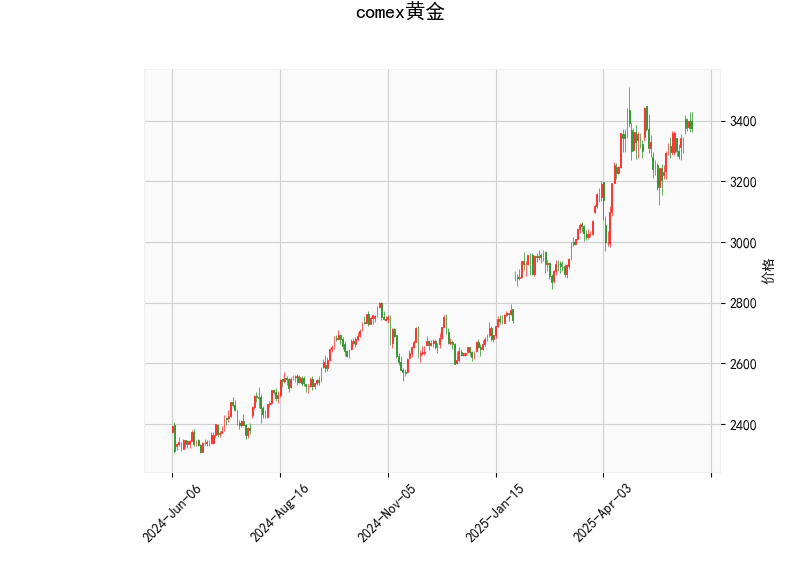

### COMEX黄金技术分析结果详解

#### 1. 对技术分析结果的分析
基于提供的COMEX黄金技术指标数据，我们可以对当前市场状况进行全面评估。以下是对各指标的逐一分析：

- **当前价格（Current Price）**: 黄金价格为3376.1。这表明黄金当前处于一个相对稳定的区间，略高于中长期移动平均线，但尚未接近历史高点或显著阻力位。

- **RSI（Relative Strength Index）**: RSI值为56.84。这是一个中性偏多的信号。通常，RSI在50以上表示市场处于牛市态势，而70以上则为超买区域。目前的56.84表明黄金有轻微的上行动能，但尚未过度买入，市场可能继续积累多头力量。如果RSI持续上升，可能进一步确认牛市；反之，如果跌破50，将转为看空。

- **MACD（Moving Average Convergence Divergence）**: MACD线为32.39，信号线为27.81，MACD直方图为4.58。这是一个明显的看涨信号，因为MACD线位于信号线之上，且直方图为正值（表示多头动量）。这种“金叉”形态暗示短期内可能有向上突破的潜力，但如果直方图开始缩小或转为负值，则需警惕回调风险。

- **布林带（Bollinger Bands）**: 上轨为3497.76，中轨为3238.95，下轨为2980.13。目前价格3376.1位于中轨和上轨之间，表明黄金处于布林带的正常波动范围内。价格未触及上轨（3497.76），说明市场尚未超买；如果价格回落至中轨以下，可能进入盘整或回调阶段。布林带的收窄或扩张可以进一步指导短期趋势。

- **K线形态（CDLMATCHINGLOW）**: 这是一个看跌形态，通常表示价格可能在短期内见底或出现反转。它暗示市场可能存在潜在的卖出压力，尤其是如果伴随其他负面信号。但在当前RSI和MACD的牛市背景下，这个形态可能只是暂时的修正，而不是全面逆转。投资者需密切关注后续K线确认。

**总体市场看法**:  
从整体来看，COMEX黄金显示出中性偏多的态势。RSI和MACD的指标支持潜在的上行趋势，表明黄金可能在短期内继续走强。然而，CDLMATCHINGLOW的出现提醒了下行风险，特别是在全球经济不确定性（如通胀、地缘政治事件）的影响下。价格在中轨之上，但未突破上轨，暗示市场处于蓄势待发的阶段。如果外部因素（如美联储政策）利好黄金，上涨机会较大；反之，任何负面消息都可能触发回调。

#### 2. 近期可能存在的投资或套利机会和策略
基于上述分析，COMEX黄金的近期机会主要聚焦于短期交易和风险管理。以下是针对当前技术指标的判断和策略建议：

- **可能的投资机会**:
  - **上行机会**: RSI和MACD的看涨信号表明黄金可能测试上轨（3497.76）。如果全球避险需求上升（如地缘冲突或经济衰退预期），黄金价格有潜力向上突破，带来10-15%的短期涨幅。
  - **下行风险**: CDLMATCHINGLOW形态提示潜在回调，如果价格跌破中轨（3238.95），可能滑向下轨（2980.13），提供逢低买入的机会。
  - **套利潜力**: 在COMEX和现货黄金市场之间，可能存在价格差异导致的套利机会。例如，如果COMEX期货溢价过高，可以考虑现货买入并期货卖出套利。但需注意流动性风险，黄金市场通常更适合短期价差套利而非长期持有。

- **投资策略建议**:
  - **多头策略（推荐当前环境）**: 在RSI未超买的情况下，考虑买入黄金期货或实物黄金。**进场点**: 当前价格附近（3376.1）。**目标价**: 上轨3497.76。**止损设置**: 若跌破中轨3238.95，立即止损以控制损失。结合MACD直方图，待其扩大时加仓。
  - **空头策略**: 如果CDLMATCHINGLOW形态得到确认（如后续K线显示更多卖压），可以尝试做空。**进场点**: 价格回落至中轨附近。**目标价**: 下轨2980.13。**止损设置**: 若价格反弹至上轨以上，及时平仓。该策略适合短期波段交易。
  - **中性策略（套利或范围交易）**: 利用布林带的波动区间进行买卖。**方法**: 在上轨附近卖出，在下轨附近买入，实现区间内套利。**风险管理**: 控制仓位不超过总资金的20%，并使用技术止损（如基于RSI回落至50以下）。
  - **整体风险提示**: 黄金市场受宏观因素影响大，如通胀数据或美元走势。建议结合基本面分析（如关注美联储会议），并使用小仓位测试。长期投资者可考虑多元化，如黄金ETF搭配股票资产，以降低波动性。

总之，近期COMEX黄金的投资机会以短期多头为主，但需警惕技术反转信号。策略应以风险控制为先，结合市场新闻动态调整。