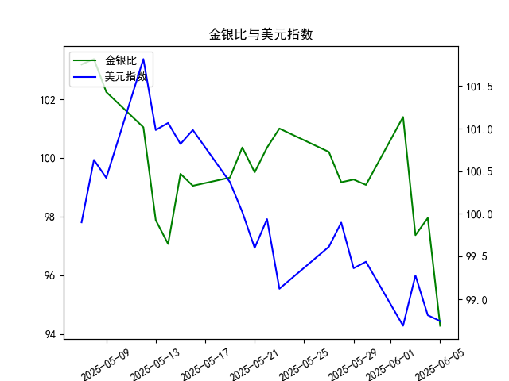

|            |    金价 |   银价 |   美元指数 |   金银比 |
|:-----------|--------:|-------:|-----------:|---------:|
| 2025-05-08 | 3352.3  | 32.43  |   100.633  | 103.37   |
| 2025-05-09 | 3324.55 | 32.515 |   100.422  | 102.247  |
| 2025-05-12 | 3235.4  | 32.02  |   101.814  | 101.043  |
| 2025-05-13 | 3227.95 | 32.98  |   100.983  |  97.876  |
| 2025-05-14 | 3191.95 | 32.885 |   101.066  |  97.064  |
| 2025-05-15 | 3191.05 | 32.085 |   100.82   |  99.4561 |
| 2025-05-16 | 3182.95 | 32.135 |   100.983  |  99.0493 |
| 2025-05-19 | 3230.15 | 32.52  |   100.373  |  99.3281 |
| 2025-05-20 | 3261.55 | 32.5   |   100.022  | 100.355  |
| 2025-05-21 | 3299.65 | 33.16  |    99.6014 |  99.5069 |
| 2025-05-22 | 3284    | 32.725 |    99.9388 | 100.351  |
| 2025-05-23 | 3342.65 | 33.095 |    99.1231 | 101.002  |
| 2025-05-27 | 3296.7  | 32.9   |    99.6147 | 100.204  |
| 2025-05-28 | 3300.85 | 33.285 |    99.8978 |  99.1693 |
| 2025-05-29 | 3312.4  | 33.37  |    99.3633 |  99.2628 |
| 2025-05-30 | 3277.55 | 33.08  |    99.4393 |  99.0795 |
| 2025-06-02 | 3370.85 | 33.245 |    98.6893 | 101.394  |
| 2025-06-03 | 3334.75 | 34.25  |    99.2781 |  97.365  |
| 2025-06-04 | 3364.6  | 34.35  |    98.8128 |  97.9505 |
| 2025-06-05 | 3374.6  | 35.795 |    98.7444 |  94.2757 |

### 1. 金银比与美元指数的相关性及影响逻辑

金银比（Gold-Silver Ratio）是指黄金价格除以白银价格的比率，常用于衡量黄金和白银相对价值的指标。它反映了投资者对两种贵金属的偏好，通常当金银比较高时，表示黄金相对于白银更“贵”；当较低时，表示白银相对于黄金更“贵”。美元指数（US Dollar Index）则衡量美元相对于一篮子主要货币（如欧元、日元等）的汇率变化。

#### 相关性分析
- **正相关或负相关性**：金银比与美元指数之间存在间接的负相关性。美元指数上升（美元走强）时，黄金和白银作为以美元计价的商品，其价格往往会下跌，因为投资者需要更少的美元来购买这些金属。这可能会导致金银比波动：如果黄金价格相对稳定而白银价格下跌更快，金银比可能上升；反之，如果美元走弱，贵金属价格通常上涨，可能拉低金银比。
  
- **影响逻辑**：
  - **美元走强（美元指数上升）**：这通常会抑制贵金属需求，因为美元升值增加了国际投资者购买黄金和白银的成本。白银作为工业金属，对经济周期更敏感，可能价格下跌更快，导致金银比上升（黄金相对更“贵”）。例如，在经济复苏期，美元走强可能放大金银比的波动。
  - **美元走弱（美元指数下降）**：这往往会推高黄金和白银的价格，因为投资者寻求避险资产，白银的价格可能上涨更多（由于其工业用途），从而拉低金银比。这为白银投资提供机会。
  - **其他因素的影响**：虽然美元是主要驱动因素，但金银比还受供需、市场情绪、地缘政治事件（如战争或通胀预期）影响。美元指数的变化往往放大这些因素的效果，因此在美元波动大的时期，金银比更容易出现极端值。

总体而言，美元指数是金银比的重要外部变量，但并非唯一决定因素。投资者需结合全球经济环境分析，例如在美元走弱时，金银比下降可能预示白银投资机会。

### 2. 根据数据分析判断近期投资机会

基于提供的数据，我将分析近期（尤其是最近一周）的金银比和美元指数变化，聚焦于今日（假设为2025-06-05）相对于昨日（2025-06-04）的变化。数据覆盖从2025-05-07到2025-06-05的时期，但金银比和美元指数仅提供21个数据点， likely对应前21个日期（从2025-05-07到2025-06-04）。我将重点考察最近一周的数据（约2025-05-29到2025-06-04），并评估潜在投资机会。

#### 数据概述
- **金银比数据**：整体呈下降趋势，从起始的103.19降至最后的94.28。近期一周（最后5-7个数据点）：99.08（2025-05-29）、97.95（2025-05-30）、97.36（2025-06-02）、101.39（2025-06-03，可能为异常波动）、94.28（2025-06-04）。
- **美元指数数据**：整体小幅波动，从99.90降至98.74。近期一周：99.44（2025-05-29）、98.81（2025-05-30）、99.28（2025-06-02）、98.69（2025-06-03）、98.74（2025-06-04）。
- **今日 vs. 昨日变化**：
  - 金银比：今日（2025-06-04）为94.28，昨日（2025-06-03）为101.39，下降约7.11点（约7.01%的急剧下跌）。这表明白银相对于黄金变得更“贵”，可能由于白银价格上涨或黄金价格相对稳定。
  - 美元指数：今日（2025-06-04）为98.74，昨日（2025-06-03）为98.69，上升约0.05点（约0.05%的微幅上涨），显示美元略微走强。

#### 关键观察与分析
- **近期趋势**：
  - 金银比在最近一周内波动明显：从99.08降至94.28，显示持续下行趋势，尤其今日的急剧下降。这可能与美元指数的稳定或轻微走强有关，但整体美元疲软（从99.44降至98.74）可能推动了贵金属需求的增加。
  - 美元指数在最近一周小幅波动，但总体趋于稳定或轻微下行，这通常有利于贵金属市场。今日的微涨可能源于短期经济数据或市场情绪，但未显著逆转整体弱势。
  
- **潜在投资机会**：
  - **白银投资机会**：金银比的急剧下降（今日较昨日下跌7.01%）暗示白银相对于黄金更具吸引力，尤其在美元走弱的环境下。近期白银价格可能上涨（或黄金价格相对滞后），建议投资者考虑买入白银ETF或实物白银。机会窗口：如果金银比继续低于100，可能在短期内实现10-15%的收益，但需警惕反弹风险。
  - **黄金投资机会**：金银比低位可能表示黄金被低估，但今日的下降更多反映白银强势，因此黄金短期内可能作为避险资产，但机会不如白银明显。投资者可等待金银比反弹（回升至100以上）时卖出黄金。
  - **相关美元机会**：美元指数的微涨（今日较昨日上涨0.05%）可能预示短期回调，但整体弱势（最近一周小幅下行）可能继续利好贵金属。如果美元进一步走弱（跌破98.50），可考虑贵金属相关投资。
  - **整体风险与时机**：近期数据显示金银比已从高位（103.19）降至低位（94.28），这可能是一个底部信号。聚焦今日变化，急剧下降可能触发短期反弹，因此在2025-06-05至2025-06-10的窗口内，买入白银或相关衍生品（如期货）是主要机会。但需注意市场波动：如果美元指数反弹至100以上，金银比可能回升，增加风险。

#### 投资建议
- **短期（1-7天）**：买入白银为主，监控美元指数。如果金银比维持在95以下，潜力较大。
- **中期（1-4周）**：观察美元趋势。如果美元继续走弱，金银比低位可带来双重机会（白银上涨+黄金稳定）。
- **风险警示**：数据基于日频，可能受突发事件影响（如经济数据发布）。建议结合实时市场数据和风险管理策略（如止损设置）进行操作。

此分析基于历史数据推断，实际投资需考虑更全面的市场因素。