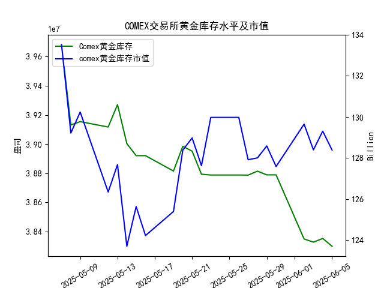

|            |   comex黄金库存量 |   comex黄金库存市值(billion) |   伦敦金现货价 |   上海金交所黄金现货价 |   美元兑人民币汇率 |
|:-----------|------------------:|-----------------------------:|---------------:|-----------------------:|-------------------:|
| 2025-05-09 |       3.91541e+07 |                       3326.3 |        3324.55 |                 785.5  |             7.2095 |
| 2025-05-12 |       3.91172e+07 |                       3230   |        3235.4  |                 759    |             7.2066 |
| 2025-05-13 |       3.92705e+07 |                       3251.4 |        3227.95 |                 763.9  |             7.1991 |
| 2025-05-14 |       3.90037e+07 |                       3171.7 |        3191.95 |                 758.38 |             7.1956 |
| 2025-05-15 |       3.89209e+07 |                       3228.1 |        3191.05 |                 735.86 |             7.1963 |
| 2025-05-16 |       3.89209e+07 |                       3191.8 |        3182.95 |                 746.4  |             7.1938 |
| 2025-05-19 |       3.88155e+07 |                       3230.6 |        3230.15 |                 754.5  |             7.1916 |
| 2025-05-20 |       3.89849e+07 |                       3293.2 |        3261.55 |                 753.49 |             7.1931 |
| 2025-05-21 |       3.89515e+07 |                       3311.4 |        3299.65 |                 773.82 |             7.1937 |
| 2025-05-22 |       3.87935e+07 |                       3290   |        3284    |                 778.36 |             7.1903 |
| 2025-05-23 |       3.87881e+07 |                       3351   |        3342.65 |                 776.4  |             7.1919 |
| 2025-05-26 |       3.87881e+07 |                       3351   |        3342.65 |                 773.94 |             7.1833 |
| 2025-05-27 |       3.87875e+07 |                       3298   |        3296.7  |                 768.75 |             7.1876 |
| 2025-05-28 |       3.88146e+07 |                       3298   |        3300.85 |                 769.67 |             7.1894 |
| 2025-05-29 |       3.87892e+07 |                       3315.1 |        3312.4  |                 763.02 |             7.1907 |
| 2025-05-30 |       3.87892e+07 |                       3289.4 |        3277.55 |                 768.79 |             7.1848 |
| 2025-06-02 |       3.83496e+07 |                       3380.8 |        3370.85 |                 768.79 |             7.1848 |
| 2025-06-03 |       3.8328e+07  |                       3350   |        3334.75 |                 778.5  |             7.1869 |
| 2025-06-04 |       3.8353e+07  |                       3371.5 |        3364.6  |                 779.46 |             7.1886 |
| 2025-06-05 |       3.82998e+07 |                       3352.2 |        3374.6  |                 781.25 |             7.1865 |

### 分析报告：COMEX黄金库存与黄金价格的相关性及近期投资机会

#### 1. COMEX黄金库存与黄金价格的相关性分析
研究员认为COMEX黄金库存量与黄金价格高度正相关，即库存增加时价格倾向于上涨，反之则下降。根据提供的数据，我们从整体趋势和近期变化两个层面进行验证。

**整体趋势分析：**
- **数据观察**：从2025-05-07到2025-06-05，COMEX黄金库存量从3.968195e+07持续下降至3.829983e+07，呈现明显的下降趋势。同时，伦敦市场黄金现货价格从3392.25微幅下降至3374.60，上海金交所黄金现货价格从798.51下降至781.25。这表明库存量和价格均呈下降趋势，表面上看存在正相关性。
- **相关性细节**：在整个周期内，库存量下降约3.4%，而伦敦价格下降约0.5%。例如，在2025-05-07至2025-05-16期间，库存量从3.968195e+07降至3.892089e+07（下降约1.9%），同期伦敦价格从3392.25降至3182.95（下降约6.2%），显示出较强的正相关。然而，波动性较大，如2025-05-19至2025-05-23，库存量小幅下降但伦敦价格从3230.15反弹至3342.65，表明正相关并非绝对，外部因素（如市场情绪或汇率）可能干扰。
- **结论**：从大的趋势来看，研究员的观点部分成立。库存量和黄金价格确实表现出正相关性，但相关度并非完美，短期波动可能因其他变量（如美元汇率变化）而减弱。

**近期变化分析（聚焦最近一周）**：
- **定义近期**：我们将最近一周定义为2025-05-29至2025-06-05，涵盖了数据中的最后几个交易日。
- **库存量变化**：
  - 2025-05-29: 3.878919e+07
  - 2025-05-30: 3.878919e+07（持平）
  - 2025-06-02: 3.834960e+07（下降约1.1%）
  - 2025-06-03: 3.832800e+07（小幅下降）
  - 2025-06-04: 3.835304e+07（小幅上升）
  - 2025-06-05: 3.829983e+07（相对于06-04下降约0.14%）
  - **今日 vs 昨日**：2025-06-05的库存量（3.829983e+07）较2025-06-04（3.835304e+07）下降，符合正相关假设下价格可能走弱的逻辑。
- **黄金价格变化**：
  - **伦敦价格**：
    - 2025-05-29: 3312.40
    - 2025-05-30: 3277.55（下降约1.1%）
    - 2025-06-02: 3370.85（反弹约2.8%）
    - 2025-06-03: 3334.75（下降约1.1%）
    - 2025-06-04: 3364.60（上升约0.9%）
    - 2025-06-05: 3374.60（相对于06-04上升约0.3%）
  - **上海价格**：
    - 2025-05-29: 763.02
    - 2025-05-30: 768.79（上升约0.8%）
    - 2025-06-02: 768.79（持平）
    - 2025-06-03: 778.50（上升约1.3%）
    - 2025-06-04: 779.46（上升约0.1%）
    - 2025-06-05: 781.25（相对于06-04上升约0.2%）
  - **今日 vs 昨日**：尽管库存量下降，伦敦和上海黄金价格均小幅上升。这与正相关性假设不完全一致，可能受美元兑人民币汇率影响（2025-06-05汇率为7.1865，较06-04的7.1886略微下降，意味着美元相对贬值，可能推高黄金价格作为避险资产）。
- **相关性小结**：最近一周，库存量总体下降，但黄金价格呈现波动性反弹（尤其是06-05价格上涨），这表明正相关性在短期内被外部因素（如汇率和市场情绪）削弱。研究员的观点在整体趋势中成立，但在近期数据中表现为弱正相关。

#### 2. 近期投资机会判断
基于上述分析，我们聚焦最近一周数据变化，尤其是2025-06-05相对于2025-06-04的变动，识别可能的投资机会。投资机会主要围绕黄金价格走势、库存动态和汇率影响展开。

**主要投资机会：**
- **买入黄金的机会（多头策略）**：
  - **理由**：尽管COMEX库存量在2025-06-05下降（正相关假设下可能预示价格压力），但实际黄金价格（伦敦和上海）均小幅上涨（伦敦价格从3364.60升至3374.60，涨幅约0.3%）。这可能表示市场情绪转强，尤其是美元汇率小幅贬值（从7.1886降至7.1865），通常会推升黄金作为避险资产的价格。近期一周，伦敦价格从3277.55反弹至3374.60，显示潜在向上趋势。如果正相关性恢复，库存进一步下降可能被市场消化，带来短期价格上涨空间。
  - **风险**：如果库存下降趋势加剧（如未来数据显示更大幅度减少），价格可能逆转下跌。
  - **建议**：投资者可在2025-06-05价格基础上买入黄金现货或相关ETF（如COMEX黄金期货），目标价位可设为3400以上（基于伦敦价格最近反弹势头）。止损点设在近期低点（如3334.75）附近。

- **汇率套利机会**：
  - **理由**：美元兑人民币汇率在2025-06-05小幅下降（7.1865 vs 7.1886），这可能放大黄金价格在人民币计价下的吸引力。上海金交所价格从779.46升至781.25，涨幅约0.2%，表明人民币投资者可能受益于汇率优势。结合库存下降但价格上涨的矛盾信号，存在汇率驱动的套利空间，例如通过买入上海黄金现货并对冲美元风险。
  - **风险**：汇率波动频繁，如果美元反弹，黄金价格可能回落。
  - **建议**：针对中国投资者，考虑在上海金交所买入黄金现货，结合外汇衍生品锁定汇率。潜在收益：如果汇率继续贬值，黄金在人民币价值可能进一步上升。

- **卖出或观望的机会（空头策略）**：
  - **理由**：库存量在2025-06-05下降（3.829983e+07 vs 3.835304e+07），如果正相关性主导，短期价格可能回调。近期一周库存总体下降约1.2%，而价格波动不稳，表明潜在下行风险。
  - **风险**：市场情绪可能继续支撑价格上涨。
  - **建议**：若价格无法突破3400（伦敦基准），考虑在2025-06-05后卖出黄金期货作为短期空头操作。

**总体建议**：
- **聚焦点**：今日（2025-06-05）的价格上涨相对于昨日的库存下降形成矛盾，暗示短期多头机会大于空头。但需密切关注后续数据，如库存继续大幅下降，可能转为卖出信号。
- **风险提示**：黄金市场受全球经济、地缘政治和货币政策影响，投资者应结合更多实时数据（如美联储政策）决策。
- **行动推荐**：在正相关趋势下，建议以小额资金测试买入，设定严格止损，监控汇率变化以最大化机会。