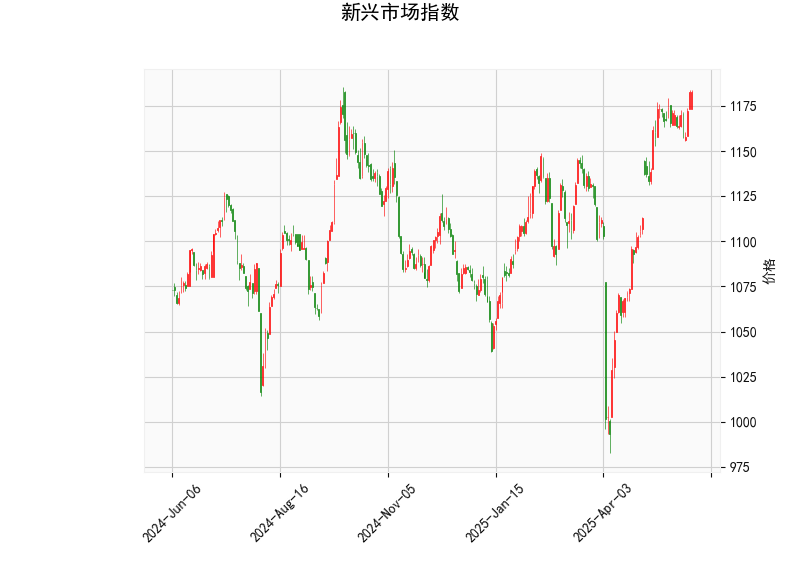

# 新兴市场指数的技术分析结果分析

新兴市场指数的当前技术指标显示出混合信号，结合价格行为、动量指标、趋势跟踪工具以及K线形态，我们可以对市场短期走势进行评估。以下是对各指标的详细分析：

### 1. 当前价格与布林带分析
- **当前价格**: 1182.68，位于布林带的中轨（1121.24）和上轨（1218.51）之间。
- **布林带解读**: 
  - 中轨（1121.24）作为20期简单移动平均线，代表中期趋势的基准。
  - 价格接近上轨（1218.51），表明市场可能处于高位波动期。布林带的宽度（上轨减下轨）约为194.52，显示当前波动率中等偏高。
  - 当价格靠近上轨时，通常暗示潜在的超买状态或即将逆转的风险。如果价格回落至中轨以下，可能触发修正；反之，若突破上轨，则可能延续上涨趋势。

### 2. RSI（相对强弱指数）分析
- **RSI值**: 66.38。
- **解读**: RSI处于超买区域（高于70的阈值），当前值已接近这一水平，表明买盘力量强劲但可能过度。近期RSI上升趋势暗示市场多头主导，但这也增加了回调风险。如果RSI突破70，可能进一步确认超买，并引发短期卖出压力。

### 3. MACD（移动平均收敛散度）分析
- **MACD线**: 15.02，**信号线**: 16.24，**柱状图（Hist）**: -1.23（负值）。
- **解读**: 
  - MACD线低于信号线，形成看跌交叉（death cross），这通常是卖出信号，暗示短期趋势可能逆转或弱化。
  - 负的柱状图表示动量正在减弱，卖方力量可能开始占上风。尽管MACD线仍为正值（表明整体趋势偏多头），但其与信号线的背离预示潜在的下行风险。
  - 这可能反映市场从之前的强势上涨中冷却，投资者需警惕进一步的负面发展。

### 4. K线形态分析
- **形态**: CDLBELTHOLD（腰带持有）和CDLGAPSIDESIDEWHITE（间隙侧边白线）。
- **解读**: 
  - CDLBELTHOLD 是一种看涨形态，通常表示多头控制市场，价格可能维持强势。但在当前超买背景下，它可能只是短期反弹的延续，而非长期信号。
  - CDLGAPSIDESIDEWHITE 暗示价格间隙上涨，伴随实体较大的白色蜡烛，显示强势买盘。但结合其他指标，这可能已达到顶峰，容易引发获利回吐。
  - 整体K线形态偏向多头，但需与其他指标验证，以避免假突破。

### 总体技术分析总结
新兴市场指数当前显示出短期多头主导的迹象（如K线形态和价格接近上轨），但动量指标（如RSI超买和MACD看跌信号）警告潜在回调风险。市场可能处于关键转折点：如果多头维持，价格可能测试上轨以上；反之，卖出压力可能导致回落至中轨或下轨（1023.98）。整体而言，短期走势偏中性偏空，需关注外部因素（如经济数据或地缘事件）以确认方向。

# 近期可能存在的投资或套利机会和策略

基于上述分析，新兴市场指数的混合信号为投资者提供了潜在机会，但也伴随风险。以下是针对短期（1-3个月）的判断和策略建议，重点关注波动性和趋势逆转。

### 1. 可能存在的投资机会
- **短期回调机会**: RSI超买和MACD看跌信号暗示市场可能出现10-15%的回调（价格回落至中轨附近1121-1150区间）。这为价值投资者提供买入点，尤其如果基本面（如新兴市场经济增长）支持长期上涨。
- **多头延续机会**: K线形态显示看涨潜力，如果价格突破上轨（1218.51），可能触发进一步上涨至1250以上。适合趋势跟踪者入场。
- **风险警示**: 当前指标显示高波动性，投资需设置止损（例如，价格跌破中轨时止损）以控制损失。

### 2. 套利机会分析
- **波动率套利**: 布林带显示中等波动率，RSI和MACD的背离可能导致短期价格波动加大。通过期权或期货市场进行套利，例如：
  - **卖出看涨期权（Call Option）**: 如果预期回调，投资者可在当前高位卖出1180-1220区间的看涨期权，收取溢价作为收益（波动率较高时更具吸引力）。
  - **买入看跌期权（Put Option）**: 针对MACD信号，买入价格回落至1100附近的看跌期权，以对冲下行风险。
- **跨市场套利**: 新兴市场指数可能与全球股市（如美国股指）相关。如果全球市场稳定，新兴市场回调时可进行指数间套利（例如，卖出新兴市场多头，买入发达市场多头）。
- **潜在收益与风险**: 套利机会主要源于指标背离（如RSI超买与K线多头冲突），预计收益率为5-10%，但需警惕突发事件（如通胀数据或地缘紧张）放大波动。

### 3. 推荐投资策略
- **保守策略**: 观望为主，等待RSI回落至60以下再买入。使用布林带作为参考：在上轨附近卖出部分持仓，在中轨附近加仓。
- **中性策略**: 结合多空平衡，例如构建一个50%多头（买入指数ETF）和50%空头（卖出期货或期权）的组合。目标是捕捉波动性，提供5-8%的无风险收益。
- **积极策略**: 如果您偏好高风险，基于K线形态做多（买入现货或杠杆产品），但同时设置10%的止损位（例如，价格跌破1150）。若MACD信号确认，切换为做空策略。
- **总体建议**: 短期内，优先考虑防御性策略，如分散投资于新兴市场相关资产（例如，结合债券或大宗商品）。监控关键水平：若价格跌破中轨，空头机会增加；若RSI降至50以下，多头机会显现。始终结合基本面分析（如新兴经济复苏数据）以增强决策。