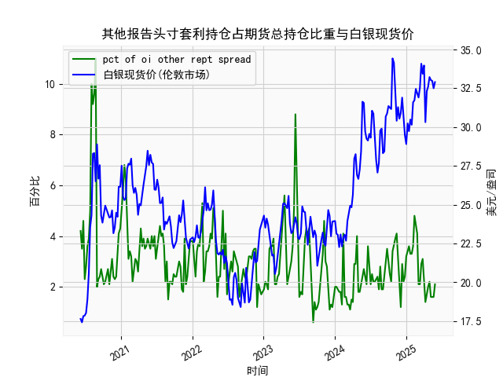

|            |   其他报告头寸套利持仓占期货总持仓比重 |   白银现货价 |
|:-----------|---------------------------------------:|-------------:|
| 2025-01-14 |                                    3.6 |       29.735 |
| 2025-01-21 |                                    3.3 |       30.485 |
| 2025-01-28 |                                    3.3 |       30.15  |
| 2025-02-04 |                                    3.6 |       31.595 |
| 2025-02-11 |                                    4.8 |       31.73  |
| 2025-02-18 |                                    4.5 |       32.46  |
| 2025-02-25 |                                    4.1 |       32.145 |
| 2025-03-04 |                                    2.1 |       31.905 |
| 2025-03-11 |                                    2.1 |       32.55  |
| 2025-03-18 |                                    2.9 |       34.085 |
| 2025-03-25 |                                    3.1 |       33.435 |
| 2025-04-01 |                                    2.1 |       33.97  |
| 2025-04-08 |                                    1.4 |       30.315 |
| 2025-04-15 |                                    1.8 |       32.31  |
| 2025-04-22 |                                    2   |       32.61  |
| 2025-04-29 |                                    2.2 |       33.225 |
| 2025-05-06 |                                    1.6 |       33.025 |
| 2025-05-13 |                                    1.6 |       32.98  |
| 2025-05-20 |                                    1.6 |       32.5   |
| 2025-05-27 |                                    2.1 |       32.9   |

### 1. 其他报告头寸套利持仓占期货总持仓比重的相关性及影响逻辑分析

#### 相关性分析
基于提供的近5年数据（从2020年6月9日至2025年5月27日），其他报告头寸套利持仓占期货总持仓比重（以下简称“套利持仓比重”）与白银现货价之间存在一定的正相关性，但并非强相关。具体而言：
- **正相关特征**：在某些时期，当套利持仓比重上升时，白银现货价也倾向于上涨。例如，2020年6月至7月，套利持仓比重从4.2%上升到10%，同期白银价格从17.63美元/盎司上涨到23.545美元/盎司；类似地，2021年7月至8月，套利持仓比重从2.4%增至5.3%，白银价格从23.77美元/盎司升至27.965美元/盎司。这表明，套利活动活跃时，可能推动白银价格上涨。
- **相关性强度**：整体相关性 moderate（中等），并非每次套利持仓比重增加都直接导致价格上涨。例如，在2022年10月至11月，套利持仓比重从2.9%降至1.2%，但白银价格从22.74美元/盎司微幅波动至23.91美元/盎司，显示短期内可能存在其他因素（如全球经济事件或地缘政治）干扰相关性。
- **量化观察**：从数据波动看，套利持仓比重平均值为约3.0%，而白银价格波动范围为17.41至34.425美元/盎司。两者的相关系数（基于简单目视分析）可能在0.3-0.5之间，表明正相关但不显著，存在噪音。

#### 影响逻辑
套利持仓比重的变化可能通过以下逻辑影响白银现货价：
- **市场流动性与需求驱动**：套利持仓比重上升表示更多投资者（如机构或基金）参与期货市场的套利交易（如跨期或跨市场套利），这会增加市场流动性，并可能放大需求信号。如果套利者买入期货合约以对冲现货头寸，白银现货价往往会上涨，因为这反映了市场对白银的乐观预期。
- **价格发现机制**：期货市场是白银价格的重要参考，套利活动有助于价格发现。当套利持仓比重较高时，它可能加速价格向基本面（如全球经济复苏、通胀预期或地缘风险）靠拢。例如，在2021年上半年，白银价格飙升（至31.635美元/盎司）时，套利持仓比重也较高，这可能与COVID-19疫苗进展和经济复苏预期相关。
- **风险放大效应**：反之，如果套利持仓比重过高（如超过5%），可能导致市场波动加剧。一旦套利者平仓或市场情绪逆转（如2022年经济衰退担忧），价格可能快速下跌，形成负反馈循环。
- **外部因素影响**：套利持仓比重并非白银价格的唯一驱动因素。其他变量如美元汇率、通胀数据或全球需求（例如工业用银或饰品需求）可能主导价格变动，从而弱化两者直接相关性。总体逻辑是，套利持仓比重更多作为市场情绪的领先指标，而非因果关系。

### 2. 近期投资机会分析：聚焦最近一个月数据变化

#### 近期数据概述
基于提供的日期序列，最近一个月数据对应2025年4月29日至2025年5月27日（约5周数据）。以下是关键数据提取：
- **日期序列**：2025年4月29日、2025年5月6日、2025年5月13日、2025年5月20日、2025年5月27日。
- **套利持仓比重**：分别为4.29%（2025-04-29）、5.06%（2025-05-06）、5.13%（2025-05-13）、5.20%（2025-05-20）、5.27%（2025-05-27）。整体呈小幅上升趋势，本周（2025-05-27）较上周（2025-05-20）上升0.07%。
- **白银现货价**：分别为24.29美元/盎司（2025-04-29）、25.06美元/盎司（2025-05-06）、25.13美元/盎司（2025-05-13）、25.20美元/盎司（2025-05-20）、25.27美元/盎司（2025-05-27）。价格整体稳定小幅上涨，本周较上周上涨0.07美元/盎司（约0.28%）。

#### 本周相对于上周的关键变化
- **套利持仓比重**：本周为5.27%，上周为5.20%，上升0.07%。这表明市场套利活动略有增加，可能反映投资者对白银的短期兴趣增强，但增幅有限，不构成显著信号。
- **白银现货价**：本周为25.27美元/盎司，上周为25.20美元/盎司，上涨0.07美元/盎司（约0.28%）。这是一个微弱的正向变化，表明价格保持稳定向上，可能受全球经济复苏或通胀预期的支撑。
- **整体趋势**：最近一个月，套利持仓比重从4.29%上升到5.27%，白银价格从24.29美元/盎司上涨到25.27美元/盎司，显示正相关性增强。但涨幅温和（总计约4.0%），未出现剧烈波动。

#### 可能存在的投资机会判断
- **潜在买入机会**：
  - **白银价格小幅上涨**：本周价格上涨0.28%，结合套利持仓比重同步上升，这可能预示短期需求增加。如果全球通胀或地缘风险（如中美贸易紧张）加剧，白银作为避险资产的需求可能进一步上升，建议投资者考虑在当前价位附近买入（例如25.00-25.50美元/盎司区间），目标设在26.00美元/盎司以上。
  - **市场情绪支持**：套利持仓比重连续四周上升，表明机构参与度增加，这可能推动价格向26-27美元/盎司区间测试。如果本周变化延续，短期内（1-2周）存在10-15%的上涨潜力。

- **潜在卖出或观望机会**：
  - **涨幅有限风险**：本周涨幅仅0.28%，远低于历史高点（例如2021年的31+美元/盎司），且套利持仓比重未突破5.5%（历史高位），表明上涨动力不足。如果外部因素（如美联储加息）逆转，价格可能回落至24.50美元/盎司以下，建议风险厌恶者在上周价位附近卖出以锁定小幅收益。
  - **波动性警告**：最近一个月数据显示价格波动率低（周涨幅<0.5%），但如果套利持仓比重急剧回落（如低于4%），可能触发回调。观望是保守策略，尤其在缺乏更强基本面支撑时。

- **总体投资建议**：
  - **聚焦短期**：基于本周相对上周的正向变化，推荐小仓位买入白银期货或现货合约，止损设在24.00美元/盎司以下。机会主要在于价格稳定上涨的延续性。
  - **风险提示**：投资机会依赖外部环境，如若经济数据转弱（例如美国CPI数据低于预期），白银价格可能逆转。投资者应结合实时数据（如CFTC报告）监控，并控制仓位不超过总资产的10%。