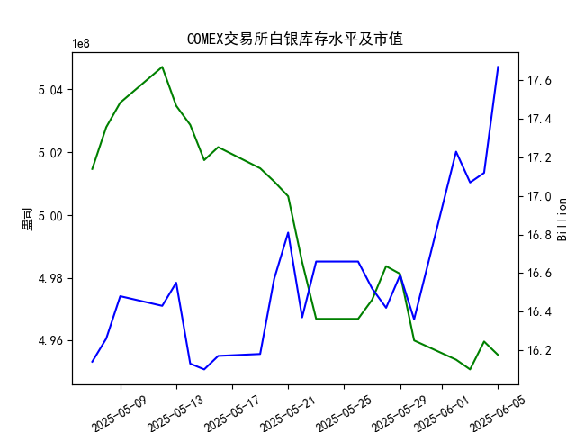

|            |   comex白银库存量 |   comex白银库存市值(billion) |   伦敦银现货价 |   上海金交所白银现货价 |   美元兑人民币汇率 |
|:-----------|------------------:|-----------------------------:|---------------:|-----------------------:|-------------------:|
| 2025-05-09 |       5.03581e+08 |                       32.73  |         32.515 |                   8150 |             7.2095 |
| 2025-05-12 |       5.04719e+08 |                       32.56  |         32.02  |                   8124 |             7.2066 |
| 2025-05-13 |       5.03481e+08 |                       32.88  |         32.98  |                   8214 |             7.1991 |
| 2025-05-14 |       5.02874e+08 |                       32.085 |         32.885 |                   8172 |             7.1956 |
| 2025-05-15 |       5.0175e+08  |                       32.085 |         32.085 |                   7967 |             7.1963 |
| 2025-05-16 |       5.02164e+08 |                       32.195 |         32.135 |                   8062 |             7.1938 |
| 2025-05-19 |       5.0149e+08  |                       32.265 |         32.52  |                   8113 |             7.1916 |
| 2025-05-20 |       5.01069e+08 |                       33.065 |         32.5   |                   8057 |             7.1931 |
| 2025-05-21 |       5.00598e+08 |                       33.575 |         33.16  |                   8237 |             7.1937 |
| 2025-05-22 |       4.98504e+08 |                       32.84  |         32.725 |                   8268 |             7.1903 |
| 2025-05-23 |       4.96695e+08 |                       33.535 |         33.095 |                   8244 |             7.1919 |
| 2025-05-26 |       4.96695e+08 |                       33.535 |         33.095 |                   8239 |             7.1833 |
| 2025-05-27 |       4.97303e+08 |                       33.215 |         32.9   |                   8189 |             7.1876 |
| 2025-05-28 |       4.98373e+08 |                       32.955 |         33.285 |                   8211 |             7.1894 |
| 2025-05-29 |       4.98128e+08 |                       33.3   |         33.37  |                   8202 |             7.1907 |
| 2025-05-30 |       4.96008e+08 |                       32.975 |         33.08  |                   8192 |             7.1848 |
| 2025-06-02 |       4.95395e+08 |                       34.79  |         33.245 |                   8192 |             7.1848 |
| 2025-06-03 |       4.95085e+08 |                       34.475 |         34.25  |                   8405 |             7.1869 |
| 2025-06-04 |       4.95974e+08 |                       34.51  |         34.35  |                   8441 |             7.1886 |
| 2025-06-05 |       4.95544e+08 |                       35.665 |         35.795 |                   8456 |             7.1865 |

### 近期白银市场投资机会分析

#### 1. 分析概述
基于提供的2025年5月7日至6月5日数据，我对近期白银市场（包括COMEX交易所白银库存量、库存市值、伦敦市场现货价格、上海金交所现货价格以及美元兑人民币汇率）进行了分析。重点聚焦于最近一周（2025-05-29至2025-06-05）的变化，尤其是今日（2025-06-05）相对于昨日（2025-06-04）的变动。白银市场受供需、价格波动和汇率影响较大，近期数据显示价格整体上涨趋势，可能带来买入机会，但需注意库存小幅减少的潜在风险。

投资机会主要基于以下观察：
- **价格上涨趋势**：伦敦和上海白银价格均在最近一周显著上升，表明市场需求强劲。
- **库存变化**：COMEX库存小幅减少，可能反映供应紧张，支持价格上涨。
- **汇率影响**：美元兑人民币小幅贬值，可能为中国投资者提供相对优势。
- **风险因素**：短期波动较大，需要关注全球经济事件。

#### 2. 关键数据摘要
以下是最近一周（2025-05-29至2025-06-05）相关数据的关键点，突出今日（2025-06-05）与昨日（2025-06-04）的比较：

| 指标               | 日期          | 值                  | 昨日 vs 今日变化          | 最近一周趋势          |
|--------------------|---------------|---------------------|---------------------------|-----------------------|
| **COMEX白银库存量** | 2025-06-04  | 4.959736e+08       | 减少约0.004294e+08 (-0.09%) | 小幅下降，整体稳定 |
|                    | 2025-06-05  | 4.955442e+08       | -                         | -                   |
| **COMEX白银库存市值** | 2025-06-04  | 17.12 (billion)    | 增加约0.55 (+3.21%)      | 上涨，波动性增加     |
|                    | 2025-06-05  | 17.67 (billion)    | -                         | -                   |
| **伦敦市场白银价格** | 2025-06-04  | 34.350             | 增加约1.445 (+4.21%)     | 显著上涨            |
|                    | 2025-06-05  | 35.795             | -                         | -                   |
| **上海金交所白银价格** | 2025-06-04  | 8441.0             | 增加约15.0 (+0.18%)      | 小幅上涨            |
|                    | 2025-06-05  | 8456.0             | -                         | -                   |
| **美元兑人民币汇率** | 2025-06-04  | 7.1886             | 减少约0.0021 (-0.03%)    | 稳定小幅下降        |
|                    | 2025-06-05  | 7.1865             | -                         | -                   |

- **解释**：最近一周，白银价格（伦敦和上海）整体上行，伦敦市场涨幅更明显（从2025-05-29的33.370上升至2025-06-05的35.795）。库存量虽小幅减少，但未出现剧变。汇率小幅下降意味着人民币相对强势，可能降低中国投资者买入国际白银的成本。

#### 3. 详细分析
- **价格变化与投资信号**：
  - 伦敦市场白银价格从昨日的34.350上涨至今日的35.795，涨幅达4.21%，这是最近一周最显著的变动。这可能源于全球需求增加或地缘政治因素（如通胀预期或避险需求）。上海金交所价格也小幅上涨（从8441.0到8456.0，涨幅0.18%），显示国内市场跟进国际趋势。
  - **投资机会**：价格上涨暗示短期买入机会，尤其是如果趋势持续。白银作为避险资产，在全球经济不确定性中可能进一步走高。建议关注伦敦市场，作为全球基准。

- **库存量与市值变化**：
  - COMEX库存量从昨日的4.959736e+08小幅减少至今日的4.955442e+08（-0.09%），这可能表示供应趋紧，支持价格上涨。市值从17.12 billion增加至17.67 billion（+3.21%），进一步强化需求强劲的信号。
  - **投资机会**：库存减少结合市值上涨，可能预示价格进一步上行。投资者可考虑COMEX相关产品，但需警惕库存持续下降导致的潜在波动。

- **汇率影响**：
  - 美元兑人民币从昨日的7.1886下降至今日的7.1865（-0.03%），人民币相对升值。这对持有人民币的投资者有利，因为它降低了从国际市场买入白银的成本（例如，通过汇率换算，伦敦价格对人民币投资者更具吸引力）。
  - **投资机会**：中国投资者可利用汇率优势，增加在上海金交所的买入。但如果汇率逆转，可能会增加风险。

- **整体最近一周趋势**：
  - 从2025-05-29起，伦敦价格从33.370逐步上升，显示稳定上行；上海价格从8202.0微幅波动后上扬。库存量在最近一周内总体稳定，但小幅下降。汇率保持窄幅震荡。
  - **潜在风险**：虽然价格上涨，但若全球经济数据转弱（如通胀回落），可能导致回调。今日相对于昨日的变化虽正面，但需监控后续数据。

#### 4. 投资机会判断与建议
基于以上分析，以下是近期可能存在的投资机会，主要聚焦于白银市场的买入潜力。建议结合个人风险偏好和市场动态。

- **主要机会**：
  - **买入白银现货或期货**：伦敦市场价格强势上涨（今日涨幅4.21%），是最佳机会。预计若需求持续，价格可能进一步突破35.00水平。适合短期投机型投资者。
  - **上海金交所机会**：价格小幅上涨（今日+0.18%），结合人民币升值，适合中国国内投资者。汇率优势可降低成本，潜在回报率较高。
  - **COMEX库存相关机会**：库存小幅减少和市值上涨暗示供应紧张，可能推动价格上涨。考虑COMEX白银ETF或衍生品，但需注意库存波动风险。

- **次要机会**：
  - **汇率套利**：美元贬值（今日-0.03%）可能为跨市场套利提供机会，例如买入伦敦白银并在上海出售。但操作复杂，仅适用于经验丰富的投资者。
  - **多元化组合**：将白银与避险资产结合， hedge通胀或经济不确定性风险。

- **风险与注意事项**：
  - **短期波动**：今日价格上涨强劲，但若明日数据逆转（如库存急剧增加），可能回调。
  - **全球因素**：关注经济数据（如美联储政策）和地缘事件，可能放大白银波动。
  - **建议**：在投资前，使用止损策略，并监控下一周数据。保守投资者可等待确认趋势。

总体而言，近期白银市场呈现正面信号， especially今日相对于昨日的上涨趋势，提供潜在买入机会。但投资需谨慎，基于数据分析而非保证未来表现。