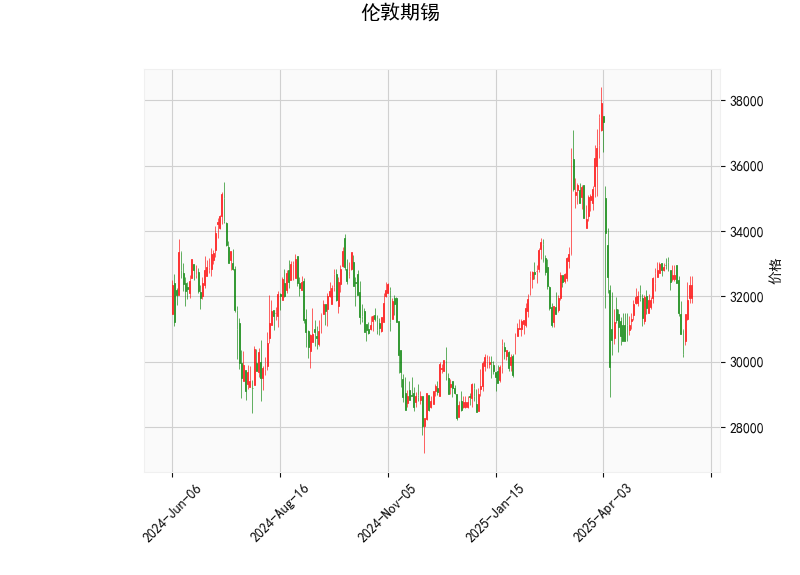

### 1. 对伦敦期锡的技术分析结果的分析

以下是对提供的伦敦期锡技术指标的详细分析，这些指标反映了市场的当前状态和潜在趋势。整体来看，指标显示出中性偏涨的信号，但仍需结合市场环境和风险因素进行综合评估。

- **当前价格（Current Price）**: 32360.0  
  当前价格位于Bollinger Bands的中轨（32835.33）下方，但高于下轨（28936.31），表明价格处于相对稳定的波动区间内。这暗示市场可能在整理阶段，短期内若突破中轨，可能出现向上趋势；反之，若跌破下轨，则可能进入超卖区。

- **RSI（Relative Strength Index）**: 52.20  
  RSI值处于中性区域（30-70之间），略高于50，显示市场动力温和偏涨。这意味着近期买方力量稍占上风，但未出现超买（RSI > 70）或超卖（RSI < 30）的情况，建议投资者警惕可能的横盘或小幅回调。

- **MACD（Moving Average Convergence Divergence）**:  
  - MACD线：-151.35  
  - MACD信号线：-159.17  
  - MACD直方图：7.82  
  MACD线高于信号线（直方图为正值），这形成了一个看涨交叉信号，尽管MACD整体为负值，表明短期内可能有向上反转的潜力。但由于MACD仍处于负区，市场可能尚未完全摆脱下行压力，投资者应关注直方图的持续性——如果直方图继续扩大，可能强化涨势。

- **Bollinger Bands（布林带）**:  
  - 上轨（Upper Band）：36734.34  
  - 中轨（Middle Band）：32835.33  
  - 下轨（Lower Band）：28936.31  
  当前价格接近中轨，显示市场波动率适中（带宽较窄）。如果价格向上逼近上轨，可能表示超买风险增加；反之，向下接近下轨，则可能触发超卖反弹。整体而言，这反映出市场处于中性区间，适合观察突破机会。

- **K线形态（K线形态）**: ['CDLGAPSIDESIDEWHITE']  
  这是一个看涨的K线模式，通常表示价格出现向上跳空缺口，伴随实体较长的阳线，显示买方强势。这种形态暗示短期内可能有进一步上涨，但需结合其他指标确认，避免假突破。

总结分析：技术指标呈现混合信号，主要以中性偏涨为主。RSI和K线形态支持潜在的上行趋势，而MACD的正直方图进一步强化了这一观点，但Bollinger Bands显示价格尚未脱离波动区间。投资者需注意外部因素，如全球经济数据或商品市场动态，可能影响锡价的波动。

### 2. 近期可能存在的投资或套利机会和策略

基于上述分析，伦敦期锡市场可能存在短期投资机会，特别是针对价格反弹或波动性。但需强调，市场不确定性高，建议结合风险管理工具（如止损订单）操作。以下是针对近期可能的投资和套利机会的判断及策略建议：

#### **可能的投资机会**
- **看涨机会**：  
  当前RSI中性偏涨、MACD出现看涨交叉、K线形态强势，暗示价格可能向上测试中轨或上轨（32835.33-36734.34）。如果全球需求（如电子和新能源行业对锡的需求）改善，这可能转化为实际上涨。  
  **策略**：  
  - **买入策略**：在价格稳定于中轨以上时考虑买入多头头寸，目标价位设在35000-36000（接近上轨）。设置止损在下轨附近（约29000），以控制风险。适合中短期投资者，例如持有1-2周。  
  - **风险提示**：若MACD直方图回落或RSI升至70以上，可能出现回调，需及时获利了结。

- **横盘或波动机会**：  
  价格在中Bollinger Bands区间震荡，适合日内交易或短期波段操作。如果市场维持在中性波动，投资者可利用小幅价格变动获利。  
  **策略**：  
  - **波段交易**：买入低点（接近下轨时）和卖出高点（接近中轨时）的策略。例如，当价格跌至31000以下时买入，目标卖出至33000。使用RSI作为辅助，RSI低于45时入场买入。  
  - **潜在回报**：预计回报率5-10%，但需监控成交量以避免假突破。

#### **可能的套利机会**
- **跨市场套利**：  
  伦敦期锡与全球大宗商品（如铜或铝）相关性较高。如果锡价相对其他金属（如LME铜）出现低估，可能存在套利空间。例如，当前锡价偏低（相对于历史均值），而铜价强势时，可进行锡-铜价差套利。  
  **策略**：  
  - **价差套利**：买入锡期货的同时卖出铜期货（或反之），目标捕捉价差收敛。假设锡价反弹而铜价稳定，价差可达5-10%。使用MACD确认时机，例如当锡的MACD直方图转为正时入场。  
  - **风险管理**：设置动态止损，例如若价差扩大超过预期阈值（5%），立即平仓。适合经验丰富的投资者，通过多交易所操作实现。

- **波动率套利**：  
  Bollinger Bands显示带宽较窄，暗示潜在波动扩大。如果市场预期（如地缘政治事件）导致锡价剧烈波动，可利用期权或期货的波动率差异进行套利。  
  **策略**：  
  - **期权策略**：买入锡价看涨期权（Call Option），同时卖出波动率较高的看跌期权（Put Option），以捕捉隐含波动率差异。目标在价格突破上轨时获利，预计回报5-15%。  
  - **执行建议**：在K线形态确认后入场，结合RSI避免超买风险。短期内（如1-3天）操作，适合高频交易者。

#### **总体策略建议和风险警示**
- **积极因素**：技术指标偏涨，K线形态强势，可能迎来反弹行情，适合多头布局。  
- **消极因素**：MACD整体负值和价格在中轨下方，增加了下行风险；全球经济不确定性（如通胀或需求减弱）可能放大波动。  
- **风险管理**：始终使用止损（例如10-15%损失阈值）和分批入场策略。建议结合基本面分析（如锡矿供应数据）验证技术信号，并控制仓位不超过总资金的20%。  
- **时机判断**：短期内（1-2周）关注突破信号；中期（1-3个月）等待RSI和MACD进一步确认。

以上分析基于当前数据，市场行情瞬息万变，投资者应根据实时数据和个人风险承受能力调整策略。