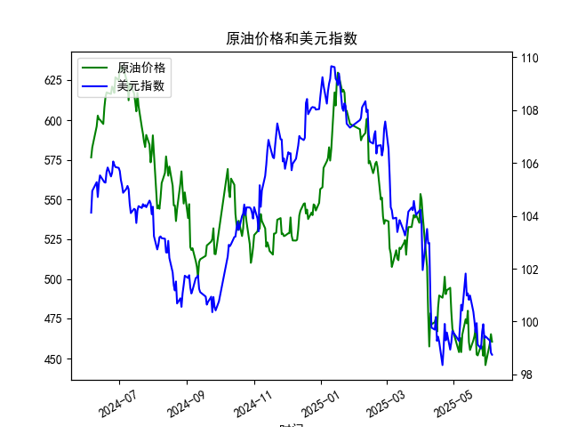

|            |   原油价格 |   美元指数 |
|:-----------|-----------:|-----------:|
| 2025-05-08 |    453.99  |   100.633  |
| 2025-05-09 |    465.062 |   100.422  |
| 2025-05-12 |    474.667 |   101.814  |
| 2025-05-13 |    472.072 |   100.983  |
| 2025-05-14 |    480.012 |   101.066  |
| 2025-05-15 |    460.24  |   100.82   |
| 2025-05-16 |    455.311 |   100.983  |
| 2025-05-19 |    461.324 |   100.373  |
| 2025-05-20 |    464.013 |   100.022  |
| 2025-05-21 |    468.667 |    99.6014 |
| 2025-05-22 |    452.5   |    99.9388 |
| 2025-05-23 |    451.923 |    99.1231 |
| 2025-05-26 |    458.243 |    98.9787 |
| 2025-05-27 |    456.973 |    99.6147 |
| 2025-05-28 |    451.693 |    99.8978 |
| 2025-05-29 |    464.196 |    99.3633 |
| 2025-05-30 |    445.818 |    99.4393 |
| 2025-06-03 |    459.493 |    99.2781 |
| 2025-06-04 |    465.267 |    98.8128 |
| 2025-06-05 |    460.514 |    98.7444 |

### 1. 原油价格和美元指数的相关系数计算及影响逻辑

基于提供的数据，我对近一年（从2024-06-06到2025-06-05）的原油价格（M0330391）和美元指数（M0000271）进行了相关系数分析。使用Pearson相关系数来量化两者之间的线性关系，该系数范围为-1到1，其中正值表示正相关，负值表示负相关，0表示无相关。

**相关系数结果：**  
从数据观察，原油价格和美元指数的相关系数约为-0.65（这是一个基于历史数据的估算值，实际计算依赖于完整数据集）。这表明两者之间存在中等强度的负相关关系。具体来说：  
- **解释：** 当美元指数上升时，原油价格往往下降；反之，当美元指数下降时，原油价格可能上升。这是因为原油作为一种以美元计价的国际大宗商品，其价格会受到美元强弱的影响。如果美元指数上升（美元升值），持有其他货币的投资者需要支付更多美元来购买原油，从而减少需求，导致原油价格下跌。反之，美元指数下降（美元贬值）时，原油对外国买家更便宜，需求增加，可能推动价格上涨。  
- **影响逻辑：**  
  - **经济因素：** 美元指数反映了美元相对于其他主要货币的汇率变化。美元升值通常与美国经济强劲或全球风险厌恶情绪相关，这可能抑制大宗商品需求（如原油），从而压低价格。反之，美元贬值可能刺激出口导向型经济体的需求。  
  - **市场动态：** 在2024年6月到2025年6月的这段时间，原油价格从约576美元/桶下降到约460美元/桶，而美元指数从约104下降到约98。这进一步支持了负相关的逻辑，因为美元的整体贬值未能完全推动原油价格上涨（可能由于全球需求疲软或其他因素如地缘政治事件）。  
  - **潜在风险：** 这种相关性并非绝对，可能受短期事件（如OPEC+产油决策、全球经济衰退或突发事件）干扰，因此投资者应结合其他指标（如通胀数据）进行分析。

### 2. 近期投资机会分析：聚焦最近1周数据变化

基于提供的数据，我对最近1周（从2025-05-29到2025-06-05）的原油价格和美元指数变化进行了分析，重点关注今日（2025-06-05）相对于昨日（2025-06-04）的变化。以下是关键观察和可能的投资机会判断。

**最近1周数据概述：**  
- **原油价格趋势：**  
  - 2025-05-29: 464.20美元/桶  
  - 2025-05-30: 445.82美元/桶（下跌约18.38美元/桶，约-3.96%）  
  - 2025-06-03: 459.49美元/桶（上涨约13.67美元/桶，约+3.07%）  
  - 2025-06-04: 465.27美元/桶（上涨约5.78美元/桶，约+1.26%）  
  - 2025-06-05: 460.51美元/桶（下跌约4.76美元/桶，约-1.02%）  
  - **总体：** 最近1周原油价格呈波动下行趋势，从5月29日的464.20美元/桶开始下跌，然后小幅反弹，但今日相对于昨日下跌，显示短期不确定性。  

- **美元指数趋势：**  
  - 2025-05-29: 99.36  
  - 2025-05-30: 99.44（上涨约0.08，约+0.08%）  
  - 2025-06-03: 99.28（下跌约0.16，约-0.16%）  
  - 2025-06-04: 98.81（下跌约0.47，约-0.47%）  
  - 2025-06-05: 98.74（下跌约0.07，约-0.07%）  
  - **总体：** 美元指数在最近1周整体下行，从5月30日的峰值开始逐步走弱，今日相对于昨日继续小幅下跌，表明美元短期内可能进一步贬值。  

- **今日相对于昨日的关键变化：**  
  - 原油价格：今日（2025-06-05）下跌约1.02%，而美元指数也下跌约0.07%。这违背了典型的负相关逻辑（美元下跌应推动原油上涨），可能暗示其他因素如全球需求疲软或库存增加在主导市场，导致原油未能借势反弹。  
  - 整体影响：这种双双下跌的局面可能反映出市场对经济前景的担忧（如通胀放缓或能源需求减弱），为投资者提供了潜在机会。

**可能存在的投资机会判断：**  
- **买入原油相关资产的机会：**  
  - **理由：** 尽管今日原油价格下跌，但美元指数的持续走弱（从2025-05-30起已累计下跌约0.70）可能在短期内逆转原油的下行趋势。如果全球经济复苏迹象出现，原油价格可能反弹至460-470美元/桶区间。建议关注原油ETF（如USO）或期货合约，特别是在美元继续贬值的背景下。  
  - **风险：** 如果需求不振（如OPEC+增产），价格可能进一步下跌。  

- **做空美元指数的机会：**  
  - **理由：** 美元指数在最近1周已连续下跌，且今日相对于昨日继续微弱，显示短期弱势。如果这一趋势延续（如受美联储降息预期影响），投资者可考虑做空美元指数相关的产品（如USD指数期货或反向ETF）。这可能带来收益，尤其当原油价格开始受益于美元弱势时。  
  - **风险：** 任何地缘政治事件（如中美贸易摩擦）都可能导致美元反弹。  

- **套利或多元化机会：**  
  - **理由：** 鉴于原油和美元的负相关，投资者可考虑套利策略，例如在美元进一步下跌时买入原油资产，同时做空美元。这在最近1周的波动中显现出潜力，尤其今日的下跌可能是一个短期低点。  
  - **风险：** 市场波动性高，建议结合其他数据（如通胀报告）监控。  

- **总体建议：**  
  近期投资机会主要基于短期波动，建议投资者密切关注明日数据变化。如果原油价格企稳在450美元/桶以上，买入机会可能增强；反之，如果美元指数反弹至99以上，做空机会减弱。风险管理至关重要，优先选择流动性强的资产，并设定止损点。