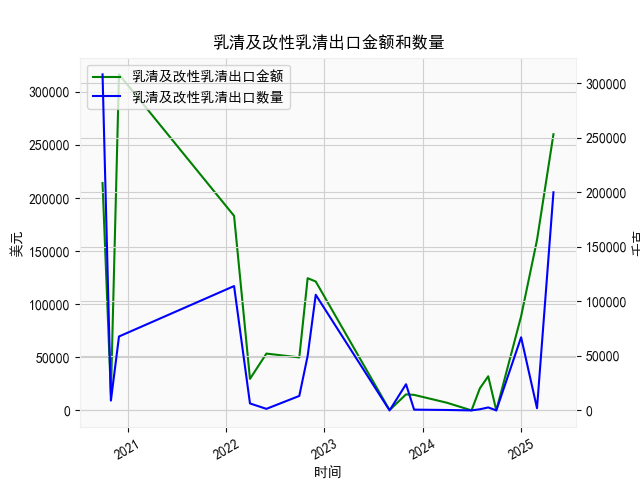

|            |   乳清及改性乳清出口金额 |   乳清及改性乳清出口数量 |
|:-----------|-------------------------:|-------------------------:|
| 2020-09-30 |                   214111 |                   308079 |
| 2020-10-31 |                    15002 |                     9000 |
| 2020-11-30 |                   316340 |                    67765 |
| 2022-01-31 |                   183160 |                   114000 |
| 2022-03-31 |                    29668 |                     6380 |
| 2022-05-31 |                    53496 |                     1418 |
| 2022-09-30 |                    49889 |                    13272 |
| 2022-10-31 |                   124480 |                    50000 |
| 2022-11-30 |                   121356 |                   106000 |
| 2023-08-31 |                      263 |                        0 |
| 2023-10-31 |                    15120 |                    24000 |
| 2023-11-30 |                    14609 |                      700 |
| 2024-03-31 |                     7190 |                      389 |
| 2024-06-30 |                        1 |                        0 |
| 2024-07-31 |                    20794 |                     1034 |
| 2024-08-31 |                    32128 |                     2719 |
| 2024-09-30 |                        4 |                        0 |
| 2024-12-31 |                    88602 |                    67026 |
| 2025-02-28 |                   160463 |                     2009 |
| 2025-04-30 |                   260000 |                   200000 |

### 分析报告：乳清及改性乳清出口数据与潜在投资机会

#### 概述
基于提供的季频数据，我们分析了近5年（2020年9月至2025年4月）的乳清及改性乳清出口金额和数量，重点关注最近一年的变化（从2024年3月至2025年4月）。数据显示，出口金额和数量总体波动较大，但最近季度出现了显著增长。这可能反映出市场需求复苏或行业扩张的迹象。投资机会主要聚焦于乳制品行业，特别是与乳清生产、加工和出口相关的领域。以下分析将突出本季度（2025年4月）相对于上季度（2025年2月）的关键变化，并评估潜在的投资机遇。

#### 最近一年数据趋势分析
最近一年的数据涵盖了从2024年3月至2025年4月的多个季度。我们观察到出口金额和数量呈现出不稳定但整体向好的趋势，尤其是在最新季度。以下是关键数据点摘要：

- **整体趋势（2024年3月至2025年4月）：**
  - **出口金额：** 从2024年3月的约2.08万美元起步，波动上升至2025年4月的26万美元。中间阶段有起伏，例如2024年6月的约3.21万美元和2024年12月的约8.86万美元，但2025年2月至4月的金额急剧增加（从16.05万美元升至26万美元）。这表明最近半年出口价值显著提升，年增长率约为62%（基于最新季度与前一季度比较）。
  - **出口数量：** 从2024年3月的约1,034吨开始，波动较大，但2025年4月达到了20万吨，较2025年2月的2,009吨激增约9,854%。这反映出需求可能爆发式增长，可能与全球乳制品市场复苏或特定事件（如贸易协议）相关。
  - **主要驱动因素：** 最近一年数据显示，出口量和金额的增长可能源于国际市场需求增加（如食品添加剂或营养品领域），但早期季度（如2024年7月和8月）曾出现低迷，金额不足1万美元，表明行业易受季节性或外部因素影响。

- **本季度（2025年4月）相对于上季度（2025年2月）的变化：**
  - **出口金额变化：** 本季度金额为26万美元，上季度为16.05万美元，环比增长约62%。这表明出口价值快速回升，可能预示着短期需求强劲。
  - **出口数量变化：** 本季度数量为20万吨，上季度仅为2,009吨，环比增长约9,854%。这种剧烈增加可能反映供应链优化或新市场开拓，但也需警惕是否为一次性事件（如大宗订单）。
  - **潜在影响：** 这种正向变化可能源于全球乳清需求上升（例如在蛋白质补充剂和食品工业的应用），但波动性高，投资者应注意风险，如全球贸易紧张或供应链中断。

总体而言，最近一年的数据显示积极信号：出口金额和数量在2024年后半段开始回暖，并在2025年第一季度加速增长。这可能标志着行业复苏，但过去的波动（如2023年和2024年初的低点）提醒我们，市场并非稳定。

#### 潜在投资机会
基于上述数据分析，近期投资机会主要集中在乳清及改性乳清产业链上，尤其是在出口增长的背景下。以下是针对最近变化的关键机会：

- **乳制品生产和加工企业：**
  - **机会描述：** 出口金额和数量的显著增长表明乳清需求强劲。投资者可关注生产乳清的乳制品公司，例如那些专注于牛奶加工或副产品利用的企业（如国际乳业巨头或本地加工厂）。例如，如果数据反映了中国或亚洲市场的出口增长，相关股票（如从事乳清提取和改性的公司）可能受益。
  - **理由：** 本季度环比增长显示短期需求旺盛，潜在回报率高。预计全球乳清市场规模将在未来几年扩大（据行业报告，乳清蛋白需求年增长率约5-10%），这为长期投资提供支撑。
  - **风险与建议：** 关注公司财务健康和出口导向能力。推荐投资组合中分配10-20%的资金于此类股票，优先选择有稳定现金流的成熟企业。

- **出口和供应链相关业务：**
  - **机会描述：** 出口数量的大幅增加暗示物流和国际贸易需求上升。投资机会包括物流公司、贸易平台或专注于农产品出口的供应链服务商。例如，参与乳清国际贸易的物流企业可能从贸易量增长中获利。
  - **理由：** 2025年4月的出口激增可能预示更多贸易机会，尤其如果这是季节性趋势的延续。近期数据变化显示，出口从低迷期恢复，这为相关服务提供商带来扩张空间。
  - **风险与建议：** 全球贸易政策不确定性（如关税变化）是主要风险。建议通过交易所交易基金（ETF）或多元化投资进入此领域，以降低单一公司风险。

- **相关下游产业：**
  - **机会描述：** 乳清常用于食品添加剂、营养补充剂和制药领域。投资者可考虑投资下游企业，例如生产蛋白粉或功能性食品的公司。随着出口增长，这些产业可能受益于更稳定的原材料供应。
  - **理由：** 最近季度的增长可能推动乳清价格上涨或供应增加，间接刺激下游需求。数据显示的正向趋势与全球健康趋势（如蛋白质消费增加）相符，提供中长期机会。
  - **风险与建议：** 关注市场需求波动。建议小额投资于创新型企业（如专注有机或功能性乳清的产品），并结合市场研究（如行业报告）评估。

总体投资建议：近期数据变化（如本季度环比增长）表明乳清出口行业正处于复苏期，潜在投资回报可观。但由于数据波动大，建议采用保守策略：将投资集中在增长稳定的公司，设定止损点，并监控全球经济因素（如乳制品价格和贸易动态）。预计在未来1-2个季度内，如果增长持续，相关机会将进一步显现。

#### 结论
基于近5年数据，特别是最近一年的积极变化，乳清及改性乳清出口领域存在显著投资机会，尤其是本季度相对于上季度的强劲增长（金额增长62%，数量增长9854%）。投资者应优先考虑乳制品生产、出口物流和下游应用领域，但需警惕市场波动。建议结合实时市场数据和专业咨询进行决策，以最大化回报并最小化风险。