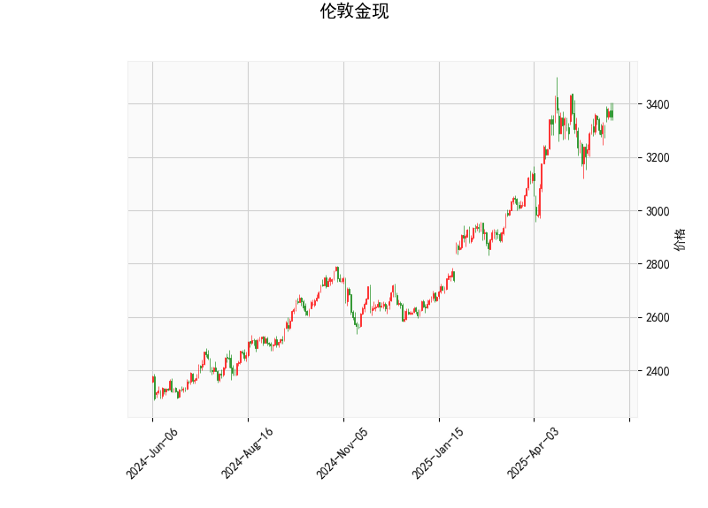

# 伦敦金现的技术分析结果分析

## 1. 对技术分析结果的详细解读
基于提供的伦敦金现（现货黄金）技术指标数据，我们可以从多个维度对其进行分析，以评估当前市场的技术面状况。以下是对关键指标的逐一解读：

- **当前价格（Current Price）**：当前价格为3351.92美元/盎司。这表明黄金价格处于相对稳定的区间，但需要结合其他指标判断其短期趋势。
  
- **RSI（Relative Strength Index，相对强弱指数）**：RSI值为56.04，这是一个中性偏强的信号。RSI通常在0-100范围内运行，当RSI高于50时，表示市场处于强势状态；高于70时可能超买，而低于30时可能超卖。目前的RSI值接近中线上方，暗示短期内黄金市场可能有温和的买盘支撑，但尚未进入超买区域，潜在风险较低。

- **MACD（Moving Average Convergence Divergence，移动平均收敛散度）**：MACD线值为28.81，信号线值为26.95，直方图（MACD Hist）值为1.87。MACD线高于信号线，且直方图为正值，这是一个典型的看涨信号，表明短期内多头动能正在增强。MACD指标显示价格可能向上突破，但需要关注直方图的持续性——如果直方图继续扩大，上涨势头将更强劲。

- **布林带（Bollinger Bands）**：上轨为3485.60，中轨为3225.58，下轨为2965.56。目前价格3351.92位于中轨和上轨之间，这反映出价格处于一个相对平衡的波动区间。价格在上轨下方表明市场尚未过度扩张，但如果价格逼近上轨（3485.60），可能面临回调风险；反之，如果跌破中轨，可能会测试下轨支撑。整体上，布林带的收窄或扩张可以预示波动性变化，目前的定位显示潜在的上行空间。

- **K线形态**：检测到的形态为“CDLMATCHINGLOW”（Matching Low模式）。这是一个经典的看涨反转形态，通常出现在下跌趋势末期，表示市场可能形成底部并开始反弹。Matching Low模式暗示买家正在入场，短期内黄金价格可能企稳或向上测试更高水平。

综合上述指标，黄金市场当前呈现出中性偏强的态势。RSI和MACD的看涨信号结合K线形态的底部反转迹象，表明短期内存在潜在的上行压力。然而，价格尚未触及布林带上轨，这意味着上涨空间有限，需要警惕可能的回调风险。总体而言，市场可能正处于一个积累阶段，投资者应密切关注后续数据以确认趋势。

## 2. 近期可能存在的投资或套利机会和策略判断
基于上述技术分析结果，我们可以进一步评估近期（例如未来1-3个月）的投资或套利机会。黄金作为避险资产，其价格受全球经济、地缘政治和货币政策影响，但从技术面来看，以下是可能的机遇和策略建议。请注意，投资涉及风险，以下分析仅基于技术指标，不包括基本面因素，建议结合实际市场环境和风险管理进行决策。

### 投资机会分析
- **看涨机会**：当前指标显示黄金可能处于短期反弹阶段，RSI、MACD和K线形态均支持多头观点。如果全球经济不确定性增加（如通胀压力或地缘冲突），黄金作为避险工具的需求可能上升，价格有潜力向上测试布林带上轨（3485.60）。预计近期投资机会主要集中在价格突破中轨后的追涨操作。
  
- **潜在风险**：如果RSI升至70以上，市场可能进入超买状态，导致回调；或如果MACD直方图转为负值，暗示多头动能减弱。价格跌破中轨（3225.58）将增加下行风险。

### 套利机会分析
套利机会通常涉及利用市场 inefficiencies，如现货与期货之间的价格差异，或跨品种套利。但基于当前数据，主要机会聚焦于黄金现货市场。以下是可能的套利类型：
- **现货与期货套利**：如果黄金现货价格（3351.92）与期货合约价格出现暂时的背离（如期货溢价过高），投资者可考虑现货买入+期货卖出的套利策略。例如，如果COMEX黄金期货价格高于现货且超出合理范围，利用技术指标确认趋势后进行反向操作，可能获利。
- **波动率套利**：布林带显示当前价格波动相对温和，如果市场预期（如美联储政策会议）导致波动率上升，投资者可通过期权策略（如买入看涨期权、卖出看跌期权）捕捉波动率差异。目前的Matching Low形态可能预示波动率回升，提供短期套利窗口。

### 推荐策略
- **趋势跟踪策略**：如果MACD直方图保持正值，建议买入现货黄金或相关ETF（如GLD），目标价位设在布林带上轨（3485.60）。止损位可设在中轨下方（约3200），以控制风险。适合风险偏好中等的投资者。
  
- **均值回归策略**：价格当前在中轨上方，如果出现回调至中轨附近（3225.58），可考虑加仓买入，期待反弹。结合RSI的超卖信号（若RSI跌至40以下），这可能是一个低风险入场点。

- **套利具体策略**：
  - **跨市场套利**：监控现货与期货价差，如果差价扩大到历史均值以上（如0.5%以上），执行现货买入+期货卖出组合。利用技术指标（如MACD确认趋势）后，持有至价差收窄。
  - **期权套利**：买入黄金看涨期权（strike price在3400附近），同时卖出短期看跌期权，以捕捉Matching Low带来的反弹。预计收益率为5-10%，但需注意时间衰减风险。

### 总体风险提示
虽然技术指标显示看涨信号，但黄金市场易受外部因素影响，如美元汇率波动或经济数据发布。建议投资者在执行策略前进行充分的风险评估，包括设置止盈止损（例如，止损在下轨2965.56下方），并结合基本面分析。短期内，关注RSI和MACD的变化作为调整信号，以最大化机会并最小化损失。