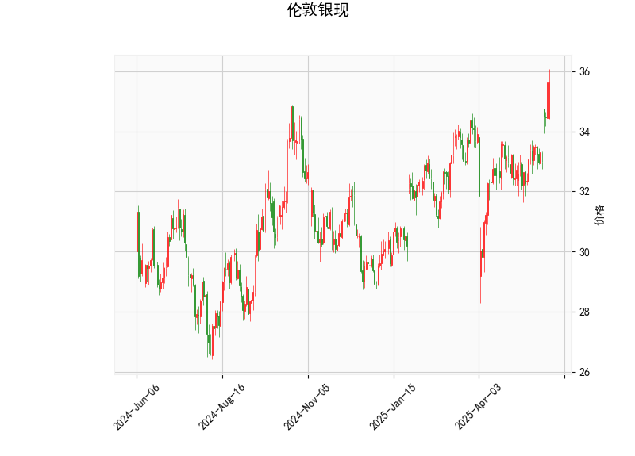

### 1. 对伦敦银现的技术分析结果进行分析

伦敦银现的当前技术指标显示出混合信号，结合RSI、MACD、布林带和K线形态，我们可以解读出价格可能处于强势但潜在风险较高的阶段。以下是对关键指标的详细分析：

- **当前价格（35.63）**：价格高于布林带的Upper Band（35.14），这表明银价短期内表现出强势上涨，但也可能已进入超买区域。布林带整体显示中轨（Middle Band，33.02）为主要支撑位，下轨（Lower Band，30.91）作为潜在支撑。如果价格回落至中轨附近，可能形成修正。

- **RSI（69.71）**：RSI值超过70，属于典型的超买信号。这暗示市场可能过度乐观，短期内存在回调风险。如果RSI继续上升，可能进一步确认超买状态；反之，若回落至50以下，则可能预示趋势逆转。

- **MACD指标**：
  - MACD线（0.58）高于信号线（0.30），且直方图（0.28）为正值，这是一个看涨信号，表明短期内多头力量占优。
  - 然而，直方图的正值虽支持上涨，但幅度较小（0.28），显示多头动能可能正在减弱。如果MACD线回落至信号线以下，将转为看跌信号。

- **布林带**：
  - Upper Band（35.14）已被突破，这通常表示价格波动加大，可能伴随高波动性。如果价格持续在上轨上方，可能进一步推高，但历史数据显示，这种情况往往是短期顶部信号。
  - Middle Band（33.02）作为动态支撑线，如果价格跌破此位，可能测试下轨（30.91），增加下行风险。

- **K线形态（CDLBELTHOLD）**：这是一种蜡烛图形态，通常被称为“Belt Hold”形态。在上涨趋势中，它可能表示强势延续（多头控制），但在当前超买背景下，更可能暗示潜在的疲软。如果后续K线出现反转形态（如阴线），则可能确认回调。

总体而言，技术指标呈现出“强势与风险并存”的局面：MACD和K线形态支持短期看涨，而RSI和布林带突破上轨则警告超买风险。银价可能在35-36区间内波动，但若无新催化剂（如经济数据或地缘事件），短期内回调的可能性较大。

### 2. 分析判断近期可能存在的投资或套利机会和策略

基于上述分析，伦敦银现的近期走势可能存在短期交易机会，但需谨慎管理风险。以下是对潜在投资或套利机会的判断，以及相应的策略建议：

#### 潜在机会：
- **投资机会**：
  - **短期做多机会**：MACD的看涨信号和K线形态可能支持价格进一步上涨，尤其如果突破36水平。投资者可考虑在当前价位附近买入，但需注意RSI超买的风险，这可能导致快速回调。
  - **短期做空机会**：RSI超买和价格超过布林上轨暗示修正风险。如果价格回落至34-35区间，这将是一个潜在的卖出点，适合风险厌恶型投资者。
  - **套利机会**：银现货市场可能与期货或相关商品（如黄金）存在价差套利。例如，如果银价相对于黄金的比值偏高（当前银金比约为80:1左右，历史均值在60-70之间），则可考虑跨市场套利（如买入黄金、卖出银）。但需监控全球市场波动，例如美联储政策或地缘事件可能放大价差。

- **风险因素**：市场整体不确定性较高，包括全球经济数据、通胀预期和地缘政治事件。这些可能放大波动，导致机会迅速逆转。

#### 推荐策略：
- **做多策略**：
  - **买入点**：在35.50-35.70附近入场，止损设在布林中轨（33.00）以下。
  - **目标**：目标价位36.50，若MACD直方图保持正值。
  - **风险管理**：结合RSI监控，若RSI超过75，则考虑减仓以避开超买回调。

- **做空策略**：
  - **卖出点**：等待价格回落至35.00-35.20附近入场，止盈设在布林中轨（33.00）以上。
  - **目标**：下行目标30.90（布林下轨），若RSI跌破50。
  - **风险管理**：设置止损在36.00以上，避免MACD反转导致损失。

- **套利策略**：
  - **跨资产套利**：如果银价与黄金或白银期货的价差扩大，可采用“买入低估资产、卖出高估资产”的策略。例如，买入黄金期货并卖出银现货，目标是捕捉价差收敛（预计1-2周内实现）。需使用杠杆工具（如期权）来放大收益，但严格控制头寸不超过总资金的10%。
  - **波动率套利**：在高波动期（如经济数据发布前），使用期权策略（如铁蝶式或铁 condor）来捕捉银价波动范围内的收益，预计在布林带内波动时有效。

总体策略建议：优先采用短期交易（如日内或隔夜持仓），并结合技术指标（如等待MACD交叉或RSI回落）作为进出信号。风险控制至关重要，建议将仓位控制在20%以内，并实时监控全球市场动态。如果市场出现重大事件（如利率决定），可能需要及时调整策略。投资者应结合基本面分析（如银矿供应或需求数据）以增强决策。