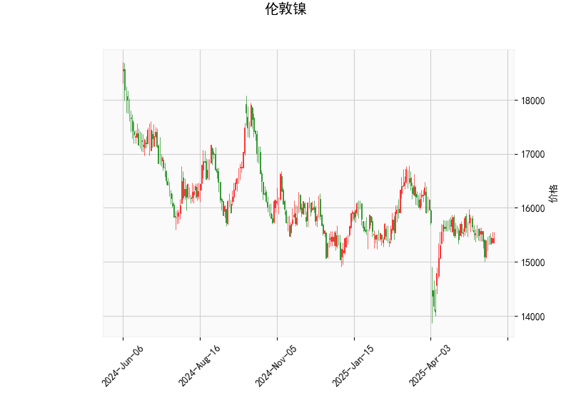

### 伦敦镍技术分析结果解读

#### 1. 对技术分析结果的详细分析
以下是对提供的伦敦镍技术指标的逐项分析，这些指标反映了当前市场的技术面状况。伦敦镍的当前价格为15445.0，整体指标显示市场处于相对中性偏弱的态势，可能存在短期下行风险。

- **当前价格（Current Price）: 15445.0**  
  当前价格位于布林带中轨（15616.98）下方，但高于下轨（14655.89），表明价格处于中性区域。相比近期均值（中轨为参考），价格略微偏低，这可能暗示短期修正或波动，但尚未进入超卖区。

- **RSI（Relative Strength Index）: 48.32**  
  RSI值接近50的中性线，表明市场力量基本均衡，没有明显的超买（RSI > 70）或超卖（RSI < 30）信号。目前的RSI值显示买卖压力较为平衡，但略微偏向卖方。如果RSI继续下降至30以下，可能预示进一步的下跌风险；反之，如果上升至70以上，则可能转为强势。

- **MACD（Moving Average Convergence Divergence）指标: -62.38 (MACD线), -55.64 (Signal线), -6.74 (Histogram)**  
  MACD线低于Signal线，且Histogram为负值，这是一个典型的看跌信号。MACD指标反映了短期移动平均线与长期移动平均线的差异，目前的负值表明短期趋势弱于长期趋势，可能存在卖出压力。如果Histogram继续扩大负值，价格下跌的可能性将增加；反之，如果MACD线向上穿越Signal线，则可能出现反弹机会。

- **布林带（Bollinger Bands）: Upper band 16578.07, Middle band 15616.98, Lower band 14655.89**  
  当前价格处于中轨和下轨之间，显示价格在布林带的中部偏下运行。这暗示市场波动性适中，没有极端扩张（例如价格突破上轨或下轨）。如果价格跌破下轨（14655.89），可能触发进一步下跌；反之，如果反弹至上轨（16578.07）附近，则可能出现卖出机会。布林带整体收窄可能预示短期波动加剧。

- **K线形态: []**  
  K线形态为空，表明近期未形成明显的经典形态（如锤头线、吞没形态等）。这意味着缺乏强有力的短期信号，投资者需依赖其他指标进行判断。

总体而言，技术指标显示伦敦镍处于中性偏弱的态势。RSI中性、MACD看跌以及价格在布林带中下部，共同暗示短期内可能存在下行压力，但尚未出现极端信号。市场情绪较为谨慎，适合观望或等待更明确的方向。

#### 2. 近期可能存在的投资或套利机会和策略
基于上述分析，伦敦镍的近期走势可能以区间震荡或小幅下行为主。以下是针对潜在投资机会和策略的判断，重点考虑风险管理。策略建议基于技术面，不包括基本面因素（如全球镍需求或地缘政治事件）。

- **潜在投资机会：**  
  - **短期下行机会：** MACD指标的负Histogram和价格接近布林带下轨，暗示可能出现进一步下跌。如果价格跌破14655.89（下轨），短期内可能测试14500-14000的支撑位，这为做空或卖出策略提供机会。RSI若降至40以下，将强化这一信号。  
  - **反弹机会：** 如果RSI回升至50以上或MACD Histogram转为正值，价格可能反弹至中轨（15616.98）或上轨（16578.07），适合逢低买入。当前中性RSI表明市场未过度超卖，潜在反弹空间存在。  
  - **套利机会：** 伦敦镍作为大宗商品，其价格与相关衍生品（如期货合约）或同类金属（如铜或铝）可能存在价差。如果镍价格继续下行，而相关金属（如不锈钢期货）未同步调整，可探索跨品种套利（如卖出镍期货、买入相关金属）。此外，如果现货与期货价格出现异常背离（如期货折价过大），可进行现货-期货套利，但需监控全球库存和需求数据。

- **推荐策略：**  
  - **做空策略（针对下行趋势）：** 如果MACD线持续低于Signal线，建议在价格接近中轨（15616.98）时卖出或做空镍期货。止损设在中轨上方（如15700），目标位为下轨（14655.89）附近。风险：若全球需求回升，价格快速反弹。  
  - **区间交易策略：** 在布林带区间内（14655.89-16578.07）进行买卖。买入点：价格跌至下轨附近（14655.89）时；卖出点：价格反弹至中轨或上轨时。这适合波动性市场，风险较低，但需注意交易费用。  
  - **套利策略：** 监控镍与其他金属（如LME铜）的价差。如果镍相对铜的价差扩大到历史异常水平（如超过20%），可进行反向套利（例如卖出镍、买入铜）。风险：大宗商品市场相关性强，需实时数据支持。  
  - **风险管理建议：** 任何策略均应结合资金管理（如仓位不超过总资金的10%）和多指标确认（如结合RSI和MACD）。短期内，建议等待RSI跌破45或MACD交叉信号再行动，以避免假突破。长期投资者可关注基本面，如电动汽车需求对镍的影响。

总体判断：近期伦敦镍的投资机会以短期交易为主，偏向下行策略，但市场不确定性较高。建议投资者结合实时数据和全球经济环境（如中国需求或美联储政策）进行决策，避免单一指标依赖。