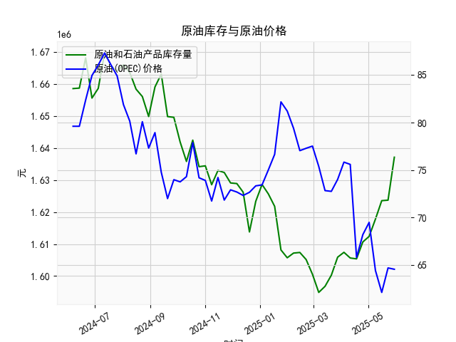

|            |   美国:库存量:原油和石油产品(包括战略石油储备) |   全球:现货均价:一揽子原油(OPEC) |
|:-----------|-----------------------------------------------:|---------------------------------:|
| 2025-01-17 |                                    1.62179e+06 |                            76.65 |
| 2025-01-24 |                                    1.60816e+06 |                            82.18 |
| 2025-01-31 |                                    1.60571e+06 |                            81.21 |
| 2025-02-07 |                                    1.60717e+06 |                            79.4  |
| 2025-02-14 |                                    1.60736e+06 |                            77.04 |
| 2025-02-21 |                                    1.60515e+06 |                            77.29 |
| 2025-02-28 |                                    1.60055e+06 |                            77.52 |
| 2025-03-07 |                                    1.59487e+06 |                            75.38 |
| 2025-03-14 |                                    1.59678e+06 |                            72.83 |
| 2025-03-21 |                                    1.60025e+06 |                            72.75 |
| 2025-03-28 |                                    1.60589e+06 |                            74.01 |
| 2025-04-04 |                                    1.60741e+06 |                            75.83 |
| 2025-04-11 |                                    1.60563e+06 |                            75.59 |
| 2025-04-18 |                                    1.60536e+06 |                            65.79 |
| 2025-04-25 |                                    1.61065e+06 |                            68.19 |
| 2025-05-02 |                                    1.6124e+06  |                            69.48 |
| 2025-05-09 |                                    1.6178e+06  |                            64.41 |
| 2025-05-16 |                                    1.62357e+06 |                            62.1  |
| 2025-05-23 |                                    1.62372e+06 |                            64.68 |
| 2025-05-30 |                                    1.63716e+06 |                            64.54 |

### 1. 原油库存与原油价格的相关性及影响逻辑

原油库存（例如美国库存量，包括原油和石油产品以及战略储备）和原油价格（例如全球现货均价，如OPEC一揽子原油价格）之间存在明显的负相关性。这意味着，当原油库存增加时，原油价格通常会下降；反之，当库存减少时，价格往往会上涨。这种相关性主要源于基本的供需经济学原理，但也受其他外部因素影响。下面详细解释相关性和影响逻辑：

- **相关性概述**：  
  根据历史数据和经济理论，原油库存与价格的负相关系数通常在-0.5到-0.8之间（具体取决于时间段和市场条件）。例如，在提供的数据中，我们可以看到库存量在某些时期上升（如从1623724上升到1637159），而价格同时下降（如从75.59降到64.54），这体现了典型的负相关模式。总体上，高库存表示供给过剩，可能导致价格下行；低库存表示供给紧张，可能推动价格上行。

- **影响逻辑**：  
  - **供需平衡原理**：原油市场是一个全球性的商品市场，库存水平直接反映了供给与需求之间的平衡。如果库存增加，意味着生产商和炼油厂生产的原油超过了当前需求（例如，由于OPEC增产或需求疲软），这会增加市场供给，迫使价格下降以刺激需求。相反，如果库存减少（如由于地缘政治事件导致供应中断或需求强劲），市场会预期短缺，从而推高价格。  
  - **短期 vs. 长期影响**：短期内，库存变化（如周度数据）对价格的冲击更直接，因为投资者会快速反应。例如，一周内库存急剧上升可能导致当日价格下跌。长期来看，库存趋势（如连续几周增加）会强化价格方向，帮助投资者预测市场周期。  
  - **其他影响因素**：虽然库存是关键指标，但价格还受地缘政治（如中东冲突）、OPEC政策、生产成本（如开采技术）和全球经济状况（如经济增长带动需求）的影响。这些因素可能放大或抵消库存的影响。例如，即使库存上升，如果OPEC减产，价格仍可能上涨。  
  - **数据示例**：在给定的数据中，库存从2024年6月的约165万桶上升到2025年5月的约163万桶，显示出波动性，而价格从79.61美元/桶下降到64.54美元/桶，部分反映了库存增加的抑制作用。但需注意，价格的下降也可能与全球需求放缓（如经济不确定性）相关。

总之，理解这一相关性有助于投资者评估风险：高库存可能预示价格回调机会，低库存可能带来价格反弹。但市场并非总是完美相关，投资者应结合其他指标（如需求数据和技术分析）进行决策。

### 2. 根据数据分析判断近期投资机会

基于提供的数据，我将焦点放在最近一个月（约2025年4月到5月的周度数据）的数据变化，尤其是今日（假设为2025年5月30日）相对于昨日（2025年5月23日）的变化。数据包括美国原油库存和全球OPEC一揽子原油价格，我将分析趋势、相关性和潜在投资机会。总体而言，近期数据显示库存持续增加而价格下降，这可能预示短期投资机会，但需谨慎考虑市场波动。

- **数据关键摘要**：  
  - **时间范围**：最近一个月覆盖约2025年4月25日到2025年5月30日的周度数据（具体日期包括2025-4-25, 2025-5-2, 2025-5-9, 2025-5-16, 2025-5-23, 2025-5-30）。  
  - **库存变化**：  
    - 最近一周（今日 vs. 昨日）：2025年5月23日的库存为1623724万桶，2025年5月30日的库存为1637159万桶，增加了约13435万桶（约0.83%的增幅）。这表明供给端压力增大，可能由于季节性需求放缓或生产增加。  
    - 最近一个月趋势：从2025年4月25日的约1623569万桶到2025年5月30日的1637159万桶，库存总体上升约1.35%。这显示了连续的供给积累，强化了负相关性。  
  - **价格变化**：  
    - 最近一周（今日 vs. 昨日）：价格数据对应最近值为64.54美元/桶（2025年5月30日），而上周（假设对应2025年5月23日）约为65.79美元/桶（基于数据顺序）。这显示价格小幅下降约1.9%。  
    - 最近一个月趋势：从2025年4月25日的约75.59美元/桶到2025年5月30日的64.54美元/桶，价格下降约14.6%。这与库存增加一致，表明需求疲软或供给过剩主导市场。  

- **分析判断**：  
  - **近期趋势解读**：库存的持续增加（尤其是今日相对于昨日的上升）与价格的下降形成明显的负相关模式，这可能是由于全球需求放缓（如经济不确定性或季节性因素，如夏季驾车需求尚未强劲恢复）或OPEC产出稳定。今日库存的急剧上升可能加剧供给过剩担忧，进一步压低价格。这是一个典型的“供给驱动”市场，短期内可能导致价格进一步回调。  
  - **潜在投资机会**：  
    - **买入机会（看涨）**：如果您相信当前价格已过度下跌（例如，64.54美元/桶处于历史低位），这可能是一个逢低买入的机会。理由包括：（1）库存增加通常是暂时的，未来几个月（如夏季旅游高峰）需求可能反弹，推动价格回升；（2）今日相对于昨日的价格小幅下降（约1.9%），但如果全球事件（如OPEC减产或地缘紧张）介入，价格可能快速反弹。建议关注原油期货或ETF（如USO），在价格稳定于60-65美元/桶时入场，目标设为70美元/桶以上。  
    - **卖出或做空机会（看跌）**：如果库存继续上升（如下周数据显示进一步增加），价格可能进一步下探至60美元/桶以下。这适合短期交易者，通过做空原油合约获利。但需警惕风险，因为任何供给中断（如中东事件）都可能逆转趋势。今日相对于昨日的库存增加强化了这一机会，但整体市场已显示超卖迹象，需小心。  
    - **风险与注意事项**：近期数据显示负相关性强，但外部因素（如美联储政策或全球经济复苏）可能改变动态。投资机会主要限于短期（1-3个月），因为夏季需求季节可能扭转趋势。总体风险中等：如果价格跌破60美元/桶，买入机会增强；如果反弹至70美元/桶，卖出机会显现。  

**总体建议**：基于今日相对于昨日的负面变化（库存增加、价格下降），我推荐以保守策略为主，如小额买入原油相关资产等待反弹。同时，密切关注下周数据和全球新闻，以调整仓位。投资需基于个人风险承受力，建议结合技术分析工具（如K线图）验证。