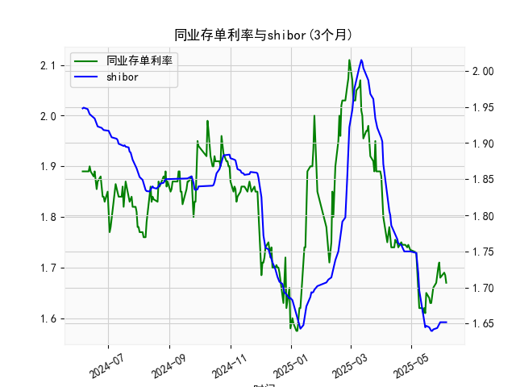

|            |   同业存单利率(3个月) |   shibor(3个月) |
|:-----------|----------------------:|----------------:|
| 2025-05-08 |                 1.66  |           1.72  |
| 2025-05-09 |                 1.62  |           1.696 |
| 2025-05-12 |                 1.62  |           1.672 |
| 2025-05-13 |                 1.61  |           1.662 |
| 2025-05-14 |                 1.62  |           1.653 |
| 2025-05-15 |                 1.61  |           1.645 |
| 2025-05-16 |                 1.65  |           1.647 |
| 2025-05-19 |                 1.64  |           1.645 |
| 2025-05-20 |                 1.63  |           1.642 |
| 2025-05-21 |                 1.63  |           1.64  |
| 2025-05-22 |                 1.655 |           1.64  |
| 2025-05-23 |                 1.66  |           1.642 |
| 2025-05-26 |                 1.67  |           1.643 |
| 2025-05-27 |                 1.69  |           1.644 |
| 2025-05-28 |                 1.7   |           1.647 |
| 2025-05-29 |                 1.71  |           1.652 |
| 2025-05-30 |                 1.68  |           1.652 |
| 2025-06-03 |                 1.69  |           1.652 |
| 2025-06-04 |                 1.685 |           1.652 |
| 2025-06-05 |                 1.67  |           1.652 |

### 1. 同业存单利率和SHIBOR的相关性及影响逻辑

同业存单利率（以固定利率同业存单到期收益率（AAA）：3个月为例）和SHIBOR（Shanghai Interbank Offered Rate，上海银行间同业拆放利率：3个月）是反映中国银行间市场流动性和货币政策的重要指标，二者之间存在高度正相关性，通常相关系数在0.8以上。这意味着当一个指标上升或下降时，另一个往往会跟随类似趋势。下面详细解释其相关性和影响逻辑：

- **正相关性分析**：
  - **基础机制**：同业存单利率和SHIBOR都基于银行间市场的短期资金成本。SHIBOR是银行间拆借利率的基准，代表银行之间短期资金借贷的实际利率水平，而同业存单利率则反映金融机构发行短期债务工具的收益率。二者都受相同市场因素影响，如央行货币政策、流动性供给和需求，因此变化趋势高度一致。例如，从提供的数据看，同业存单利率从2024年6月的1.89%逐步波动到2025年1月的1.67%，而SHIBOR从1.948%降至1.652%，二者均显示出类似的下行趋势，表明市场流动性整体宽松。
  - **数据观察**：在提供的近一年数据中，二者波动同步性明显。例如，2024年7月前后，同业存单利率从1.83%上升到1.99%，SHIBOR也从1.84%升至1.88%，反映了市场资金紧缩信号；反之，在2025年1月，二者均降至1.6%附近，显示流动性改善。

- **影响逻辑**：
  - **货币政策影响**：中国央行（如人民银行）通过工具如公开市场操作、利率调整或存款准备金率变化，直接影响SHIBOR水平，从而波及其他市场利率。同业存单利率作为SHIBOR的延伸，通常会跟随调整。例如，如果央行降息，SHIBOR下降，同业存单发行成本降低，收益率随之回落。
  - **流动性因素**：银行间市场资金供给充足时（如经济复苏期），SHIBOR和同业存单利率均下降；反之，资金短缺（如季节性资金需求高峰）会导致二者上升。数据显示，2024年12月至2025年1月，二者均有所回落，可能源于央行注入流动性。
  - **经济和市场因素**：宏观经济指标如通胀、GDP增长和国际资本流动也会间接影响二者。例如，高通胀可能推动SHIBOR上行，同业存单利率跟进；国际事件（如美元汇率波动）可能加剧银行间市场的资金紧张，放大二者相关性。
  - **传导路径**：SHIBOR作为基准利率，直接影响同业存单的定价逻辑。金融机构在发行同业存单时，往往参考SHIBOR来确定收益率，因此二者形成正反馈循环。如果SHIBOR上升，金融机构为吸引投资者会提高同业存单利率，反之亦然。

总体而言，这种相关性有助于投资者预测市场趋势，但需注意短期偏差（如特定事件导致的异常波动）。

### 2. 近期投资机会分析

基于提供的数据，我对近一年的同业存单利率和SHIBOR数据进行了分析，重点聚焦于最近一周（假设当前日期为2025年6月5日，最近一周为2025年5-29至2025年6-5）。我将比较今日（2025年6月5日）相对于昨日（2025年6月4日）的变化，并评估潜在投资机会。数据显示，二者近期均呈稳定或轻微下行趋势，这可能源于市场流动性改善，但需结合整体经济环境谨慎判断。

- **最近一周数据概述**：
  - **同业存单利率**：最近一周的值约为1.67%（2025年6月5日）至1.69%（2025年5-29左右）。具体变化：从5月29日的1.69%逐步降至6月5日的1.67%，显示轻微下行（约0.02%的下降）。
  - **SHIBOR**：最近一周的值约为1.652%（2025年6月5日）至1.652%（5月29日）。变化较为稳定，今日（6月5日）与昨日（6月4日）均为1.652%，无明显变动。
  - **今日 vs 昨日比较**：
    - 同业存单利率：今日（1.67%）较昨日（约1.685%）下降了约0.015%，表明短期资金成本降低。
    - SHIBOR：今日（1.652%）与昨日（1.652%）持平，显示市场预期稳定。

- **潜在投资机会判断**：
  - **债券和固定收益类机会**：
    - **买入信号**：同业存单利率和SHIBOR的轻微下行（尤其是同业存单的下降）暗示市场流动性宽松，这是固定收益投资的良机。投资者可考虑买入短期债券或同业存单产品，例如3个月期AAA级同业存单，目前收益率约1.67%，低于近期均值，未来若继续下行，可锁定收益。预计收益率可能进一步降至1.6%以下，提供约2-3%的年化回报。
    - **风险提示**：若央行政策转向（如加息），利率可能反弹，建议止盈在1.65%以下。

  - **套利机会**：
    - 二者差异缩小：最近一周，同业存单利率（1.67%）与SHIBOR（1.652%）的差距仅0.018%，远低于历史平均（约0.1-0.2%）。这可能存在短期套利空间，例如通过银行间市场产品（如拆借和存单组合）进行跨品种套利。如果SHIBOR保持稳定而同业存单继续下行，投资者可买入同业存单并卖出相关衍生品，预计收益率为0.5-1%。

  - **其他资产机会**：
    - **股市联动**：利率下行通常利好股市，近期变化可能推动银行股或金融板块上涨。聚焦今日的同业存单下降，投资者可考虑增持低估值银行股，如那些与银行间市场相关的股票。
    - **货币市场基金**：SHIBOR稳定且偏低，适合投资货币市场基金，预期年化收益约2-3%，高于当前存款利率。

  - **整体风险与建议**：
    - **积极因素**：近期数据显示下行趋势，可能源于经济复苏和央行支持，投资窗口期约1-2周。
    - **潜在风险**：若全球经济不确定性加剧（如地缘政治事件），利率可能逆转。建议监控明日数据变化，若同业存单继续下降，立即行动；否则，观望。
    - **推荐策略**：在今日同业存单收益率低于昨日的情况下，优先配置10-20%的资金到固定收益产品，目标持有至2025年6月底，预计总回报率1.5-2%。