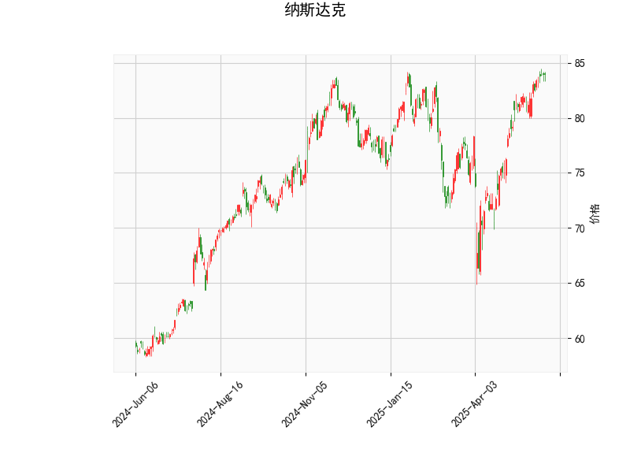

# 纳斯达克指数技术分析结果详解

## 1. 对技术分析结果的整体分析
基于提供的纳斯达克指数数据，我们可以从多个技术指标入手，评估当前市场态势。以下是对关键指标的逐一解读，以及整体市场信号的总结。

### 关键指标解读
- **当前价格（Current Price）**: 指数当前位于84.0点。这是一个相对较高的位置，暗示价格可能接近短期峰值，需要关注潜在回调风险。
  
- **RSI（Relative Strength Index）**: 值达到70.42，这表明市场处于超买状态。通常，RSI超过70被视为警告信号，意味着买入力量过强，卖出压力可能增加，导致短期修正或回调。

- **MACD（Moving Average Convergence Divergence）**: MACD线为1.86，信号线为1.87，直方图（MACD Hist）为-0.01。MACD线低于信号线且直方图为负，显示短期动量减弱，可能预示着看跌信号。这往往表示多头力量正在消退，市场可能从上涨转为横盘或下跌。

- **布林带（Bollinger Bands）**: 
  - 上轨（Upper Band）: 86.17
  - 中轨（Middle Band）: 77.27
  - 下轨（Lower Band）: 68.37
  当前价格84.0位于中轨和上轨之间，接近上轨。这表明价格处于布林带的较高区域，市场波动性可能增加。如果价格突破上轨，可能引发进一步上涨；反之，若回落至中轨以下，则可能进入修正阶段。

- **K线形态（Candlestick Patterns）**: 检测到的形态包括CDLDOJI、CDLDRAGONFLYDOJI、CDLHANGINGMAN、CDLLONGLEGGEDDOJI、CDLMATCHINGLOW、CDLSPINNINGTOP和CDLTAKURI。这些形态多体现出市场不确定性和潜在反转信号：
  - CDLDOJI、CDLLONGLEGGEDDOJI和CDLSPINNINGTOP 表示市场犹豫，可能预示方向不明朗。
  - CDLDRAGONFLYDOJI、CDLHANGINGMAN和CDLTAKURI 暗示潜在反转，尤其是如果出现在上涨趋势末端，可能意味着卖出机会。
  - CDLMATCHINGLOW 显示可能的支撑水平，表明短期底部可能已形成。

### 整体市场信号总结
从以上指标来看，纳斯达克指数当前处于超买状态（RSI超70），MACD显示动量减弱，布林带位置暗示价格过高，而K线形态则强调市场不确定性和反转风险。整体而言，这反映出短期内市场可能从强势上涨转为回调或横盘整理。投资者应警惕潜在下行压力，尤其是如果外部因素（如经济数据或地缘事件）加剧卖出情绪。

## 2. 近期可能存在的投资或套利机会和策略判断
基于上述分析，我们可以识别出一些潜在的投资机会和策略。纳斯达克指数作为科技股主导的市场，往往具有较高的波动性，这为短期交易和套利提供了空间。以下是针对当前状况的判断和建议。

### 可能的机会评估
- **回调机会**: RSI超买和MACD负直方图暗示短期回调可能性较高。这可能为逢低买入提供机会，尤其是在价格回落至布林带中轨（约77.27）附近时。
- **反转套利潜力**: K线形态中的反转信号（如CDLHANGINGMAN或CDLTAKURI）表明，如果市场从当前高位回落，投资者可通过差价套利获利。例如，利用期权或期货合约捕捉短期波动。
- **横盘交易机会**: 多个犹豫形态（如CDLDOJI）显示市场可能进入盘整期，这适合范围交易策略，在上轨（86.17）和中轨（77.27）之间进出。
- **风险因素**: 需注意全球经济不确定性（如通胀或利率变化）可能放大下行风险，减少多头机会。

### 推荐投资策略
- **短期卖出或观望策略**: 
  - 如果RSI继续上升或MACD直方图恶化，建议优先卖出持仓或采用空头策略（如卖空ETF）。目标位可设在中轨77.27附近，止损设在上轨86.17以上。
  - 对于风险厌恶者，观望等待K线形态确认反转（如出现更多看跌形态）后再行动。

- **逢低买入策略**:
  - 若价格回落至下轨68.37附近（结合CDLMATCHINGLOW的支撑信号），可考虑买入纳斯达克相关ETF或个股。止盈可设在中轨以上，止损控制在下轨以下。
  - 结合RSI回落到50以下时入场，以捕捉反弹。

- **套利策略建议**:
  - **波动率套利**: 利用布林带的扩张期（当前价格接近上轨），通过期权价差交易获利。例如，购买看跌期权对冲回调风险，同时卖出看涨期权以赚取溢价。
  - **跨市场套利**: 若纳斯达克与其他指数（如S&P 500）出现分歧，可在纳斯达克回调时买入，同时在相关资产（如科技股）中寻找低估机会，实现跨资产套利。
  - **风险管理**: 所有策略均应结合止损机制（如基于布林带），并控制仓位不超过总资金的20-30%，以应对突发事件。

总体而言，近期纳斯达克指数的投资机会更多倾向于短期交易和风险控制，而非 aggressive 多头操作。投资者应结合基本面分析（如公司财报或宏观数据）验证这些信号，并根据个人风险偏好调整策略。