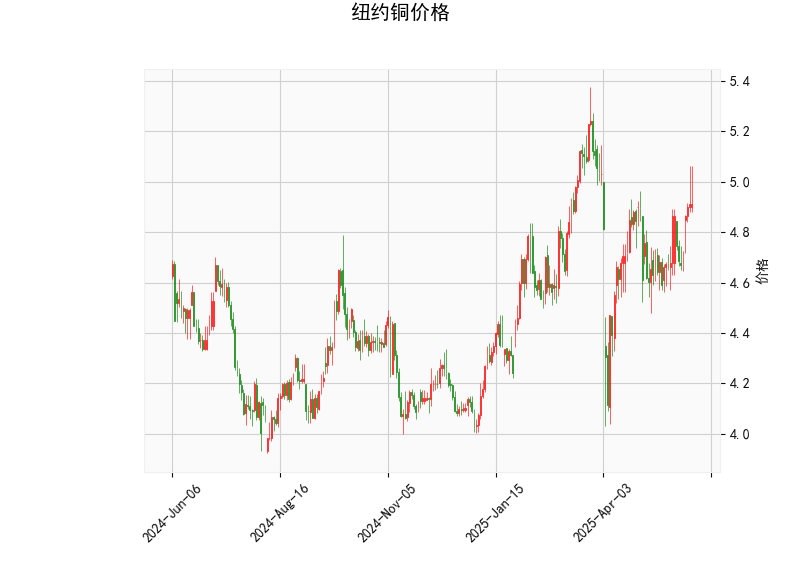

### 纽约铜价格的技术分析结果分析

#### 1. 对技术分析结果的详细解读
基于提供的纽约铜价格数据，我们可以从多个技术指标入手，对当前市场态势进行全面评估。当前价格为4.9115，这是一个相对稳定的水平，但结合其他指标，我们可以看到一些潜在的动向。

- **RSI（相对强弱指数）**：当前RSI值为59.37。这表明纽约铜价格处于中性偏强区域（RSI通常在30-70区间为中性，超过70为超买）。RSI接近60的水平暗示近期价格有一定的上涨动能，但尚未进入超买状态，这可能意味着市场还有上行空间。然而，如果RSI继续上升至70以上，则需警惕可能的回调风险。

- **MACD（移动平均收敛散度）**：MACD线为0.0401，信号线为0.0143，MACD直方图（Hist）为0.0259。这些数值显示MACD线高于信号线，且直方图为正值，这是一个典型的看涨信号。直方图的正值表示短期价格动量向上，暗示买方力量占优，价格可能继续小幅上涨。但如果直方图开始缩小或转为负值，则可能预示动量减弱和潜在反转。

- **布林带（Bollinger Bands）**：上轨为5.2376，中轨为4.7892，下轨为4.3409。目前价格4.9115位于中轨和上轨之间，接近中轨。这表明价格处于布林带的中间偏上位置，通常被视为一个相对平衡的区域，但也暗示潜在的上行趋势。如果价格突破上轨（5.2376），可能触发进一步上涨；反之，如果回落至中轨以下，则可能面临回调。布林带的宽度显示市场波动性适中，没有极端扩张或收缩。

- **K线形态**：检测到的形态包括Doji、Long-legged Doji和Spinning Top。这些形态整体上反映了市场的犹豫和不确定性：
  - Doji表示开盘价和收盘价接近，暗示买卖力量平衡，可能预示反转或盘整。
  - Long-legged Doji强调了价格在当日大幅波动后收盘接近开盘，显示市场情绪不稳，进一步强化不确定性。
  - Spinning Top（陀螺形态）显示实体较小，上下影线较长，表明买卖双方拉锯，可能预示短期反转或横盘。

综合来看，技术指标呈现出混合信号：RSI和MACD支持轻度看涨，而布林带显示价格在中上位置，但K线形态强调市场不确定性。这可能意味着短期内价格有上行潜力，但也存在回调或盘整的风险。整体市场环境偏向中性偏多头，但需密切关注K线形态的变化以避免突然反转。

#### 2. 近期可能存在的投资或套利机会和策略判断
基于上述分析，纽约铜市场的短期走势可能存在一定的投资机会，特别是针对多头策略，但需谨慎应对不确定性。以下是对潜在机会和策略的评估：

- **投资机会评估**：
  - **看涨机会**：MACD的正直方图和RSI的偏强水平暗示短期价格可能向上测试布林带上轨（5.2376）。如果价格突破这一水平，投资者可能捕捉到10-15点左右的涨幅（基于当前价格4.9115计算）。此外，铜作为工业金属，其需求往往受全球经济复苏影响，如果外部因素（如制造业数据）支持，价格上涨的概率会增加。
  - **回调或反转风险**：K线形态（如Doji和Spinning Top）显示市场可能进入盘整期，甚至出现向下调整。如果价格回落至布林带中轨（4.7892）以下，可能会提供逢低买入的机会，但这也增加了潜在损失。
  - **套利机会**：在商品市场，套利通常涉及跨市场或跨品种操作。例如，纽约铜与伦敦金属交易所（LME）铜价之间的价差可能存在套利空间。如果纽约铜价格相对于LME铜价出现异常偏离（例如，由于季节性需求或库存变化），投资者可考虑无风险套利策略，如期现套利或跨交易所套利。但基于当前数据，套利机会尚不明显，需要进一步监控价差（当前价与历史均值的比较）。

- **投资策略建议**：
  - **多头策略**：如果投资者看好铜价上涨，可在当前价格附近买入多头头寸（例如，通过期货合约），并设置止盈位在布林带上轨（5.2376）附近。止损位可设在中轨（4.7892）以下，以控制风险。结合RSI和MACD的信号，入场时机宜在K线形态确认后（如出现阳线突破Doji）。
  - **观望或中性策略**：鉴于K线的不确定性，保守投资者可选择等待更多确认信号，例如RSI突破60或MACD直方图扩大后再行动。同时，可使用布林带作为动态支撑/阻力参考：在上轨附近减仓，在中轨附近加仓。
  - **套利策略**：若发现纽约铜与LME铜价差扩大（例如超过历史平均10-20点），可采用跨市场套利：买入低价市场合约，同时卖出高价市场合约，以锁定价差收益。风险管理上，需关注外部事件（如地缘政治或经济数据发布）对价差的影响，并使用限价订单控制执行风险。
  - **风险管理总体建议**：无论采用何种策略，都应控制仓位（例如不超过总资金的20%），并结合基本面分析（如铜矿供应和需求数据）。短期内，市场波动可能加剧，因此建议结合技术分析工具（如移动平均线）监控动态，并在价格触及关键水平时及时调整。

总之，近期纽约铜市场存在轻度看涨的投资机会，但K线形态的警示信号提醒投资者需防范反转风险。策略应以灵活性和风险控制为优先，建议在实际操作前结合实时数据和市场新闻进行验证。