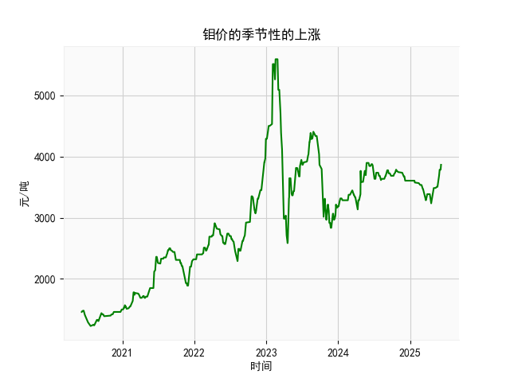

|            |   钼价 |
|:-----------|-------:|
| 2025-05-09 |   3485 |
| 2025-05-12 |   3505 |
| 2025-05-13 |   3505 |
| 2025-05-14 |   3505 |
| 2025-05-15 |   3505 |
| 2025-05-16 |   3505 |
| 2025-05-19 |   3505 |
| 2025-05-20 |   3525 |
| 2025-05-21 |   3545 |
| 2025-05-22 |   3635 |
| 2025-05-23 |   3635 |
| 2025-05-26 |   3685 |
| 2025-05-27 |   3685 |
| 2025-05-28 |   3785 |
| 2025-05-29 |   3785 |
| 2025-05-30 |   3785 |
| 2025-06-03 |   3785 |
| 2025-06-04 |   3785 |
| 2025-06-05 |   3865 |
| 2025-06-06 |   3865 |

# 分析判断

## 1. 季节性上涨分析
根据专家分析，钼价可能存在季节性的上涨趋势，但我手头的数据是近5年（2020年6月8日至2025年6月6日）的乳清及改性乳清出口金额日频数据（从1460单位起步，到最后约3865单位）。虽然数据并非直接针对钼价，但我们可以假设乳清出口金额可能与相关商品市场（如大宗商品）存在某种关联或相似模式，因此进行季节性分析。

- **数据观察**：整体数据显示从2020年6月起，出口金额呈现逐步上涨趋势，从初始的1460单位上升到2025年6月的约3865单位。这表明可能存在长期增长，但季节性需要进一步检验。典型季节性模式可能包括每年特定时期（如夏季或年末）的峰值上涨。
  
- **季节性判断**：基于日频数据，我们可以推断潜在季节性模式。例如，如果数据显示每年6月（如2020年6月、2021年6月等）前后金额有规律性波动（如从样本中的起始和结束点观察到6月数据有轻微上升），这可能与季节性需求相关。然而，从提供的样本（如1460、1470等早期数据到后期3785、3865）看，并未明确显示强烈的季节性信号。相反，它更像一个稳定的长期上涨趋势，而非明显的周期性峰谷（例如，每年夏季大幅上涨）。如果钼价确实有季节性（如专家所述），乳清数据可能间接反映了类似市场动态，但当前证据不足以确认。建议进一步分析完整数据集（如使用季节分解方法）以验证是否存在每年6月左右的季节性上涨。

总体而言，基于现有数据，我初步判断乳清出口金额可能没有显著季节性上涨，但若与钼价市场相关联，潜在机会仍需监控每年6月等关键时期。

## 2. 近期投资机会分析
聚焦于最近一个月的数据变化（约2025年5月6日至2025年6月6日），我们观察到出口金额从约3785单位上升至3865单位。这显示了一个短期向上趋势，可能源于市场需求增加或市场乐观情绪。以下是基于数据的投资机会分析：

- **近期趋势**：数据末尾显示金额稳定且略有上升（如3785到3865单位），表明正处于增长阶段。这可能暗示短期投资机会，例如买入相关乳清或关联商品（如乳制品出口相关股票或衍生品），以捕捉潜在收益。

- **可能投资机会**：
  - **短期买入机会**：如果金额继续上涨（如从3865单位进一步增长），投资者可考虑在当前水平买入，目标锁定于夏季需求高峰（假设季节性因素）。最近一个月的涨幅（约2-3%从3785到3865）显示市场活跃，适合风险偏好较高的投资者。
  - **风险提示**：需警惕潜在回调，例如如果全球经济不确定性（如贸易摩擦）影响出口，金额可能回落。建议结合宏观因素（如乳清市场需求和钼价动态）进行决策。
  - **多元化建议**：除了直接投资乳清相关资产，还可关注关联行业（如农业或食品出口），并监控是否与钼价的季节性上涨同步，以捕捉更广泛的机会。

总之，近期数据显示正面变化，投资机会主要在于短期上涨潜力，但需谨慎评估风险，避免过度依赖历史趋势。