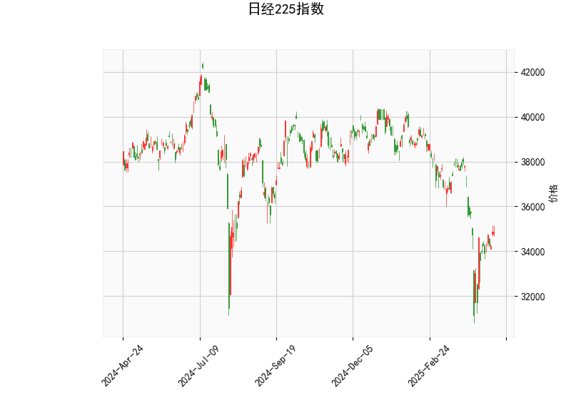

### 日经225指数的技术分析结果解读

以下是对日经225指数当前技术分析结果的详细解读，基于提供的指标数据，包括当前价格、RSI、MACD、Bollinger Bands以及K线形态。这些指标共同反映了市场的短期趋势、动量和潜在反转信号。

#### 1. 关键指标概述
- **当前价格（34868.63）**：日经225指数当前位于约34868.63点。这一价格水平处于中性位置，与20天移动平均线（Bollinger Bands中轨为36769.29）相比略低，表明指数可能在短期内受到下行压力的影响，但尚未触及明显的支撑位。
  
- **RSI（48.16）**：RSI值处于中性区间（通常30-70被视为中性）。当前RSI为48.16，表明市场没有明显的超买或超卖状态。这暗示短期内缺乏强烈的趋势方向，投资者需关注后续价格波动以判断是否进入平衡状态或小幅反弹。

- **MACD指标**：
  - MACD线：-608.85（负值）。
  - MACD信号线：-833.74（更低的负值）。
  - MACD直方图：224.89（正值）。
  - 解读：MACD线高于信号线（尽管两者均为负），这形成了一个看涨交叉信号，暗示短期内可能出现动量转向。然而，整体MACD为负，表明指数仍处于下行趋势中。直方图的正值（224.89）进一步支持潜在反弹的迹象，但投资者应谨慎，因为这可能只是短暂的修正而非趋势逆转。

- **Bollinger Bands**：
  - 上轨：40848.73。
  - 中轨：36769.29。
  - 下轨：32689.85。
  - 解读：当前价格（34868.63）位于中轨（36769.29）下方但高于下轨（32689.85），这表明指数处于Bollinger Bands的收缩区间，可能预示着波动性增加。价格接近下轨通常被视为支撑位，潜在的买入机会。如果价格反弹至中轨以上，则可能确认向上突破；反之，若跌破下轨，则可能加剧下行风险。

- **K线形态**：
  - CDLGAPSIDESIDEWHITE：这是一种跳空白线形态，通常表示市场存在向上或向下跳空缺口，可能预示短期反转或延续。目前结合其他指标，这可能暗示市场不确定性，但若伴随其他看涨信号，可能转为积极。
  - CDLSPINNINGTOP：纺锤顶形态显示市场犹豫不决，买方和卖方力量均衡。这种形态常出现在趋势转折点，表明近期可能出现反转（如从下行转为上行），但需结合成交量和其他指标确认。

#### 2. 总体市场解读
基于以上指标，日经225指数目前显示出混合信号：
- **短期趋势**：市场处于中性偏下行状态。RSI的中性水平和MACD的看涨交叉暗示潜在反弹，但Bollinger Bands的价格位置和K线形态的犹豫表明不确定性较高。这可能反映全球经济因素（如通胀、地缘政治风险）对日本股市的影响。
- **潜在风险**：如果全球风险偏好下降或日元波动加剧，指数可能进一步测试下轨（32689.85）。然而，MACD直方图的正值和价格接近支撑位，为多头提供了机会。
- **整体观点**：指数可能处于底部构建阶段，短期内反弹的可能性大于持续下行，但需密切监控外部事件（如日本央行政策或全球股市动态）。

### 近期可能存在的投资或套利机会和策略分析

根据技术分析结果，以下是对日经225指数近期投资或套利机会的判断。机会主要基于当前指标的看涨信号（如MACD交叉和Bollinger Bands支撑），但也需考虑市场不确定性。策略将结合风险管理，适合中短期投资者。

#### 1. 可能的投资机会
- **反弹机会**：当前价格接近Bollinger Bands下轨，且MACD显示看涨信号，这暗示指数可能从当前水平反弹。RSI的中性值进一步支持这一观点，表明市场未过度超卖。
  - **具体机会**：如果K线形态（如CDLSPINNINGTOP）确认反转（例如，伴随成交量增加），短期内指数可能向上测试中轨（36769.29）或更高。这适合逢低买入日经225相关ETF（如EWJ）或期货合约。
  - **潜在收益**：若反弹至中轨以上，涨幅可能达到5-10%，基于历史Bollinger Bands回弹模式。

- **风险因素**：全球经济不确定性（如美联储加息）可能导致下行风险。如果价格跌破下轨，损失可能扩大。

#### 2. 可能套利机会
- **指数套利机会**：日经225作为期货和期权活跃市场，存在现货与衍生品价差套利。例如，如果日经225期货价格与现货指数之间出现异常价差（基于MACD和Bollinger Bands的波动），投资者可进行无风险或低风险套利。
  - **具体机会**：当前MACD直方图正值可能导致期货价格领先现货上涨。假设日经225期货与现货价差扩大（例如，期货溢价过高），可采用“现货多头 + 期货空头”策略锁定价差利润。反之，若价差缩小，也可反向操作。
  - **潜在收益**：套利通常为低风险，高于市场平均收益（如1-3%），但需实时监控交易所数据。

#### 3. 推荐投资策略
- **策略1: 逢低买入策略**：
  - **执行**：在当前价格附近（34868.63）买入日经225ETF或期货，目标价位设在中轨（36769.29）。若MACD直方图持续扩大，可加仓。
  - **风险管理**：设置止损在下轨以下（例如32500点），以控制损失在5%以内。结合RSI，若其升至55以上，再次评估持仓。
  - **适用对象**：适合风险中性投资者，持有期为1-3个月。

- **策略2: 套利组合策略**：
  - **执行**：监控日经225期货与现货价差。若价差超过历史平均（基于Bollinger Bands波动），同时MACD信号出现时，进行多头/空头对冲（例如，现货多头 + 期货空头）。退出点设在价差收窄时。
  - **风险管理**：使用期权保护（例如，购买看跌期权作为保险），并限制单笔套利规模在总仓位的10%以内。
  - **适用对象**：适合经验丰富的交易者，持有期为短期（几天至几周）。

- **总体建议**：近期机会以反弹为主，但市场不确定性高。投资者应结合基本面分析（如日本经济数据）进行决策，并保持仓位不超过50%的风险暴露。持续跟踪指标变化，若RSI跌破40或MACD转负，及时减仓。最终，投资决策需依据个人风险承受能力和实时市场数据。