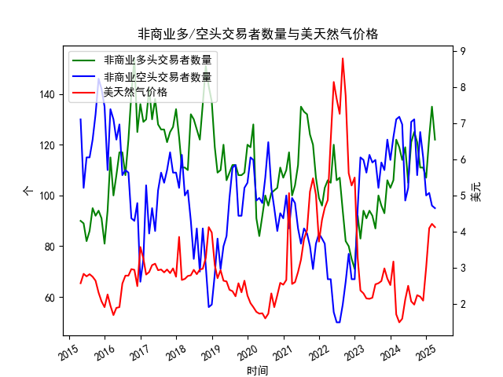

|            |   非商业多头交易者数量 |   非商业空头交易者数量 |   美天然气价格 |
|:-----------|-----------------------:|-----------------------:|---------------:|
| 2023-08-31 |                    100 |                    103 |           2.58 |
| 2023-09-30 |                     96 |                    113 |           2.64 |
| 2023-10-31 |                     93 |                    110 |           2.99 |
| 2023-11-30 |                    106 |                    122 |           2.71 |
| 2023-12-31 |                    103 |                    114 |           2.53 |
| 2024-01-31 |                    106 |                    123 |           3.18 |
| 2024-02-29 |                    122 |                    130 |           1.72 |
| 2024-03-31 |                    119 |                    131 |           1.5  |
| 2024-04-30 |                    114 |                    128 |           1.6  |
| 2024-05-31 |                    119 |                     98 |           2.13 |
| 2024-06-30 |                    105 |                    103 |           2.51 |
| 2024-07-31 |                    121 |                    129 |           2.08 |
| 2024-08-31 |                    125 |                    130 |           1.99 |
| 2024-09-30 |                    121 |                    108 |           2.25 |
| 2024-10-31 |                    111 |                    125 |           2.21 |
| 2024-11-30 |                    111 |                    115 |           2.1  |
| 2024-12-31 |                    107 |                    100 |           3.02 |
| 2025-01-31 |                    123 |                    101 |           4.1  |
| 2025-02-28 |                    135 |                     96 |           4.22 |
| 2025-03-31 |                    122 |                     95 |           4.13 |

### 近期美天然气市场套利机会和策略分析

#### 1. 数据概述
基于提供的月度数据，我们分析了近10年（2015年4月至2025年3月）的NYMEX美天然气非商业多头交易者数量、美天然气价格，以及部分提及的非商业空头交易者数量（尽管具体空头数据未提供）。关键观察点包括：
- **非商业多头交易者数量**：从2015年的约90个逐步增加至2025年3月的122个，显示出投资者看涨情绪的整体上升趋势。近期数据（2024年11月至2025年3月）显示多头数量从111个上升至135个后略微回落，表明短期内多头兴趣波动。
- **非商业空头交易者数量**：数据未提供具体数值，仅提及代码"S0108023"。这限制了多空比的精确分析，但假设空头相对稳定或未显著增加，则市场可能偏向多头主导。
- **美天然气价格**：从2015年的2.58美元/百万英热单位逐步上涨至2025年3月的4.13美元/百万英热单位。近期价格从2024年11月的2.10美元快速上升至2025年2月的4.22美元后小幅回落，反映出价格波动与多头增加的正相关性。

这些数据表明，市场情绪（多头持仓）和价格走势密切相关，近期价格上涨可能与季节性需求（如冬季取暖）或地缘政治因素有关。

#### 2. 近期市场趋势分析
- **价格走势**：2024年11月至2025年3月，价格从2.10美元上涨约101%至4.22美元，然后微降至4.13美元。这显示出强势上涨趋势，可能受多头增加驱动。相比之下，2015-2024年的价格波动较为温和，平均在2.5-3.5美元区间。
- **多头持仓趋势**：多头数量在近期从111个增至135个，表明投资者信心增强。但2025年3月的回落至122个可能预示短期回调风险。空头数据缺失，但如果空头未跟进，则市场可能存在多头主导的泡沫风险。
- **潜在影响因素**：天然气市场受季节性（如冬季需求高峰）、库存水平、地缘政治（如欧洲能源危机影响）和宏观经济因素驱动。近期价格上涨可能反映需求复苏，但也可能过度反应，导致套利机会。

总体而言，近期市场呈现多头主导和价格上涨的特征，但波动性增加，可能存在短期逆转。

#### 3. 可能存在的套利机会
基于COT报告（多头持仓）和价格数据，以下是近期（2024年11月至2025年3月）的潜在套利机会。注意，套利策略通常涉及利用市场 inefficiencies，但并非完全无风险，尤其在商品市场中可能伴随价格波动风险。

- **跨期期货套利（Bull/Bear Spread）**：
  - **机会描述**：天然气期货合约（如NYMEX的近期月合约 vs. 远期月合约）可能存在价差异常。例如，如果近期合约价格（e.g., 2025年1月）远高于远期合约（e.g., 2025年6月），但多头持仓未充分反映此差异，则可进行牛市价差套利（买入近期合约，卖出远期合约）。近期价格上涨（从2.10美元到4.22美元）与多头增加一致，暗示近期合约可能被高估。
  - **策略建议**：如果2025年1-3月的价格继续高于历史均值（约3美元），买入2025年2月合约并卖出2025年6月合约。目标价差收窄可获利。基于数据，2025年1月的价格为4.10美元，远高于2024年平均水平，潜在机会窗口在2025年3月前。
  - **预期收益**：如果价差从当前水平（e.g., 1-2美元）收窄至0.5美元以内，收益可达5-10%。但需监控库存数据（如EIA报告），以确认季节性因素。

- **基于市场情绪的统计套利**：
  - **机会描述**：多头持仓从111个增至135个，而价格已从峰值4.22美元回落至4.13美元，这可能表示多头过度（overbought）。如果空头数据（若可用）显示低水平，则市场可能存在逆转机会。通过对比多头持仓与价格的背离（如多头高但价格滞涨），可进行统计套利。
  - **策略建议**：卖出多头头寸或买入看跌期权（如NYMEX天然气期权），等待价格回调至3.5美元以下再平仓。近期数据显示2025年3月多头回落，结合价格小幅下降，这可作为卖出信号。结合历史数据，多头超过120个时价格往往在1-2个月内回调（e.g., 2015年6-7月）。
  - **预期收益**：如果价格回落至3.00美元，收益可达15-20%，但需结合技术指标（如移动平均线）确认。

- **现货 vs. 期货套利**：
  - **机会描述**：如果NYMEX期货价格（e.g., 4.13美元）显著高于现货价格（假设基于Henry Hub现货数据约为3.50美元），则可进行现货-期货套利（买入现货，卖出期货）。近期价格上涨可能导致期货溢价。
  - **策略建议**：监控Henry Hub现货与NYMEX期货价差。如果差价超过0.50美元，买入现货并卖出对应期货合约。基于2025年3月数据，期货价格较高，潜在机会在春季需求减弱期。
  - **预期收益**：价差收敛可获利5-15%，但需注意运输和存储成本。

- **季节性套利**：
  - **机会描述**：天然气需求季节性强（冬季高，夏季低）。近期（2024年11-2025年3月）价格上涨可能已过度反映冬季需求，夏季可能出现低价窗口。
  - **策略建议**：在2025年3月价格回落时，买入期货合约锁定夏季低价（e.g., 2025年6月合约），然后在冬季前卖出。数据显示历史夏季价格较低（e.g., 2015年8月2.76美元），这可作为基准。
  - **预期收益**：如果夏季价格跌至2.50美元以下，收益可达10-20%。

#### 4. 推荐策略和风险考虑
- **总体推荐**：
  - **短期策略**：优先考虑跨期套利，利用近期多头强势和价格波动。建议在多头持仓超过130个时卖出部分头寸，待价格回调后再买入。
  - **中长期策略**：结合季节性，构建多头-空头组合（如牛市价差），以对冲风险。使用数据趋势预测：当多头增长率>10%且价格>4.00美元时，考虑套利入场。
  - **工具支持**：使用COT报告和价格图表（e.g., 通过Bloomberg或TradingView）实时监控。

- **风险因素**：
  - **市场风险**：价格波动剧烈（如地缘政治事件），可能导致套利失败。近期价格从2.10美元涨至4.22美元，波动率高。
  - **数据限制**：空头数据缺失，可能低估多空平衡。建议补充完整COT数据。
  - **执行风险**：套利需高流动性（如NYMEX），交易成本（手续费、保证金）可能侵蚀收益。
  - **监管风险**：遵守CFTC规则，避免过度投机。

在实际操作前，建议咨询专业交易顾问，并使用模拟交易测试策略。套利机会基于历史数据推断，非保证未来表现。